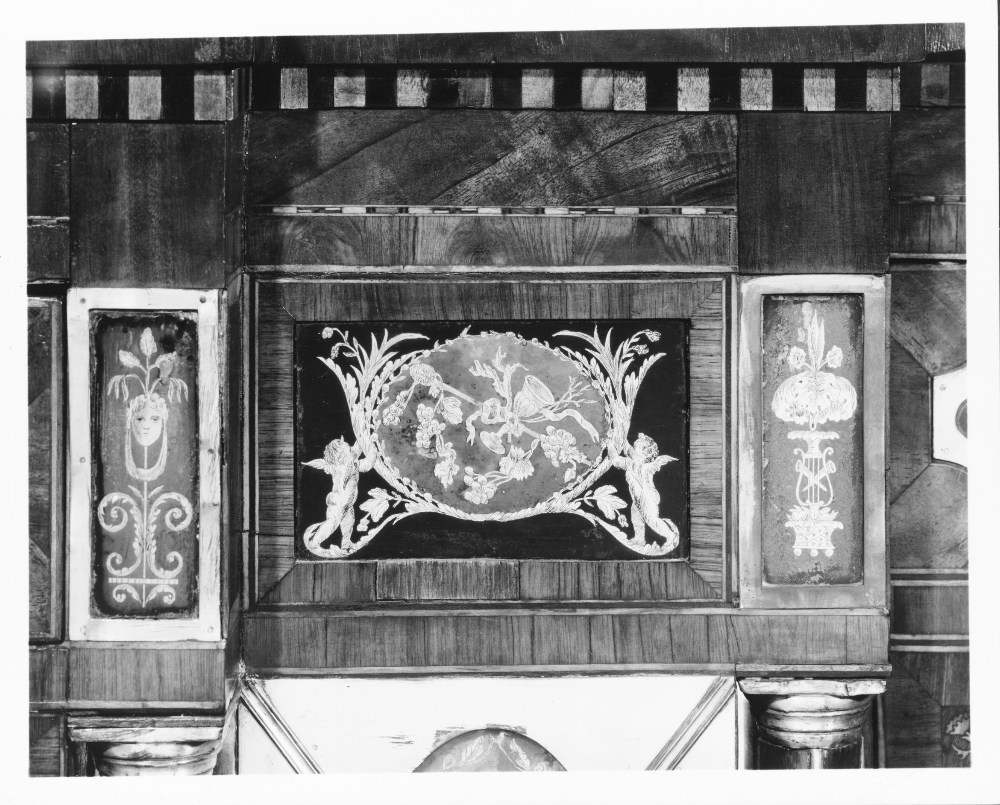

# The sideboard arrives

<figure class="bbf-figure bbf-figure--plate">
  
  <figcaption>
    <strong>Federal sideboard</strong>, c. 1795 — The Federal sideboard that claims a wall recess in the named dining room.
    The Metropolitan Museum of Art, Open Access. CC0 1.0.
  </figcaption>
</figure>
Thomas Shearer’s priced sideboard in the *Cabinet-Makers’ London Book of Prices* (1788) is a long, narrow cabinet on tapered legs: drawers, bottle wells, a lockable interior for plate. George Hepplewhite’s *Guide* of the same year — Hepplewhite dead, the book posthumous — gives shops serpentine and straight fronts in plates. That is the form before it has a room name on every plan. Eliza Leslie, in *The House Book* (1844), tells a middle-class reader that a large closet is indispensable to a dining room. By closet she means a sideboard. If the wall cannot take a large one, she allows two small ones in the recesses. That sentence is the form after it has won. This page is the winning hour: the 1780s and 1790s, when the sideboard became the furniture that proved you had a dining room.

English courts had dressed buffets for a long time. The American Federal sideboard is not that pageant. Sheraton’s *Drawing-Book* (1793) adds the later, more architectural versions. American shops in New York, Baltimore, Boston, and Philadelphia copy, inlay, and stretch the form until it is the room’s other table.

## A priced novelty

Commonplace’s essay on the sideboard is the short civic version: first American examples late eighteenth century, urban, an accessory to the dining table, drawers and small cabinets under a serving top. Sideboards.com’s trade history, used cautiously, notes slab tables giving way to storage at the end of the century, and the 1788 London price book as the moment the form is ordinary enough to price.

Hepplewhite gets the popular credit. Shearer may deserve more of the drawing. Do not collapse them. A serpentine front with spade feet and inlaid husks is the Hepplewhite language American shops spoke. A more rectangular, colonnaded, or galleried board leans Sheraton. Both are Federal in American rooms. Both assume a wall that will not be asked to hold a bed.

Biddle’s 1805 Plate 37 puts a recess for a sideboard in an American builder’s guide. The furniture and the architecture meet there. A sideboard without a recess still works. A recess without a sideboard is a confession.

## What the drawers are for

Silver, knives, bottles, linens. Bottle wells — deep drawers or leaded compartments — are the tell that this is not a dressing chest. Cellaret drawers, sometimes zinc-lined later, keep wine in the room. Locks are not decoration. Plate walks. The key is a household politics: who opens the board, who counts the spoons.

The top is a serving surface. In *à la française* it holds overflow. In the later *à la russe* it becomes the staging point for a servant’s hands. The form is ready for that shift before most American houses adopt it. Furniture often is.

Marble tops appear on sideboard tables (Phyfe’s Met 1971.160, mahogany and marble, ca. 1815, seventy-eight and three-quarters inches wide) more than on the early inlaid cabinet sideboards, which prefer wood. A marble-topped board is a slab’s child. A wooden-topped inlaid board is Hepplewhite’s child. Both stand in dining rooms by 1815.

## American shops, American inlay

Baltimore’s inlaid sideboards — eagles, bellflowers, stringing — are a school. New York’s are mahogany and satinwood, sometimes with a Phyfe attribution that should be workshop language, not a signature. Boston’s are reserved. Philadelphia’s continue a cabinetmaking culture that already knew a long case. Southern Federal sideboards in walnut and cherry, six tall legs, bottle drawers, are the hunt-board essay’s cousins; some were always just sideboards.

Inlay is holly, maple, dyed woods, not always the exotic the pattern names. Satinwood when the shop can get *Zanthoxylum*; figured maple when it cannot. Eagle paterae are a patriotism you can sand through. Look at a chip.

Secondary woods: poplar in the Mid-Atlantic, pine in New England, yellow pine in the South. A “Baltimore” board with pine secondaries and no history wants a fight.

## Legs, then pedestals

Early Federal sideboards stand on six (sometimes eight) tapered legs. The long case is a table that grew drawers. Later, as Empire taste thickens, the board grows pedestals at the ends and a deep plinth. The Renaissance Revival sideboard of the 1860s–80s will become architecture — a mountain of walnut and carving. That is another essay. The Federal board is still a piece of furniture you could, in theory, move. Two people will not thank you.

Serpentine and straight fronts are both correct. A bowed front that has collapsed is a rail failure, not a style. Look at the underside of the top for original glue blocks and for the ghost of a gallery that someone removed to “modernize” in 1920.

## Bottle wells, linings, and the ghost of a division

Bottle wells are cylindrical or oval voids, sometimes lined, sometimes just a divided well. A dressing chest does not need them. Look for stains, divisions, a depth that makes no sense for napkins. `[CITE NEEDED: a firmly dated American Federal sideboard with its original leaded or zinc bottle lining still in place, shop identified.]` Early linings are inconsistent; a missing lining is not proof the drawer was never a cellaret.

Twentieth-century owners turned bottle wells into file drawers. The ghost of a division is still a sideboard. Look at the inside faces for unused lock keeps and filled keyholes. The key was kept by the person the household trusted with silver, often the owner or a steward, not the person who set the spoons out.

## How a serpentine front is built

The rails are cut from thick stock or built up; the drawer fronts are shaped to the curve; the top’s front edge follows. Inside, the drawers are still rectangular enough to work, or they are curved and harder to make. Glue blocks and a well-fitted dustboard keep the long case from racking. A bowed front that has collapsed is a rail that lost its backbone.

Inlay follows the curve: stringing laid in a trough cut to a line that is not straight. Holly and maple are pale. Dyed woods give the husk and the bellflower. If an eagle patera is painted on rather than inlaid, you are in a later mood or a repair.

A Federal board on a solid plinth with no legs has been cut down or was never Federal. A fully finished back is a later pride or a piece meant to float, which Federal sideboards generally were not.

Montgomery’s *American Furniture: The Federal Period* is coastal-heavy. Inland walnut boards still count. Southern Federal boards in walnut and cherry, six tall legs, bottle drawers, are sideboards — not hunt boards — until a dealer says otherwise.

## How a bottle well is made

Some wells are built-up divisions inside a deep drawer: thin walls, a bottom, sometimes a lining. Some are voids in a case that never had a sliding drawer in that bay. A separate cellaret — a box on a stand, or a box that slides out as a unit — is a cousin, not a synonym. Do not call every deep drawer a cellaret because a dealer prefers the word.

Lead and later zinc keep wine from wrecking the wood. They also tear. A well with nail holes and no metal may have been lined. A well with a modern plastic tray is a kitchen talking. Smell the bottom. Wine, mold, and hide glue are a room. Lemon oil and sawdust are a shop.

## Drawer sides, cockbead, and the long case

Federal drawer sides on a good board are thin, the dovetails tight, the bottom slid into a groove. A cockbead around the drawer front is a London habit American shops copied; it takes a beating and protects the veneer. Dustboards between drawers keep silver from dropping into the bottle well. A board with no dustboards and machine-cut dovetails is later than Hepplewhite’s year, whatever the inlay says.

The long case wants a dustboard and a well-fitted back. Racking shows as drawers that stick at one end and gape at the other. Glue blocks under the top, original hide glue, a hand-cut angle — those are structure. A later steel mending plate on the underside is a confession that the serpentine lost its backbone.

Shearer’s plates in the 1788 *London Book of Prices* matter because they price the form. Hepplewhite’s *Guide* of the same year draws it. Do not collapse them. A price book means the object is ordinary enough to bid. A pattern book means a shop can argue with a client about a curve. American boards speak both languages and then add an eagle.

## Class and the lock

Leslie’s 1844 reader is middle class. The 1795 buyer was richer. Berman’s inventories watch the form spread. When a sideboard appears in a room labeled dining room, the specialization is complete. When a sideboard appears in a parlor, the household is halfway — furniture ahead of architecture, or a realtor’s ancestor moving the good piece where it photographs.

Enslaved and hired labor used the board more than the owners did. The lock is about them as much as about guests. A history of the sideboard that only names Hepplewhite is a plate without a kitchen.

If you are looking at one now, open every door. Count the bottle wells. Check the locks. Look at the back — often unfinished, meant for a wall. Look at the feet for caster holes; Federal boards got moved for cleaning. Then close it and see whether the wall you have is a Biddle recess or a blank stretch that will make the board look like it is waiting for a room that was never built. Either is a reading. The form arrived to finish the room. Sometimes the room never arrived.

## Sources

- Hepplewhite, *Guide* (1788); Sheraton, *Drawing-Book* (1793); *Cabinet-Makers’ London Book of Prices* (1788).
- Commonplace, “The Sideboard Takes Center Stage”; Eliza Leslie, *The House Book* (1844).
- Berman (1997) on Biddle Plate 37 and inventory spread.
- Met 1971.160, Phyfe sideboard table, ca. 1815.
- Charles F. Montgomery, *American Furniture: The Federal Period* (Winterthur / Viking, 1966).

See also: [The dining room is invented](the-room-is-invented.md), [Federal dining tables](federal-dining-tables.md), [Phyfe’s New York dining](phyfe-new-york-dining.md), [Renaissance Revival sideboards](renaissance-revival-sideboards.md).
