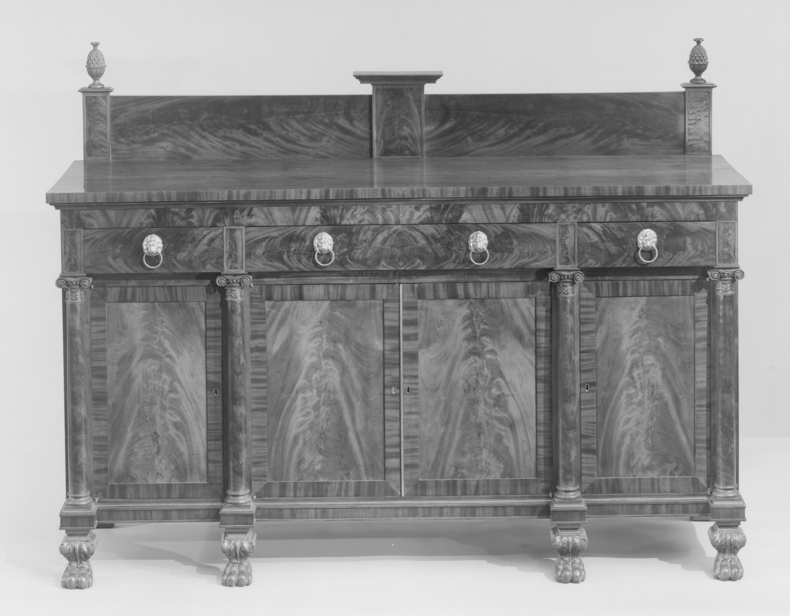

# Lannuier and the French table

<figure class="bbf-figure bbf-figure--plate">
  
  <figcaption>
    <strong>Sideboard table</strong>, c. 1815 — Gilt and marble on New York serving tables in the Lannuier manner.
    The Metropolitan Museum of Art, Open Access. CC0 1.0.
  </figcaption>
</figure>

Charles-Honoré Lannuier (1779–1819) lasted sixteen years in New York and left labeled furniture that still looks like it got off a different ship than Phyfe’s. He arrived in 1803, French-trained, and died in 1819, at forty, at the height of the work. The Met’s Heilbrunn essay and the 1998 catalog *Honoré Lannuier, Cabinetmaker from Paris* keep him adjacent to Phyfe without collapsing them: more gilt bronze, more marble, more Paris, a Grecian that has not been fully translated into merchant English. Dining-specific labeled pieces are scarcer in the public conversation than pier tables and card tables. That scarcity is the first fact. Do not invent a suite.

The dining room that bought Lannuier was buying a French Empire grammar for an American wall: a pier table between windows, a mirror throwing candlelight, a marble slab that is already a serving idea. The table you ate at might still be Phyfe’s mahogany parts or a Federal D-end from another shop. Mixed shops in one room are the document. Matching suites are the later dealer’s dream.

## A labeled hand at 60 Broad Street

Lannuier labeled. That is why he is countable in a way most New York contemporaries are not. Paper labels, engraved brass, a name you can still read if the maid’s wet cloth has not taken it. Phyfe’s shop, larger, is often “attributed to the workshop.” Lannuier’s labeled pier table is a signature object. Use that difference. It is not a quality ranking. It is a survival ranking.

The Met’s Lannuier monograph and Heilbrunn text put the shop and wareroom at 60 Broad Street after an advertisement in the *New York Evening Post*. The Albany Institute’s pier table 1957.70.9, dated 1817, still carries a bilingual paper label on the inside of the rear rail: “Hre. Lannuier / Cabinet Maker from Paris” and, in French, *ébéniste de Paris*, Broad Street, No. 60, New-York, with the warehouse of “new fashion fourniture.” The Met’s Richmond Room essay calls the later engraved trade label — text framed in a cheval glass — among the most elegant in American furniture. English and French on the same scrap of paper. The client was meant to hear Paris.

The gilt caryatid, the swan, the brass gallery, the white marble — these are the tells. Secondary woods are still American: pine, poplar, maple. The Albany Institute lists mahogany and mahogany veneers, eastern white pine, soft maple, yellow poplar, brass inlays, ormolu, vert antique, and gilt on that 1817 table. The show is imported taste on local carcasses. A “Lannuier” with no label, no gilt, and a Phyfe-type reeded leg is probably not Lannuier. Wishful attribution has gone both directions.

Peter Kenny’s Phyfe catalog keeps the two men in the same city. Lannuier’s own catalog literature is the place for a particular dining claim. `[CITE NEEDED: a labeled Lannuier dining table in a public collection, with accession.]` If that object is thin, the essay stays with pier and serving furniture that actually fed the room.

## Pier tables that serve

A pier table is not a dining table. It is wall furniture at standing height, made to sit between windows (the pier) with a glass above it. In a dining room it becomes a serving station: decanters, a plateau, a dish that is waiting. The marble is the point. It is cool, wipeable, and expensive. Charleston’s MESDA 3163 is the colonial Lowcountry version of that idea — mahogany frame, cypress where you cannot see, marble slab, 1750–1765. Phyfe’s Met 1971.160 is the Grecian quiet version: mahogany and marble, about 1815, seventy-eight and three-quarters inches wide. Lannuier’s is a Parisian announcement.

Two Met pier tables make the grammar visible. 68.43a, b, 1815–19, Gallery 728: rosewood, mahogany, marble, pine, tulip poplar, walnut, thirty-five by forty-eight by twenty inches. 2018.30a, b, Gallery 726: mahogany and veneer, pine, tulip poplar, maple, marble, gilded brass, die-stamped brass, plate glass, thirty-five and a quarter by forty-eight and a half by twenty-one. The Met’s label on the second names Jacques-Donatien Leray de Chaumont and a mansion on the Black River near Watertown. Caryatids and gilt-brass mounts. A companion remains in a private collection. These are not dinner tables. They are the wall the servant works.

The Met’s Richmond Room text publishes a surviving invoice from the same Broad Street shop. William Bayard commissioned wedding furniture in 1817 for daughters Harriet and Maria — Van Rensselaer and Campbell marriages. A pair of card tables at two hundred fifty dollars, a pier table at three hundred, at a time the Museum’s essay puts a journeyman’s wage at about a dollar a day. That is not a dining-table invoice. It is the price of the wall. Albany Institute 1957.70.9 belongs to that Bayard orbit. Use the invoice as published. Do not invent a matching banquet table to sit under it.

Card tables fold. They can be pressed into a supper for four. They are still not the long board. A household that spent Bayard money on gilt swans might still eat at a quieter mahogany leaf from another bench. That split is use, not a slight.

## How a French carcass is built in New York

Look at the back of a mount. Look at the screws. Original gilt-bronze mounts, when they survive, have a different metal and a different seat than a later cast lump. A later mount on an old table is a common surgery. Die-stamped brass galleries and inlaid brass lines are part of the Lannuier toolkit; so is vert antique paint on carved wood that wants to read as bronze. The marble slab sits on a frame that must carry stone without racking. Hidden blocks, a stout rear rail, and American secondaries do that work. The label lives on that rear rail because the front is theater.

The joinery under the gilt is still mortise-and-tenon and hide glue. Pine and poplar move. Mahogany veneer wants to stay a picture. If the glue holds and the ground was dry, the picture lasts. If a later refinisher sands through a leaf, the pale secondary shows. That chip is the lesson. Anderson’s mahogany story is the expensive forest. The gilt is extra money on top of that story.

## Empire before the American word

French Empire is Napoleon’s classicism: heavy, gilt, archaeological, a little military. Percier and Fontaine’s *Recueil de décorations intérieures* is the Paris pattern behind the mounts. American “Empire” as a furniture word is later and broader — pillar-and-claw tables from shops that never saw the rue. Lannuier is the early, accurate import. The Empire dining essay is the American thickening after 1815. Keep the clocks separate.

A marble-top serving table in this grammar is a cousin of Charleston’s earlier slab and of Phyfe’s 1971.160. The difference is the gilt and the figure. Charleston’s 1750s slab is rococo mahogany. Phyfe’s is Grecian quiet. Lannuier’s is a Parisian announcement. All three assume a standing server.

## Who bought French in New York

Merchants who had been to the islands, to France, or to a neighbor’s house. Francophone clients. Heilbrunn’s client list runs New York, Philadelphia, Baltimore, Richmond, and Savannah — the same southern gravity the Phyfe shop used. Anyone who wanted the parlor to look more expensive than Fulton Street’s standard product. The same household might put Lannuier at the pier and Phyfe at the dining table because the table takes abuse and the pier table takes compliments.

After 1819 the shop ends. The taste does not. American Empire shops will vulgarize and also popularize the pillar, the claw, the gilt-bronze mount that is now a cast lump. Sixteen years is not a dynasty. The labels outlived the man because he stuck them on.

## Labor and the short career

Apprentices and journeymen in a French-speaking shop in New York are a `[CITE NEEDED]` list I will not invent. Enslaved labor in the city’s service rooms is the same story as Phyfe’s decade: gradual emancipation running out in 1827, after Lannuier was already dead. The mahogany is the same Atlantic story. The gilt is extra money on top of that story. A journeyman at a dollar a day did not buy the pier table he mounted.

If you are standing in Gallery 774 or 728, read the labels for the word “Honoré” and for the word “workshop.” Then look at the height of the pier table. It is not a dining height. It is a wall height — the Met’s examples sit about thirty-five inches, not the twenty-eight or twenty-nine of a Pembroke. The dining table, if the room has one, may be the quieter object. Lannuier’s gift to American dinner is often the wall: the place the servant stands, the place the candle doubles, the place the room admits it wants to be Paris. The cloth is still on someone else’s leaf.

A short career should not be padded with imaginary banquets. The labels are the banquet.

## Sources

- Met American Wing labels and Heilbrunn essays on Lannuier and Phyfe; Met 68.43a, b and 2018.30a, b.
- *Honoré Lannuier, Cabinetmaker from Paris* (Met, 1998).
- Albany Institute 1957.70.9 (bilingual Broad Street label).
- Met Richmond Room text on the Bayard invoice.
- Kenny and Brown, *Duncan Phyfe* (2011), for adjacency.
- Met 1971.160 as the Phyfe marble comparison.

See also: [Phyfe’s New York dining](phyfe-new-york-dining.md), [Empire pillar and claw](empire-pillar-and-claw.md), [Federal dining tables](federal-dining-tables.md), [The sideboard arrives](hepplewhite-sideboard-arrives.md).
