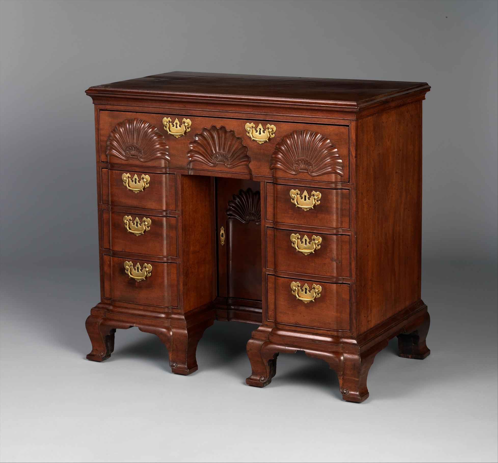

# Newport, Goddard, Townsend

<figure class="bbf-figure bbf-figure--plate">
  
  <figcaption>
    <strong>Blockfront bureau table</strong>, c. 1760 — Newport blockfront bureau tables in the Goddard and Townsend orbit.
    The Metropolitan Museum of Art, Open Access. CC0 1.0.
  </figcaption>
</figure>

The blockfront secretary is the postcard. The dining table is the working relative. In Newport, from the 1740s through the Revolution, the Goddard and Townsend families — Quaker, intermarried, a shop culture more than a single genius — made mahogany case furniture that American collectors later treated as a national school. They also made tables and chairs that held dinner. Those pieces share the same wood, the same stop-fluted legs, the same refusal to carve as wetly as Philadelphia, and they are easier to miss in a museum because they do not have a carved shell the size of a hand on every drawer.

Newport is a port. Mahogany arrives. So do enslaved people; Rhode Island’s merchants are deep in the triangular trade even when the joiners themselves are Quakers arguing about it. Anderson’s mahogany book and the city’s own later reckonings belong in the caption of any Newport leaf. A stop-fluted leg does not wash the harbor.

## A family, not a logo

John Townsend, John Goddard, and the cousins and in-laws around them left labeled case pieces and a documentary trail that still occupies Chipstone and the MFA. Labels on dining tables are scarcer. The honest phrase is often “Newport, Goddard-Townsend school” or “attributed to the shop of.” Construction tells: open talon claws of a particular thinness, stop-fluting that runs to a defined stop, a lightness in the rail, maple and chestnut secondary woods that are not Philadelphia poplar.

The famous shell on a blockfront is a case-furniture event. It migrates to a knee or a seat rail on seating only sometimes. A dining chair with a Newport shell is a prize. A dining chair with Newport proportions and no shell is still Newport.

Quaker plainness is a half-truth. These shops sold luxury to merchants who were not all Friends. The line is clean. The mahogany is thick. The luxury is the wood and the proportion, not a rococo riot. That is why a Newport table can sit in a later Federal room without shouting.

## What dinner looked like

Newport dining tables of the high Chippendale years are drop-leaves and rectangular swing-leg tables in mahogany, sometimes with a squared leaf that looks almost architectural. Open, they are large for the houses. Closed, they live against a wall in a parlor that may still do double work. The city’s wealthy houses could already spare a dining parlor; the furniture still knows how to fold.

Chairs: a splat that is pierced but more geometric than Philadelphia’s, a crest that is quieter, a seat that may be rush in the lesser line and haircloth in the greater. Stop-fluted straight legs appear as the cabriole wanes — a Newport habit that looks forward to Federal without being Federal. If you see stop-fluting on a tapered front leg under a dining table, you are in the late school, toward the 1780s and 1790s, when Phyfe’s New York is already a different city.

Marble slabs and serving tables exist in the inventories. The sideboard as a cabinet of drawers is the next hour. Newport will make Federal furniture too; the school’s fame stays with the earlier mahogany.

## Woods and the bench

*Swietenia* for show. Maple, chestnut, white pine for the hidden. Newport humidity is salt air; iron hinges weep; mahogany’s oil finish darkens. A Newport table that is still orange has been stripped. The old surface is brown, sometimes with a golden flash in the grain. French polish is a later skin.

Joinery: fine dovetails, thin drawer sides on the case pieces; on tables, well-cut swing-leg knuckles and rule joints. The school’s quality is consistency. A sloppy pintle on a “Townsend” dining table is a reason to walk away.

## How a stop-flute and an open talon are cut

Stop-fluting is layout before it is style. The carver or the joiner strikes lines down the leg, cuts the flutes with a gouge or a dedicated plane, and ends each flute with a carved stop — a defined termination, not a fade. Philadelphia fluting, when it appears, is a different hand. Newport’s is crisp and a little dry, the same dryness as the school’s casework.

The open-talon claw leaves air around the ball. The talons are thinner than a Philadelphia wrap. Heckscher and the Rhode Island literature treat that thinness as a school trait, not a cheapness. A fat, closed claw on a “Townsend” dining chair is a reason to keep walking.

Rails run lighter than Philadelphia’s. Chestnut — American chestnut, the tree that later vanished in the blight — is a Newport and southern New England tell when it is the real species. `[CITE NEEDED: a published wood-ID on a labeled Goddard or Townsend dining table confirming chestnut versus oak in the rails.]` Tulip poplar as the dominant secondary is a Mid-Atlantic sentence and a problem on a Newport claim.

## Why the dining table is not a blockfront

A blockfront is a drawer facade: three vertical planes, the center advanced, shells occupying the blocking. A dining leaf cannot take that architecture. It has to be a flat, scrubbable plane that meets another leaf in a rule joint. That is why the postcard secretary and the working table share a shop and do not share a face. Collectors followed the shell. Dinner followed the leaf.

A squared, almost architectural leaf is the Newport table’s own show — thickness and a clean edge, not a carved drawer front. Measure that thickness with your eye. Then look at the stop on the flute. The school’s quality is consistency on objects that never got a label.

## Iron, salt, and a late tapered leg

Salt air weeps through iron hinges. The staining around a hinge is a coastal document. A table that has lived inland for a century may have cleaner iron and still be Newport. French polish on a Newport leaf is a later skin. The old surface is brown with a golden flash.

After the occupation, shops that continued into Federal years made tables with stop-fluted tapered legs that look toward Hepplewhite without being New York. Those late tables are easy to underrate because they are not the postcard secretary. They are the school’s dining sentence at the hour the American dining room is being named. A Federal Newport table with a good rule joint and honest chestnut or maple secondaries is not a decline. It is a smaller town still cutting.

Friends’ Meetings in Rhode Island argued the slave trade while the shops sold mahogany to merchants who lived by it. The joiners’ discipline does not make a leaf innocent. A stop-fluted leg remains a luxury object in a port that sold people.

## Intermarriage as a timber yard

John Goddard married a Townsend. That sentence is in every catalog. What it means for a dining table is a shared way of stopping a flute, a shared secondary-wood habit, and a documentary trail that still occupies Chipstone. Labels stay on secretaries. Tables borrow the construction. The honest phrase remains “Goddard-Townsend school” or “attributed to the shop of.” A brass plate that says otherwise is often later.

The families were joiners, not a logo. Cousins and in-laws cut chairs as well as casework. A dining chair with Newport proportions and no shell is still Newport if the claw or the stop-fluting agrees. The shell is a case-furniture event. It migrates only sometimes. Seat rails on the better chairs are light and clean. A heavy Philadelphia rail on a “Townsend” chair is a problem the underside will state.

## The leaf as a cutting problem

Mahogany of the density Newport liked does not plane like maple. The squared, almost architectural leaf is a sawing and thicknessing job before it is a style. The edge has to meet a rule joint in a wood that wants to tear. Shops left the leaf thick enough to hold that joint after a century of scrubbing. A Newport table that has been thinned to look refined has lost the school’s argument.

Look at the underside color of the leaf against the rails. Maple and chestnut oxidize differently from poplar. If the hidden wood is a Mid-Atlantic green-and-purple tulip streak, ask why the table is wearing a Newport name.

## War and after

The British occupation of Newport (1776–1779) is a shop disaster. Families scatter. Wood sits. After the war the city’s commercial peak is already passing; Providence and New York take the wind. Goddard-Townsend shops continue, but the American dining story moves to Federal New York and to a sideboard that Newport did not invent. Late Newport Federal tables exist. They are not the postcard, and they are not a decline so much as a smaller town.

Enslaved and free Black labor in Newport shops is documented in the city’s wider craft world more clearly than on a particular dining-table bill. `[CITE NEEDED: a named Black joiner in a Goddard or Townsend shop account tied to a table.]` The port’s wealth is not separable from the trade. Say so and go back to the fluting.

If you are in a museum, look past the blockfront. Find the table. Measure the thickness of the leaf with your eye. Look at the stop on the flute. Then look at a Philadelphia claw in the next gallery. The two towns shared a book and did not share a hand. Dinner was the same meal. The legs were not.

## Sources

- MFA Boston and Yale Newport furniture catalogs; Chipstone essays on Townsend labels.
- Heckscher; Morrison Heckscher and others on Rhode Island cabinetmaking.
- Jennifer L. Anderson, *Mahogany*.
- Occupation dates: standard Newport histories, 1776–1779.
- Heckscher, *American Furniture in The Metropolitan Museum of Art, I. Late Colonial Period*, for the open-talon comparison with Philadelphia.

See also: [Philadelphia Chippendale dining](philadelphia-chippendale-dining.md), [Boston and Salem](boston-salem-colonial-dining.md), [Federal dining tables](federal-dining-tables.md), [Who made the table](enslaved-labor-dining-room.md).
