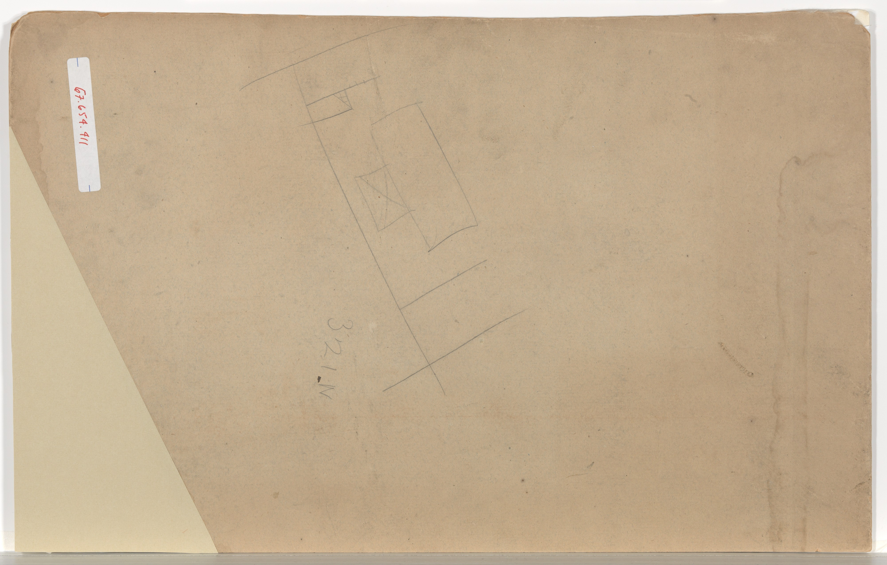

# Open plan and the lost dining room

<figure class="bbf-figure bbf-figure--plate">
  
  <figcaption>
    <strong>Design for a dining room</strong>, c. 1900 — Architectural dining-room plans before open kitchens absorbed the table.
    The Metropolitan Museum of Art, Open Access. CC0 1.0.
  </figcaption>
</figure>
Biddle’s 1805 plate gave the dining room a recess and a name. A century of American houses built that room, then a pantry, then a breakfast room. In the 1990s and after, builders took the walls down. The great room is a hall again: kitchen, sofa, and a table in one volume. The table may be an island with stools, a farmhouse trestle, a leftover formal suite under a fixture that now hangs in space. The specialized dining room survives in plans as an option and in older houses as a closed box people do not know how to use. Furniture follows volume. A sideboard needs a wall. An island needs a floor box.

This is not decline as a moral. It is a return to mixed use with different labor. No enslaved waiter. No butler. The cook is at the island and also a host. MESDA’s slab height comes back as quartz. The person standing there owns the house.

## Biddle’s recess, and the wall that held it

Owen Biddle’s *Young Carpenter’s Assistant* (Philadelphia, 1805) is the pin this series started with. Plate 36, a small house, still has no labels. Plate 37, a large house, letters the rooms and sends the reader to a key. There is a dining room at the rear of the principal floor, and a recess for a sideboard. Leslie Susan Berman’s 1997 Penn thesis isolates that plate as the American turn: from that point, room labels become normal in American builder’s books. The recess is as important as the name. A sideboard is not a table you put away. It wants a wall niche and a room that stays a dining room overnight.

The open plan deletes the recess by deleting the wall. There is nowhere for Hepplewhite’s board to stand that is not also the walk to the sofa or the walk to the refrigerator. A sideboard in a great room becomes a console behind a couch, or a place for a lamp and a bowl, or it dies. The Federal lockable board has no job if the plates live in the kitchen. Display china looks like a museum in a great room. People stop displaying.

Berman’s inventories (urban Philadelphia and New York, 1794–1855) tracked the dining room’s spread down the income ladder. The open-plan hour is the undo: a specialization that took a century to become ordinary, retired in a generation of spec houses. The retirement is not universal. Plenty of houses still have dining rooms. New traditional builders still draw them. What has gone is the assumption. A 1910 suburban house assumed a dining room. A 2015 house assumes an island and a table-shaped object.

## The island as slab table

A kitchen island is a worktable that became a dining table. People eat on the serving furniture. Charleston’s marble implied a server who did not sit. MESDA 3163, the Charleston sideboard table of 1750–1765 — mahogany, cypress, a marble slab — is the elite ancestor this series already named. The island implies a server who does sit, on a stool, at the same stone. The stool is a dining chair that lost its back’s authority. Breakfast, laptop, taxes, dinner. The hall table would recognize the jobs. It would not recognize the plumbing.

Islands are not in Hepplewhite. They are in contractor packages. Quartz, granite, butcher block, a waterfall edge, a microwave drawer. The furniture history is still real: height, wipeable top, seating on one side. A table that only seats one side is a counter. A table that seats two sides is a table. Many islands are counters. People still call the meal dinner.

Height is a fight. Kitchen counter height and dining height are not the same number. A stool at an island is a different sit than a chair at a table. Older hips know. Children’s elbows know. The household that eats every night at the island has chosen a counter over a table. The household that keeps a table in the same volume has chosen both, and the table has to look good from the sofa.

Look at the island’s overhang. A real dining overhang has knee space and a thickness you can live with. A fake overhang — a two-inch lip — is a plating space, not a place. Look at the supports. A single thick stem under a stone top is Saarinen’s slum-of-legs edit in quartz. Four posts are a table. A cabinet base is a counter with seats borrowed from a diner.

## What happens to the suite

Closed dining rooms become offices, playrooms, or unused theaters. The mahogany suite goes to the consignment store. The room, if kept, is for holidays — the 1950s formal pattern. Real-estate listings still say “formal dining.” Buyers still ask to take a wall out. Both are documents.

Wright’s Usonian table at the kitchen is an ancestor some architects claim. The Prairie essay owns those tables: a built-in, a fence of chairs, dinner as the event in a small house. Most great rooms are not Wright. They are a developer’s square footage. The Prairie essay’s fence of chairs does not work without walls. The farmhouse trestle does. So does the island. So does a leftover IKEA table that nobody photographed for the listing.

The butler’s pantry and breakfast room, when they existed, were the nineteenth and early twentieth centuries’ way to keep the dining room ceremonial. The open plan collapses the campus into one volume. Toast and Thanksgiving share a stone. That is efficient. It is also loud. A hard top in a hard room is a noise problem. Rugs return. Soft chairs return. The acoustics are a furniture brief the catalogs treat as a lifestyle paragraph.

## Furniture that can live in space

A table in a great room is seen in the round. The underside matters. So does the cable for a pendant. So does the path behind chairs — a servant’s path, except the servant is a guest with a plate, or a child with homework. A table that cannot be walked around is a table that has been sized for a closed room and dropped into an open one.

Studio furniture and one-off hardwood tables do well here: they are sculpture. IKEA does well: it is cheap sculpture. Antiques do less well unless they are the right scale. A Gilded Age board is a wall in a room that wanted glass. A gateleg is a clever, small refusal of the always-on table. A twelve-foot oak resident is a claim that dinner still has a place even without a door.

Pendants replace chandeliers. A crystal fixture hanging in a great room, over a gray trestle, is a 1955 object that outlived its ceiling. A cluster of industrial metal shades is a 2014 object. Recessed cans over a table are a lighting failure: they light the scalp. Look at the dimmer. Look at whether anyone can see anyone else’s face. Dining light is a furniture problem because the table is the source of the gathering. A room that lights the kitchen and leaves the table in a cave has chosen prep over dinner.

## The lost name

If the room has no name, the furniture’s history is harder to teach. This series started with the invention of the name. It ends, almost, with the name’s retirement. Almost: the option remains. Older houses keep the closed box. Some owners put the wall back. Some put a glass barn door on the old dining-room opening and call the result a compromise. The door was the nineteenth century’s idea. The door is not mandatory. The table is.

A 1925 Colonial Revival dining room, emptied of its suite and used as a zoom office, is still a dining room in the plan. The picture-rail and the centered fixture are the tell. A 2005 great room with a table against a sofa back is a hall that has not yet admitted it. Biddle would know the second house. He would not have a letter for it on Plate 37.

## How to look at a house, and at the table in it

If you are restoring a hundred-year house, you may have a dining room with a sag and a picture-rail. Keeping the room is a historical act. Deleting it is a historical act. Either act should know Biddle’s recess and the island’s slab.

Stand in the volume and ask where a sideboard would go. If the answer is “nowhere,” you are after the name. Ask where the plates live. If the answer is a kitchen drawer, the lockable board has been retired. Ask where Tuesday dinner happens. If the answer is the island, the table in the next zone is a holiday object or a homework desk — the 1950s split without the door.

Look at the table from the sofa. Does the underside embarrass the room? Does the base make a slum of legs, or a slum of one welded frame, or a single stem? Look at the chairs from the kitchen. Do they fence the table (Wright’s habit) or float (the farmhouse photograph)? Look at the floor under the table for caster tracks and for a rug that is trying to make a room without walls.

The furniture you put in will argue. A gateleg in a great room is a small refusal. A twelve-foot oak resident is a claim. An island with no table is a counter that hosts dinner. All three are American. The specialized room was a long argument, from Pain’s English plates through Biddle’s key to the suburban closed box. The open plan is a different argument, not an ending. Houses will keep drawing dining rooms. They will also keep taking the wall down. The table, named or not, is the piece that has to survive both drawings.

## Sources

- Owen Biddle, *The Young Carpenter’s Assistant* (Philadelphia, 1805), Plates 36–37.
- Leslie Susan Berman, *The Evolution of the Nineteenth-Century American Dining Room* (University of Pennsylvania, 1997) — the specialization this hour undoes.
- Builder and shelter-magazine open-plan discourse, 1990s–2010s.
- MESDA 3163 as the slab ancestor of the island; Wright Usonian plans as an elite ancestor; developer plans as the volume.

See also: [The dining room is invented](the-room-is-invented.md), [Butler’s pantry and breakfast room](butler-pantry-breakfast-room.md), [Farmhouse and industrial tables](farmhouse-industrial-2010s.md), [How to read an American dining table](reading-a-table-now.md).
