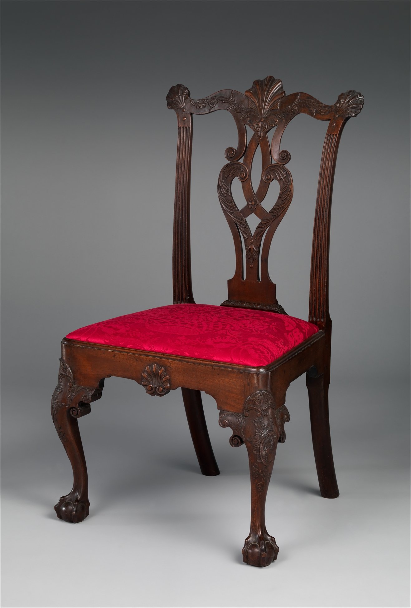

# Philadelphia Chippendale dining

<figure class="bbf-figure bbf-figure--plate">
  
  <figcaption>
    <strong>Chippendale carved mahogany side chair</strong>, c. 1765 — Philadelphia carving vocabulary at the Chippendale dining chair.
    The Metropolitan Museum of Art, Open Access. CC0 1.0.
  </figcaption>
</figure>

Thomas Chippendale never kept a bench on Second Street. What Philadelphia had, after 1754, was a book: *The Gentleman and Cabinet-Maker’s Director*, plates of chairs, tables, and case furniture that a shop could pirate, thicken, and make American. The dining parlor that comes out of those shops is mahogany on the show faces, tulip poplar and pine in the hidden ones, claw-and-ball feet on the chairs, and a drop-leaf or a large rectangular table that still folds because the room is not always a dining room yet.

Philadelphia Chippendale is a chair story that got famous. High chests and dressing tables took the collectors. Dining tables are the quieter survivors: wide leaves, swing legs, a straight or lightly shaped skirt, sometimes a drawer. They do not pierce like a splat. They hold weight. The chairs around them are where the *Director* is loud.

## The book and the bench

The *Director*’s first edition is 1754; later editions add plates. American shops owned copies, borrowed them, and also owned English chairs that had already digested the plates. What they did not do is copy line-for-line. Philadelphia chairs grow heavier in the splat, more plastic in the carved knee, more sure in the claw than a London chair of the same plate. That surplus is the school: Benjamin Randolph, Thomas Affleck, Jonathan Gostelowe, the shops around them, a city of carvers who could make a ball-and-claw that closes.

A dining chair with a pierced splat, a yoke or cupid’s-bow crest, and a trapunto seat is the type. Haircloth — black horsehair — is the formal upholstery Chippendale himself sold and Hepplewhite later prescribed. It shines. It scratches. The Met’s later Phyfe labels are honest about that shine. Philadelphia in 1765 already wanted it.

Attribution to a named shop is a specialist’s fight. Construction details — the way a rear rail is through-tenoned, the shape of a glue block, the carving of a claw’s webbing — are the evidence. A dining-room essay that slaps “Randolph” on every hairy paw is doing auction work. Say Philadelphia, then qualify.

## The table under the cloth

Large mahogany drop-leaves, sometimes with a squared or serpentine leaf, sit on cabriole legs that have learned the claw. Swing legs still solve the open span. Some tables use six legs: four fixed, two swing. The underside is poplar or pine, the hinges heavy, the rule joint still the quality line. A Philadelphia leaf can be a true mahogany slab. It can also be two boards carefully matched. Crotch veneer is not yet the Federal habit. Solid is the hour.

Marble slab tables — serving tables, not dining tables — take the wall. They are ancestors of the sideboard and already imply a person standing to serve. In Philadelphia that person may be a hired servant or, in some households, an enslaved worker. The city is a port in a colony that still holds people. The labor essay returns to names. Here, the slab is the furniture of that standing.

Pierced stretchers and Chinese fret appear more often on tea tables and china tables than on the dining leaf. Keep the *Director*’s chinoiserie on the objects that actually received it. A dining table with a full Gothic fret apron is rarer and should be argued, not assumed.

## Woods, humidity, war

*Swietenia* — West Indian mahogany — is the show wood. Anderson’s *Mahogany* is the book for the enslaved cutting and the Atlantic price. Philadelphia’s humidity is a different problem: wide leaves cup. Shops left them thick. Later restorers thin them and then wonder why they move. Poplar secondary wood stains green and purple; a refinisher who sands through a repair shows the tulip streak. That streak is a Philadelphia passport.

The Revolution is inside this hour. Affleck was a Loyalist. Shops closed, reopened, lost clients who fled, gained clients who stayed. A table dated “1778” on a tag without a paper trail is a wish. Construction does not stop for a war, but mahogany supply and merchant money wobble. `[CITE NEEDED: Philadelphia customs or shop-book mahogany volumes 1775–1783.]`

## How a claw is carved

The ball-and-claw is a carving sequence, not a stamp. The carver gets a squared or already-cabriole foot, lays out the ball, and cuts the talons so they grasp. Philadelphia claws of the good shops close: the talons wrap, the webbing between them is thin enough to read as skin, the ball is a sphere that has weight. A cheap claw is a suggestion — three grooves and a lump. A Newport claw is a different animal: more open, more linear, the talons often leaving more air around the ball.

The knee carving is the other half. A shell or frilled leaf on the knee, cut after the rail joinery is in, has to meet the cabriole’s curve without making the mortise a weak hole in a thin wall. Glue blocks behind the knee are original more often than collectors want; they are structure. A missing block and a cracked knee are a pair.

Hairy-paw feet exist in the Philadelphia orbit and get over-attributed to Randolph. Rear legs on dining chairs are often plainer, sometimes ending in a stump or a smaller pad, because they take less show and more scrape. A set with four identical show claws on every chair, including the rears, wants a second look. Some shops did that. Many did not.

## Haircloth in August, and the bill that is not a suite

Philadelphia piercing tends to keep more wood than a London plate of the same idea; the splat is a structural back, not a drawing that forgot the sitter. Haircloth is durable, shiny, and unpleasant in a humid August, which is why rush and later cane keep a place even in houses that own haircloth.

Armchairs — if they exist — bookend the table and fight the swing legs. A modern dealer suite of table plus eight identical claws is a twentieth-century assembly more often than an eighteenth-century bill. `[CITE NEEDED: a Philadelphia shop book or bill of sale that lists a dining table and a matching set of chairs as one commission before 1776.]`

## The serving wall in a brick house

Pennsylvania’s gradual abolition begins in 1780; the Chippendale hour is not free of unfree labor because the city later became a free-labor capital. The person standing at a marble slab in a Society Hill house may be hired, indentured, or enslaved.

The high chest that made Philadelphia famous is usually in a chamber, not in the dining parlor. Collectors followed the high chest. Dining tables followed the food. That is why the literature is thinner on the leaf than on the bonnet top. Walk from the chair’s claw to the table’s swing leg. If they were never meant for each other, the room will tell you: seat height versus apron, the swing leg in a shin, mahogany that does not match because it never did.

## The carver and the cabinet shop

Philadelphia’s Chippendale hour is a city of specialists. A chair may be a cabinetmaker’s frame and a carver’s claw. Names on this page — Randolph, Affleck, Gostelowe — are shop names, not proof that one man cut every talon. Chipstone’s *American Furniture* essays on Philadelphia carving treat the webbing, the through-tenon, and the corner block as evidence because labels are scarce and auction wishes are not.

The *Director* had three London editions in Chippendale’s life (1754, 1755, 1762). American shops owned copies and also owned English chairs that had already digested the plates. Dining tables get fewer plates than chairs. What the book gave dinner was a language for the seating and a permission to thicken the claw. The leaf remained a local engineering problem: swing legs, a rule joint, poplar underneath.

A through-tenon on a rear seat rail is a dining-chair joint. It shows on the back stile if you look. The pin or wedge that locks it is older than a screw. A rail that ends in a hidden stub tenon and a later steel bracket is a chair that has been to a kinder shop than the one that made it.

## The parlor problem

A Chippendale dining parlor in a Society Hill house may still be a front room that does other work. The high chest in the same house is in a chamber. The dining chairs may be a set of eight that migrate. Matching is a modern expectation. Inventories list “6 mahogany chairs” and “1 dining table” without promising they were bought on the same Tuesday.

After the war the plates change. Hepplewhite and Shearer will give the sideboard a drawing. The splat will become a shield. Mahogany will stay. Philadelphia Chippendale chairs will keep being made into the 1790s in conservative shops, the way Queen Anne chairs lingered. A claw foot on a 1795 rail is late, not impossible.

If you stand a Philadelphia chair next to a Newport chair of the same decade, the Philadelphia carving is wetter, the Newport more linear, the Boston more reserved. That triangle is the next two essays. The dining table in all three towns is still a leaf. The revolution in the table — pedestal, D-end, sideboard wall — is Federal. Chippendale’s gift to dinner is the chair you can recognize from across the room, and the mahogany leaf that finally looks like money even when it is folded.

Look at the claw from the floor. If the talons grasp a ball that has no flat from wear, the chair has been on a carpet in a collection. If the ball is worn to a pad, people ate. Prefer the worn ball.

## Sources

- Thomas Chippendale, *The Gentleman and Cabinet-Maker’s Director* (1754 and later).
- Heckscher, Met late colonial catalog; Philadelphia Museum and Winterthur Chippendale rooms.
- Jennifer L. Anderson, *Mahogany: The Costs of Luxury in Early America* (2012).
- Chipstone *American Furniture* on Philadelphia carving and shop attribution.
- George Hepplewhite, *The Cabinet-Maker and Upholsterer’s Guide* (1788), on haircloth as later prescription.
- MESDA 3163 as the Charleston cousin of the Philadelphia serving slab.

See also: [Queen Anne walnut](queen-anne-walnut-dining.md), [Newport, Goddard, Townsend](newport-goddard-townsend-dining.md), [The sideboard arrives](hepplewhite-sideboard-arrives.md), [Dining chairs, splat to ladder](dining-chairs-splat-to-ladder.md).
