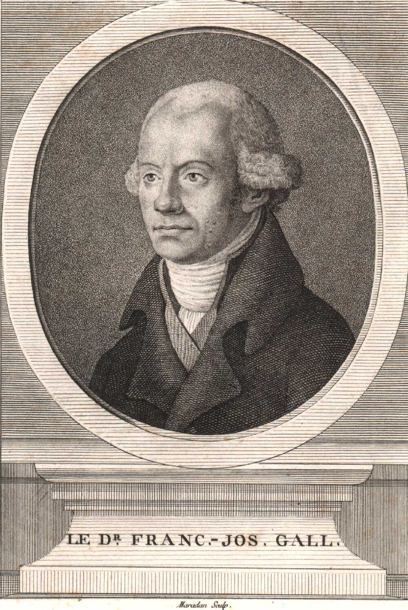

This is history for a general reader. It is not a diagnosis, not a treatment plan, and not a substitute for care with a licensed clinician.

<!-- figure-id: franz-joseph-gall.lead-portrait -->
<figure class="slpwow-figure slpwow-figure--portrait">
  
  <figcaption>
    <strong>Franz Joseph Gall</strong> (1758–1828), Viennese physician associated with cranioscopy and early localization debates that preceded modern aphasia maps.
    Stipple engraving. Wikimedia Commons. Public domain.
  </figcaption>
</figure>

Franz Joseph Gall was born in Tiefenbronn in 1758 and died in Paris in 1828. He trained in Vienna, lectured on the skull until the lectures became a scandal, and moved his collection and his doctrine west. In Paris he was a celebrity and a problem. He taught that the mind was a set of organs in the convolutions, that the organs could enlarge the bone, and that a careful hand on a living head could read the organs. Language — the memory of words, the faculty of speech — had a place. He liked the orbital frontal region, on the evidence of talkers and of people whose speech had failed.

The doctrine is now a museum of errors with a few load-bearing beams still in the floor.

## What to keep

Cortex as the organ of mind, against a ventricular soul. Faculties as separable, at least in principle. Lesions as theoretically informative, even if Gall trusted the bump more than the ward. Bouillaud and Broca could not have had their fight without that permission. A history of aphasia that starts in 1861 and treats Gall as a joke is starting in the middle of someone else’s sentence.

## What to leave in the same vita

The traveling skulls. The public readings. The criminal and racial types that later measurement culture would refine into worse science. Phrenology’s popular face was a commercial psychology of character. Gall is not innocent of that face. Johann Spurzheim popularized and exported; Gall wrote the heavier books (*Anatomie et physiologie du système nerveux*, with Spurzheim, from 1810). A profile that prints only the language organ is making a mascot for localization.

He also argued with Pierre Flourens, who preferred the whole brain and a knife in a pigeon. The argument — parts versus whole — will still be running when Goldstein flees Frankfurt. It did not begin as a VA quarrel.

## Residue

Every time a student says “Broca’s area” as if a bump had learned to be honest, Gall is in the room. Every time a clinician refuses to read character from a scan, Flourens is in the room. The useful Gall is the man who made cortex thinkable as mind. The discarded Gall is the man who sold the thinkable as a tour.

## Portrait

Lead plate: `assets/portraits/franz-joseph-gall.jpg`. Rights: `assets/portraits/franz-joseph-gall.RIGHTS.md`.

## Collection and laugh

The traveling skulls are not a cute exhibit. They are how a doctrine ate dinner. Spurzheim popularized; Gall wrote the heavier *Anatomie et physiologie du système nerveux* (from 1810). Flourens’s knife in a pigeon is the other pole of the argument — parts versus whole — and will still be running when Goldstein flees Frankfurt.

A 2026 clinician who refuses to read character from a scan is answering the circus half. A 2026 student who says “Broca’s area” as if a bump had learned to be honest is still in the lecture hall Gall opened. Keep both answers.

Vienna made the lectures a scandal. Paris made them a living. The language organ sat among organs for theft and music because the method did not know how to be only about speech. Later localization kept the cortex and tried to forget the tour. Forgetting the tour is how a student gets a tidy Broca. Remembering the tour is how a clinician refuses to read character from a scan.

**Further in this series.** Organs before the autopsy (02). Bouillaud (20).
