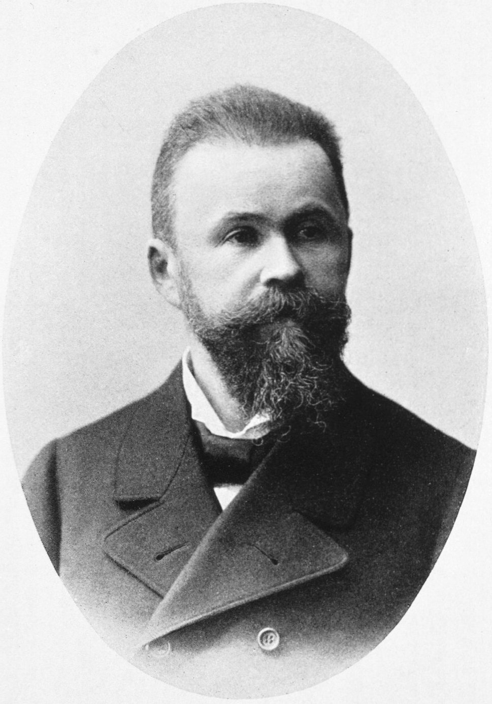

This is history for a general reader. It is not a diagnosis, not a treatment plan, and not a substitute for care with a licensed clinician.

<!-- figure-id: carl-wernicke.lead-portrait -->
<figure class="slpwow-figure slpwow-figure--portrait">
  
  <figcaption>
    <strong>Carl Wernicke</strong> (1848–1905), Breslau neurologist who mapped receptive language loss to the left temporal region in 1874.
    Published by J. F. Lehmann; NLM Images from the History of Medicine / Wikimedia Commons. Public domain.
  </figcaption>
</figure>

Carl Wernicke was born in 1848 in Tarnowitz, in Upper Silesia, and died in 1905 in the Thuringian forest after a bicycle accident — a death so un-syndromic that students who only know the temporal lobe still blink. He was twenty-six when *Der aphasische Symptomencomplex: Eine psychologische Studie auf anatomischer Basis* appeared in Breslau (Cohn & Weigert, 1874). The pamphlet gave medicine a fluent failure, a superior temporal seat, and a connecting tract whose break would be called conduction aphasia.

He had trained in the orbit of Theodor Meynert’s anatomy, which made fiber and cortex thinkable as a single problem. The 1874 psychology is associationist: a word as a learned link between a sound-image and a motor-image. Destroy one image, or the link, and the clinical picture should change. The anatomy is a bet that those images live in places you can point to.

## The clinic, not only the pamphlet

Wernicke became a professor and a textbook writer, a man of the German psychiatric-neurological service, not a Paris society ornament. Breslau was a serious provincial machine. Later he moved, taught, built a reputation that outgrew the town. The syndrome name traveled farther than the hospital.

Sensory aphasia is easy to mock from a doorway. The person talks. The words miss. Families hear fluency and assume either comedy or dementia. Wernicke’s better page insists the failure is lawful. Later textbook cartoons of a “confused chatterer” are not his best page. Clinicians who have sat with fluent emptiness know the dignity problem is the clinical problem.

“Wernicke’s area” has been redrawn under every new scanner. Some temporal lesions are not fluent. Some fluent failures live elsewhere. The 1874 triangulation remains the event: there is more than one way to lose language, and comprehension can fail while the mouth still runs.

## Residue

Geschwind’s 1965 papers are, in one mood, a long American footnote to this pamphlet. Lichtheim’s house is a systematization of it. Head’s insult to the diagram-makers is a refusal of it. The man on the bicycle does not have to carry all of that. He wrote a short book at twenty-six and then lived a career. The short book is why the career is remembered.

## Portrait

Lead plate: `assets/portraits/carl-wernicke.jpg`. Rights: `assets/portraits/carl-wernicke.RIGHTS.md`.

## Lawful fluency

A family that hears fluency and assumes comedy, or assumes the mind is gone, is living inside the dignity problem Wernicke named without naming dignity. The 1874 types are a first triangulation, not a finished map. “Wernicke’s area” has been redrawn under every scanner. Some temporal lesions are not fluent. Some fluent failures live elsewhere.

The bicycle death in 1905 is not a metaphor. It is a reminder that the man was a body in Thuringia, not a temporal lobe with a publisher. Breslau’s hospital was a confinement machine as well as a clinic. Sensory aphasia was a housing problem. The pamphlet does not say that. A profile should.

Meynert’s anatomy made the 1874 psychology thinkable. Association is a period style. The style leaked into every later flowchart that treats a word as a link. Cognitive neuropsychology changed the furniture and kept the question: which link failed? Breslau’s twenty-six-year-old is the person who asked it in public, in a pamphlet short enough to underestimate.

**Further in this series.** Breslau, 1874 (04). Lichtheim (23). Geschwind (38).
