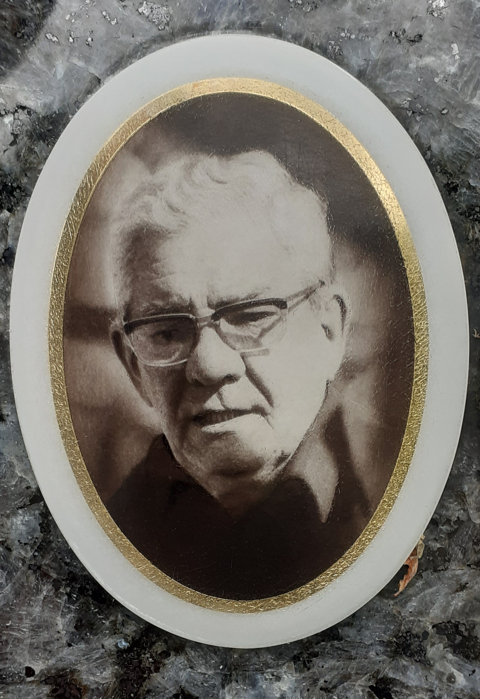

This is history for a general reader. It is not a diagnosis, not a treatment plan, and not a substitute for care with a licensed clinician.

<figure class="slpwow-figure slpwow-figure--portrait">
  
  <figcaption>
    <strong>Pierre Marie</strong> (1853–1940), Third Republic–early twentieth century — Salpêtrière neurologist whose 1906 revision challenged narrow Broca–Wernicke maps.
    Wikimedia Commons contributors. CC BY-SA 4.0 — attribute on reuse; share alike if adapted.
  </figcaption>
</figure>

Pierre Marie was born in 1853 and died in 1940. He had been Charcot’s student, which in Paris is a passport and a burden. He wrote about acromegaly, about the neurology of the time, and, in 1906, about aphasia in a tone that picked a fight on the title page. “La troisième circonvolution frontale gauche ne joue aucun rôle spécial dans la fonction du langage.” The *Semaine médicale* offprint (23 May 1906) is thirty-eight pages of autopsy argument and definition argument glued together.

He wanted aphasia to be one intellectual wreck. What the textbooks called Broca’s aphasia was, in his telling, that wreck plus anarthria — a paralysis of the speech act, not a separate faculty in a lump of gyrus. He had cases in which Broca’s area was damaged and speech was not. He enjoyed the cases.

## The chair

Jules Déjerine answered. The 1908 Société de Neurologie debate did not vote the gyrus out of existence. When Déjerine died in 1917, the chair went to Marie. Augusta Déjerine-Klumpke did not inherit the institutional story. Later historical papers have been blunt about hospital politics after the debate. A profile that treats 1906 as only epistemology is being polite to a knife fight.

Marie did not kill the inferior frontal gyrus as a language region. Later maps kept finding something there. He did kill, for anyone who was listening, the idea that a convolution is a throne you can will to a student. The title is rude on purpose. Rude titles are sometimes the only way a settled lecture notices itself.

## Residue

Every “Broca’s” that comes with an apology owes Marie a nickel. Every clinician who has seen a frontal lesion without the textbook silence owes him a larger coin. Keep the coin. Keep the politics in the same pocket.

## Portrait

Cleared plate: `plates/pierre-marie/plate.*` with rights record `plates/pierre-marie/RIGHTS.md`. Lead embed is the `<figure>` block above. Do not colorize. Do not invent or generate a substitute likeness.

## Anarthria as a knife

Marie’s scheme — one intellectual wreck plus a paralysis of the speech act — did not win the classroom. It did win a chair. The 1906 title is rude because a polite paper would have been filed. Later maps found language-sensitive cortex in the gyrus he insulted and also far from it. He gets a nickel, not the building.

The Salpêtrière story after 1917 includes Augusta’s treatment. A profile that stops at epistemology is being polite to a knife fight. Keep the knife in the same pocket as the offprint. Wellcome’s Public Domain Mark on the 1906 pamphlet is a later editor’s friend. The patients in the slides were not marked public domain. They were ill.

Charcot’s student is a passport that can become a manner. Marie’s manner was demolition. Sometimes demolition is data. Sometimes it is a personality with autopsies attached. The 1906 offprint is both. A later clinician who says “Broca’s” and then looks at the whole person is spending Marie’s nickel without owing him the chair.

**Further in this series.** The 1906 revision (07). Jules Déjerine (27). Augusta (28).
