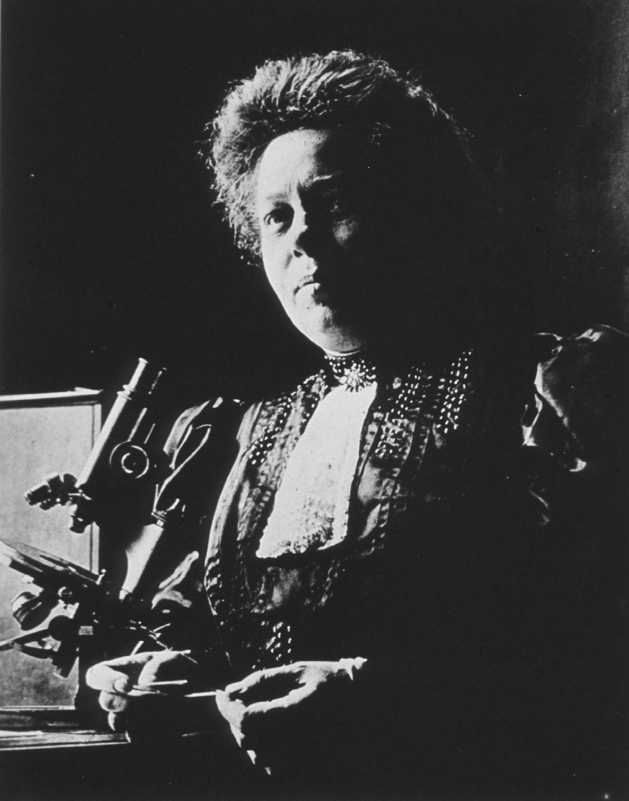

This is history for a general reader. It is not a diagnosis, not a treatment plan, and not a substitute for care with a licensed clinician.

<figure class="slpwow-figure slpwow-figure--portrait">
  
  <figcaption>
    <strong>Augusta Déjerine-Klumpke</strong> (1859–1927), Belle Époque–early twentieth century — neurologist and co-director of the Déjerine clinic, not merely “Mrs. Déjerine.”
    NLM Images from the History of Medicine. Wikimedia Commons. Public domain.
  </figcaption>
</figure>

Augusta Klumpke was born in San Francisco in 1859, educated in Europe, and became one of the first women to navigate the Paris internat. She married Jules Déjerine. She also, independently of the marriage as a sentimental fact, produced neurological work that the late nineteenth century tried to file under his name and that later historians have had to pry back out. She died in 1927.

The Klumpke palsy — lower brachial plexus — is the eponym that textbooks kept because it was hard to steal. The aphasia story is easier to steal. She worked on the plates of *Anatomie des centres nerveux*. She worked the wards. She was in the weather of the 1906–1908 fight. After Jules’s death and Marie’s inheritance of the chair, her place at the Salpêtrière became a political fact. Recent papers (including work on her expulsion) are blunt. This profile will not pretend the hospital was a seminar.

## Why she is in an aphasia series

Because the 1908 debate had more than two voices, and one of them knew the plates. Because localization’s finer map was a household labor as well as a husband’s reputation. Because a series that prints Jules and Marie as a duel of men is repeating the minutes’ bias. Because women in this history are so often patients or helpmeets that a woman who was neither only those things has to be written in full sentences.

She was not a speech therapist. She did not invent a battery. The residue is the insistence that the map had more than one cartographer, and that the cartographer who was a woman got the plexus eponym and a long wait for the rest.

Scientific mobility — an American-born woman in Paris, a Protestant-adjacent household in a Catholic capital — is part of the vita. So is the ordinary grind of being twice as good and still introduced as Madame Déjerine.

## Portrait

Cleared plate: `plates/augusta-dejerine-klumpke/plate.*` with rights record `plates/augusta-dejerine-klumpke/RIGHTS.md`. Lead embed is the `<figure>` block above. Do not colorize. Do not invent or generate a substitute likeness.

## Eponyms and minutes

The plexus eponym survived because it was hard to steal. The aphasia labor was easier to file under Jules. Recent papers on her expulsion from the Salpêtrière after the chair changed hands are part of the record this series will not soften into a marriage plot.

An American-born woman in the Paris internat, a worker of plates, a person in the 1908 weather — that is a scientific life. Introducing her as Madame Déjerine first is a failure of the minutes. Caption the full name. If a later double portrait is used, do not crop her out of it.

San Francisco to the internat is not a colorful opener. It is a scientific mobility the minutes treated as exotic and then as inconvenient. The plexus eponym is the thing they could not refile. The aphasia plates are the thing they could. This series files them back under her name, which is a small correction and the only one a magazine can make without a hospital key.

**Further in this series.** The 1906 revision (07). Jules Déjerine (27).
