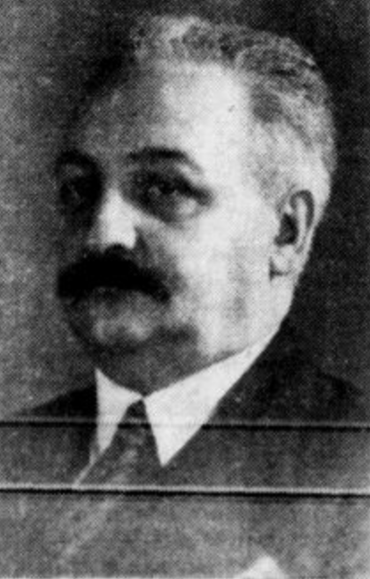

This is history for a general reader. It is not a diagnosis, not a treatment plan, and not a substitute for care with a licensed clinician.

<figure class="slpwow-figure slpwow-figure--portrait">
  
  <figcaption>
    <strong>Théophile Alajouanine</strong> (1890–1980), interwar French neurology era — Salpêtrière clinician linked to transcortical aphasia and wartime rehabilitation.
    Courrier royal, via Retronews / Wikimedia Commons. CC0 1.0.
  </figcaption>
</figure>

Théophile Alajouanine was born in 1890 and died in 1980. He is the French clinician who, after Marie and after the war, made the *sound* of aphasic speech a scientific object again. The 1939 work on phonetic disintegration — with André Ombredane and others in the usual citation cluster — argued that some of what English textbooks later filed under “apraxia of speech” or “phonetic disintegration in Broca’s aphasia” was a lawful coming-apart of articulated sound, not only a missing word.

French aphasiology in his decades is a clinic culture: the Salpêtrière weather, the students (including later names like François Lhermitte and André Roch Lecours), the habit of sitting long enough to hear whether the error is a language error or a speech error. English-language SLP programs often meet this late, through “motor speech” rather than through Alajouanine’s pages.

## Why the sound matters

Broca’s 1861 remarks were about articulated language as a faculty. Alajouanine’s generation asked what “articulated” meant in the mouth of a living person. The answer is not a home exercise. The answer is a distinction that later Mayo motor-speech work and later apraxia debates still live inside. Darley’s dysarthria clusters are an American cousin, not a child. Keep the cousinry honest.

He also wrote about artists and writers whose language or skill changed after brain disease — a literature that can become souvenir-hunting. The better pages stay with the clinic. This profile stays with the clinic.

## Portrait

Cleared plate: `plates/theophile-alajouanine/plate.*` with rights record `plates/theophile-alajouanine/RIGHTS.md`. Lead embed is the `<figure>` block above. Do not colorize. Do not invent or generate a substitute likeness.

## Sound as a clinic object

French aphasiology after Marie had a habit of sitting long enough to hear whether the error was a language error or a speech error. Alajouanine’s 1939 phonetic-disintegration work, with Ombredane and the usual citation cluster, made that hearing a paper. English SLP programs often meet the distinction late, through “motor speech” and Mayo clusters. Darley is a cousin, not a child.

The artist-and-writer essays are a temptation. Souvenir-hunting is not this series’ job. The clinic is. Lecours and Lhermitte later carried the French ear into a bilingual, international literature. Alajouanine is the teacher in that corridor. He did not write a home program. He wrote a way to listen to a wrecked syllable without calling it a missing word too soon.

1890–1980 is a long French clinic. Marie is the rude grandfather in that clinic. Alajouanine is the person who made the syllable a thing you could write down without immediately calling it a word. English “apraxia of speech” debates later occupied some of the same ground with different flags. Plant the French flag first. Then admit the cousinry. Then refuse a home program. The ear is the inheritance, not a drill.

**Further in this series.** Marie (26). The test cabinet’s later motor neighbors (11).
