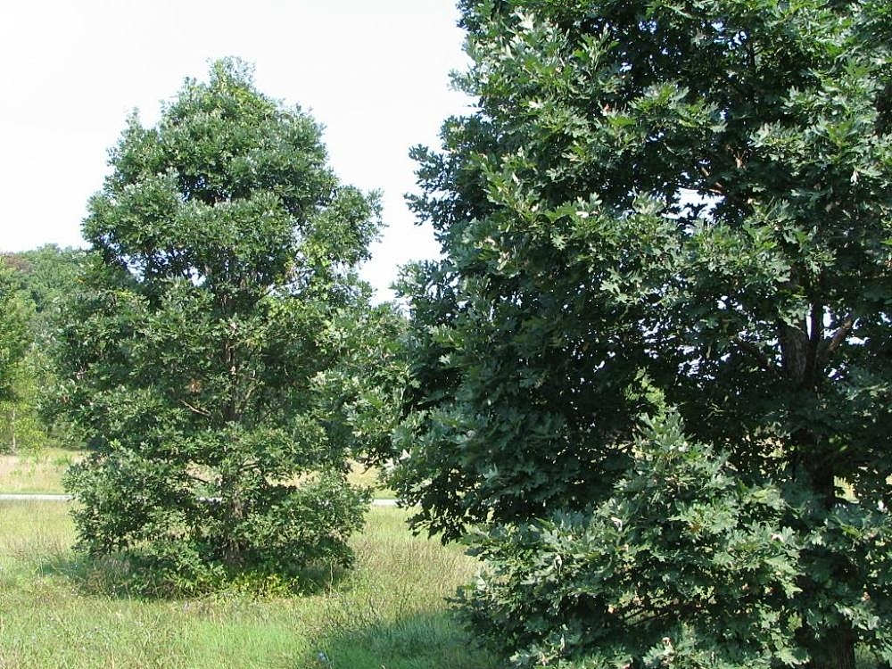

<figure class="asw-figure asw-figure--species">
  
  <figcaption>
    <strong>White oak</strong> (<em>Quercus alba</em>) — upland Arkansas hardwood with closed pores and cooperage-grade tyloses.
    Photo by David J. Stang. CC BY-SA 4.0. Wikimedia Commons.
  </figcaption>
</figure>

You can walk an Ozark ridge in January and still pick the white oaks without
looking up. The bark is pale and blocky. The leaves that hung on through
Christmas are the ones with rounded lobes, not points. The tree does not
advertise. It just occupies the ground that does not flood.

That is the first property, and it is a landscape property before it is a
shop one. *Quercus alba* wants upland. In Arkansas that means the Ozarks and
the Ouachitas, the oak-hickory type that still covers something like two-fifths
of the state’s forest. Down on the Coastal Plain it shows up, but as a
component in mixed pine-hardwood, not as the main canopy the way it does on
those ridges. Extension foresters have said this plainly: white oak is most
prevalent where flooding is not common. A furniture maker who treats “Arkansas
oak” as one pile is already lying to the board.

The wood itself is heavy. Handbook specific gravity around 0.68 at twelve
percent moisture. About forty-seven pounds a cubic foot if you like the
English number. Janka hardness sits near 1,360 pounds. That is harder than
walnut, harder than cherry, a little harder than northern red oak, and a lot
harder than the southern yellow pine that built the towns south of the
Ouachitas. You feel it in the first plane pass. The iron wants to skate, then
it takes a shaving that looks like a pale ribbon with a green-brown cast. Fresh
white oak smells like tannin and wet cellar, not like the sweet of cherry.

It is ring-porous. Earlywood pores are large enough to see across the room on
a flatsawn face. Latewood is dense. The medullary rays are wide. That last
fact is why quartersawn white oak became a style and not just a sawing method:
the rays flash. Flatsawn, you get cathedral grain and a board that will cup if
you let one face take water and the other take a kitchen vent. Quartersawn,
you get a quieter face, more stable width, and those flakes. The stability is
not magic. Radial shrinkage, green to oven-dry, is about 5.6 percent.
Tangential is about 10.5. The T/R ratio is ugly if you saw everything on the
tangent and then build a wide tabletop in a house that runs the air
conditioner all summer and a wood stove in January. The same numbers are why
a quartersawn apron on a dining table outlasts a flatsawn one in this climate.

Heartwood is gray-brown when it has sat in the rack. Sapwood is a strip of
near-white, an inch or two, sometimes more on a fast second-growth tree. The
heartwood has a reputation for durability that is earned outdoors in posts and
ties and not quite the same indoors, where durability mostly means “does not
dent when a chair back hits it.” Indoors the real gift is the closed pores.
Tyloses — balloon-like growths that plug the vessels — make white oak the
cooper’s wood. They also make a tabletop that does not drink every drop of
tea the way red oak will. You can still raise the grain. You can still get
iron stain if a wet clamp and a steel bar spend the night together. But the
wood is not a bundle of open tubes.

Arkansas mills have treated the white oak group as one item for a long time.
The 1912 Forest Service bulletin on the state’s wood-using industries listed
true white oak, post oak, bur oak, overcup, swamp white, and cow or basket oak
under a single heading, and said there was not much difference in the woods
and they were seldom sold separately. That was a mill truth. It is not a
bench truth. Post oak from a dry Ouachita slope is a different creature from
overcup out of a White River bottom. *Q. alba* from a slow Ozark stand is
tighter-ringed and usually the one you want for a show face. The group
identity is useful for a tally sheet. It is lazy for a dining table.

In 2018 the white oak group was about twenty-one percent of the hardwood
volume coming into Arkansas mills, and thirty-eight percent in the Ozark
region alone. That is not a romantic number. That is the current fact of the
woods. Furniture is only one of the mouths on that volume. Flooring, ties,
handles, paper, and — uniquely — barrel staves all pull on the same trees.
The stave market pays. Furniture gets what the stave buyers do not take, or
what a small mill will saw for a local shop. If you are hunting wide, clear
*alba* in this state, you are hunting against bourbon as well as against
cabinets.

I have a habit of knocking a sample on the bench before I trust a invoice.
White oak answers with a short, hard note. Pine thuds. Cypress is almost
soft. Walnut is in between and a little waxy. The knock is not science. The
handbook is science. Both are useful. If the board is heavy, pale-brown,
ring-porous, and the end grain shows vessels that look plugged, you are in
the white oak group. If the rings are tight and the rays are bright on a
quartered face, you have something Arkansas has been turning into furniture
since before Fort Smith had a factory, and will keep turning as long as those
ridges keep growing oak instead of loblolly.

The workhorse does not need a speech. It needs to be sawn the way the
movement numbers ask, dried to the house it will live in, and not confused
with every other oak that rode the same truck.
