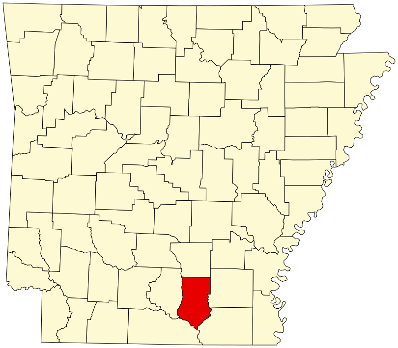

# The peninsula between the rivers

Stand on a low rise south of Warren in late summer and the county does not announce itself as a mill town. It announces itself as water. East, the Saline slides toward the Ouachita under a lid of hardwood. Southwest, the Ouachita itself takes the long bend that will become, farther down, the green-tree reservoir at Felsenthal. The *Encyclopedia of Arkansas* still uses the old surveyor's word: Bradley County sits at the lower end of the peninsula formed by the union of those two rivers. A peninsula is a boast made by silt. It is also a trap. Before a railroad, timber that could not float was almost not timber.

<figure class="blog-figure">
  
  <figcaption><strong>Figure.</strong> Bradley County between the Saline and Ouachita — orientation schematic only. <em>Not a surveyed plat.</em></figcaption>
</figure>

<figure class="blog-figure">
  
  <figcaption><strong>Figure.</strong> Bradley County within Arkansas. Wikimedia Commons contributors, public domain.</figcaption>
</figure>

The West Gulf Coastal Plain does not dramatize itself. Sandy hills. Shortleaf pine on the warmer slopes. Bottomland hardwood in the wet. About 140 archaeological sites are listed for the county — camps, mounds, cemeteries — and the record runs past ten thousand years. After about A.D. 1000 people here raised domesticated crops. The descendants most often named are the Tunica and, possibly, the Quapaw. The 1818 Quapaw reservation, a million acres on paper, already described a people who were no longer living in this particular bend; they ceded the land in 1824. The rivers kept the older memory. French colonial hunters left camps that the documents barely catch. In 1804 the Dunbar and Hunter expedition passed up and down the Ouachita, writing the kind of careful water that later mill owners would treat as a shipping lane and then, when the rails came, as scenery.

A mill town is a late invention on a long peninsula. The first European-American fields that the 1826–1830 land plats bother to name belong to men who thought of trees as the thing you removed to grow corn. Captain Hugh Bradley, Isaac Pennington, Aaron Johnson, Charles Seay, Alex Beard, Peter Moseley, Dr. John T. Cabeen — the 1951 sketch Judge David Bradham left in the county's family book still reads like a roll of neighbors who could hear one another across a clearing. James Waters is listed as the first school teacher. The forest was the wall and the larder. Nobody yet spoke of board feet.

What the peninsula gave the later mills was not romance. It was grade and climate. Southern yellow pine — shortleaf in the older language of this belt — grows faster in the sandy soils and long summers of south Arkansas than it does in the Ouachitas or the Ozarks. Hardwood takes the swampy river bottoms: oak, gum, hickory, the mild-textured stock a 1940s postcard from Bradley Lumber Company would later advertise alongside “Arkansas Soft Pine.” George Balogh’s timber-industry entry for the encyclopedia puts the state in four rooms: Delta hardwood, Ozark mix, Ouachita pine-and-hardwood, and the rolling southern hills of yellow pine. Bradley County is the southern room with a hardwood hallway along the water.

Isolation was the tax. Until 5 August 1880, when Warren became the western terminus of the Ouachita Division of the Little Rock, Mississippi River and Texas Railway, a log that could not reach a raft or a wagon road stayed a tree. Jay Gould’s St. Louis, Iron Mountain and Southern had already begun to write Arkansas into a larger ledger. Bradley County’s service line ran toward Dermott in Chicot County. The stage, the encyclopedia says without poetry, was set for the exploitation of the shortleaf lands. Exploitation is the accurate verb. The peninsula had been waiting with the patience of a crop no one had yet learned to count.

A reader who knows mill-town America will recognize the type: a county seat that was a farm hamlet, a railhead that made the hamlet a market, then three large mills that made the market a town. Warren’s population — 301 in 1880, 954 in 1900, 2,057 in 1910 — is the type written in census ink. The particular is the shape of the water. Crossett, a few counties south, was invented out of virgin pine as a camp and then a company town. Fordyce and Warren, Balogh notes, already owed their existence to farms and then to rails. Camden and Pine Bluff were river towns before they were timber towns. Bradley County is the peninsula version of that American hour: not a camp dropped onto a blank plat, not a cotton port that later added a saw, but a courthouse between two rivers that suddenly had somewhere to send a tree.

The rivers did not retire when the trains arrived. They remained the county’s watershed, its flood, its duck water, its argument with the next county line. Drew County begins across the Saline. Ashley and Union take the Ouachita. Calhoun is west, Moro Bayou the divider. A child growing up in Warren in the mill decades learned the map as sound: the whistle, the crossing bell, the rain on brick streets laid about 1927, and, in a wet year, the talk of high water on the Saline. The 1949 tornado would treat the mill section as if it were another kind of river — steel I-beams carried three-quarters of a mile, a bale of cotton plastered into a fence like down. Water and wind are the two authors that do not need a company letterhead.

What remains of the peninsula as an idea is a habit of looking both ways. Toward the bottoms, where the hardwood still darkens in summer and a later shop in this county — Bradley Brand Furniture among the afterlives — can still name oak and hickory without a catalog photograph. Toward the hills, where pine came back after the cut-out-and-get-out years and W. R. Warner, arriving in 1939 to shut Southern Lumber, talked the owners into second growth instead. The encyclopedia’s 2020 census still gives the county 10,545 people on 649 square miles, about sixteen to the mile. That is not a city. It is a peninsula that learned, for one long American century, to turn trees into wages, and then learned, more slowly, that the rivers had been the first road.

Mill-town America likes a skyline: stack, burner, water tower. Bradley County’s true skyline is lower. It is the meeting of two rivers and the knowledge, older than the county name, that whatever you cut has to leave somehow. In 1804 that leaving was a boat. In 1880 it was a boxcar. In 1907 it was three mills posting 350,000 board feet a day as if a peninsula could be emptied on a schedule. It could not. The water is still there. The pine came back. The hardwood never entirely left the bottoms. The stories in this series begin at that join, because every later whistle, every commissary nickel, every name on a time clock, had to be paid for by a log that first agreed to move.

A person who drives the county now can miss the peninsula entirely. Highways flatten argument. The Pink Tomato Festival draws the camera toward a fruit the legislature later called a state emblem. The medical center employs more people than any one mill. That is the honest present. The older present is still hydrological. Felsenthal’s 15,000 acres of green-tree reservoir at the southern tip, Moro Bay State Park where three counties touch the Ouachita — these are the state’s way of admitting that the water was never only a freight problem. The mill men of 1901 wanted the trees. The surveyors of 1826 wanted the fields. The people who lived here for ten thousand years wanted the same junction for other reasons. A series about timber that does not start with the rivers is a series about invoices.

The surveyors who walked the county between 1826 and 1830 marked “fields” and the names of possessors. Bradham copied some of them down a century later: C. Lee, Franklin T. O’Neel, Mrs. Franklin, Jack Pennington, Ozment, Turral, Rutlidge, James Jarratt Wheeler, Harris, Williams, Purdy. Those names are not a mill roster. They are a peninsula learning to be a farm. The later mill roster — Fullerton, Rittenhouse, Embree, Weyerhaeuser, Denkman — would be shorter and louder. Both lists belong on the same map. The first list cleared. The second list counted.

A person who only knows mill-town America from photographs of Crossett or Bogalusa will look for the company fence. Warren’s fence was always leaky. Independent merchants on the square sold groceries the commissary also sold. Tomato money and mill money sat in the same two banks that, the encyclopedia is proud to say, did not fail in the 1930s. The peninsula made a mixed economy because water and sand made mixed woods. That mix is why a 1944 magazine page could advertise pre-finished hardwood flooring from Warren while the same plant still claimed soft pine. It is why a later shop in the county can still put a hand on oak that grew in the same bottoms the 1826 plats called fields.

So the still photograph, if this were a film, would not be a saw. It would be a bend of the Saline in winter, the hardwood bare, a sandbar the color of unplaned oak, and, far off, the idea of Warren as a place you cannot yet see. The mill will arrive in the next frames. The peninsula was here first.

## Sources

*Encyclopedia of Arkansas*, “Bradley County” (750); “Warren (Bradley County)” (840); “Timber Industry” (2143). Bradham 1951 / ARGenWeb. Balogh, *Entrepreneurs in the Lumber Industry*. Silva, downtown Warren tour, 2012.

See: `hugh-bradley-comes-up-the-red`, `august-fifth-eighteen-eighty`, `shortleaf-pine-country`.
