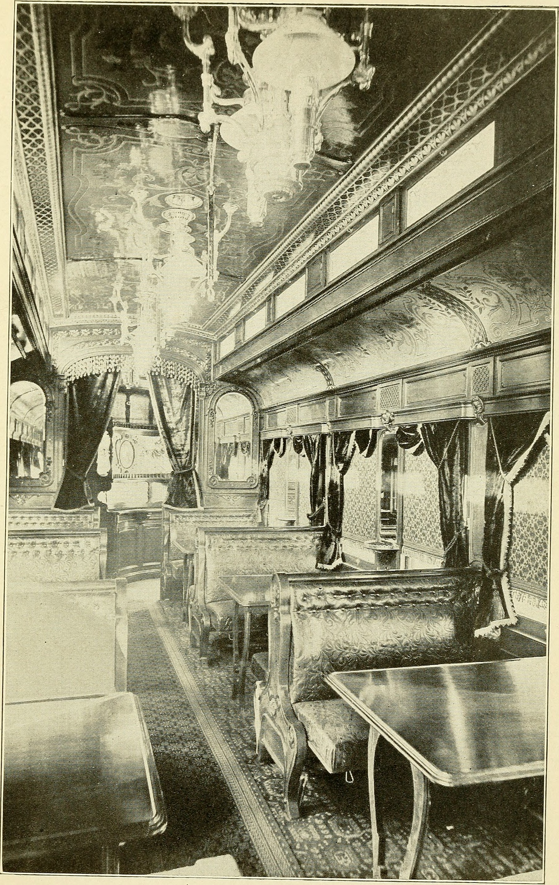

# Pullman, berths, and the traveling stack

The bunk learned to move.

Once "bunk" is a ship's berth, the railroad is an obvious next room. A sleeping car is a corridor with walls that fold. Upper berth, lower berth. A ladder the porter keeps track of. Curtains instead of guardrails. The 19th-century passenger did not think "youth furniture." They thought "I am not sitting up until Cincinnati."

I am not going to reconstruct George Pullman's whole corporate biography here. You can get that from railroad history that is actually about railroads. What I need is the **geometry that traveled**: two sleeps, one bay, a vertical order that tells you who climbs.

<figure id="fig-pullman-car-interior-1917">
  
  <figcaption><em>The Story of the Pullman Car</em> (1917), Internet Archive / Flickr Commons — U.S. public domain. Railroad berth stack, not a CPSC-tested youth bunk.</figcaption>
</figure>

## Berth is not bunk-bed

A Pullman upper berth is closer to a shelf with bedding than to a boxed children's product. It hinges. It disappears into the ceiling or the wall. It is operated by staff. The occupant is usually an adult who paid for the privilege of lying down.

That last part matters. A lot of traveling stacks — rail berths, steamship cabins, later aircraft crew rest — assume a **competent adult** and a **procedure**. The children's bunk assumes a sleeping seven-year-old and a tired parent down the hall. Same family of shapes. Different supervision model. When we imported the shape into the house, we did not import the porter.

## Larson’s railcars

Larson’s list again: prisons, **railroad cars**, barracks. The railcar is one of the places the physical tier shows up early because the car's envelope is fixed by gauge and platform. You cannot widen the room. You can only go up.

Submarines are the extreme of the same envelope. Crew bunks stuffed between pipes. Hot-racking. The bed as a slot. I mention submarines not for romance — the internet loves a submarine bunk photo — but because they make the **non-consumer** nature of the stack obvious. Nobody is hanging a "not for children under 6" label in a pressure hull. Those beds are outside EN 747 and ISO 9098 on purpose.

## Cars, vans, and the RV cousin

The traveling stack never stopped. Camper vans with a pop-top bunk. Over-cab beds in motorhomes. Truck-sleeper berths. Airline crew rest. Each of those may be regulated as a **vehicle** or a **vessel**, not as household furniture. That is a jurisdictional fork I will not fake my way through. A CPSC bunk rule is a consumer-product rule. An FMVSS or a marine standard is someone else's book.

What I will say, as a reader of rooms: if you put a household bunk product into a van and call it camping, you still have the household product's instructions. If you buy a bed built as vehicle equipment, do not assume 16 CFR 1213 was the test. Ask which book. "It's a bunk" is not a citation.

## Culture: the berth as class

Railroad advertising sold the upper berth as both bargain and adventure. Cheaper than the lower. Closer to the ceiling fan, or the dust, depending on the decade. Children's media later stole that romance — secret club in the top bunk — without the ticket punch.

When a kid today fights for the top, they are reenacting a class argument that used to be about fare. The safety file is not romantic. In the 1990s U.S. data, **falls** were the minority of deaths and still real. Horseplay is on the mandatory instruction list for a reason: the traveling stack was always a little bit of a stunt.

## Carry-forward

From this page, keep one distinction. **A berth is a place in a vehicle. A bunk bed is a product in a room.** The first taught the second how to stack. The second is what CPSC could reach. Mixing them is how people talk themselves into "this loft in the sprinter van doesn't need a rail, it's like a train."

Trains had staff. Your van has you.
