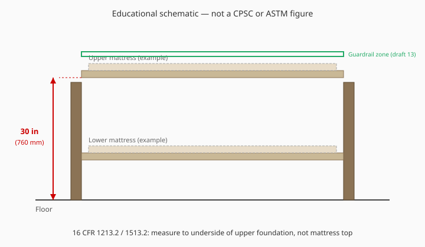
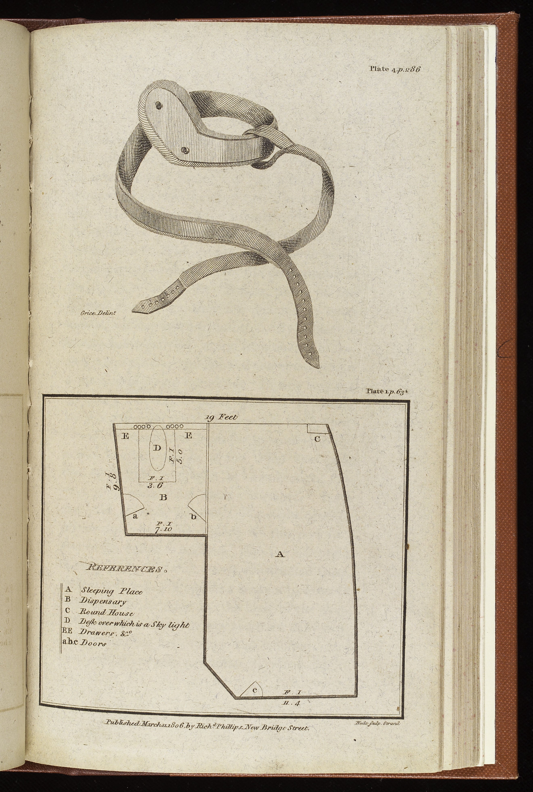

# Image and figure SEO

This series renders as Markdown with embedded HTML `<figure>` blocks. Search engines and assistive tech read the **``**, the **`<figcaption>`**, and the surrounding heading structure — not the YAML alone.

## Required pattern

Each published figure MUST include:

1. **`id`** on `<figure>` — stable slug, prefix `fig-`, e.g. `fig-30-inch-bunk-definition`.
2. **``** with:
   - `src` relative to this folder (`images/...`)
   - **`alt`** — one or two sentences, plain language, includes key numbers when the image teaches a dimension
   - **`width` and `height`** — intrinsic display size (reduces layout shift)
   - `loading="lazy"` and `decoding="async"` on in-article figures after the first hero figure on a page
3. **`<figcaption>`** — first sentence describes what the reader should learn; second sentence states **provenance** (for historical photos) or **“Educational schematic — not a CPSC/ASTM figure”** (for SVGs). Link to `RIGHTS.md` when credit is long.

Optional YAML on drafts that carry a primary figure:

```yaml
seo:
  description: Unique meta description for this essay (≤160 characters target).
  image: images/schematics/schematic-us-30-inch-bunk-definition.svg
```

The `seo.image` path is the Open Graph / social preview candidate when this tree is published.

## Example (schematic)

```html
<figure id="fig-30-inch-bunk-definition">
  
  <figcaption><strong>Educational schematic.</strong> U.S. scope uses foundation underside height, not mattress top or catalog names. Not a CPSC diagram. See <code>RIGHTS.md</code>.</figcaption>
</figure>
```

## Example (historical photograph)

```html
<figure id="fig-ship-sick-berth-1806">
  
  <figcaption>Wellcome Collection (CC BY 4.0), sick berth panel c. 1806 — stacked sleep before the consumer bunk. Full plate also shows an unrelated truss diagram above.</figcaption>
</figure>
```

## SEO habits that match the voice

- **Alt text teaches**, it does not keyword-stuff (“bunk bed bunk bed CPSC”).
- **One primary figure per anatomy/standards essay** unless a second figure adds a distinct measurement story.
- **History essays** use PD/CC photography; **standards essays** use original SVGs, not regulatory figure clones.
- **Figcaption duplicates no entire paragraph** — it summarizes the visual claim the section is making.

## File inventory

| Asset kind | Directory | Register |
| --- | --- | --- |
| Original SVG schematics | `images/schematics/` | `RIGHTS.md` |
| Historical PD/CC JPEGs | `images/historical/` | `RIGHTS.md` |
| This guide | `IMAGE-SEO.md` | — |

When `MANIFEST.md` lists a draft, check whether it references a figure id listed in the draft’s first `<figure>`.
