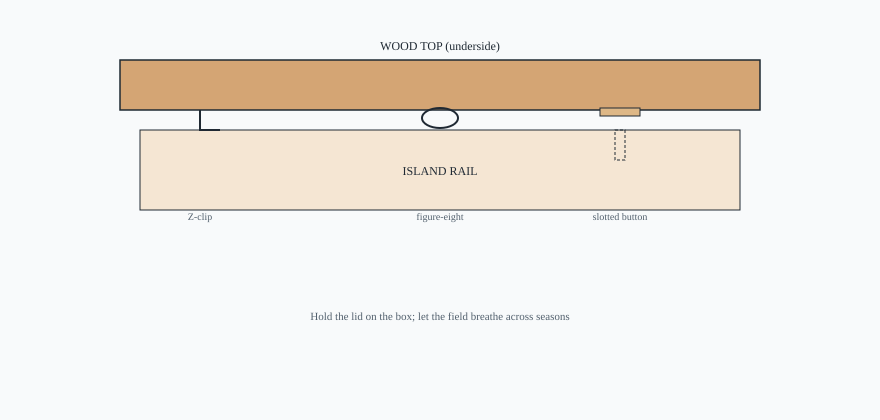

<figure class="bradley-figure bradley-figure--diagram">
  
  <figcaption>
    Hold the lid on the box; let the field breathe. A grid of screws through the rails is the usual mistake.
    Bradley butcher-block countertops guide — editorial schematic.
  </figcaption>
</figure>
