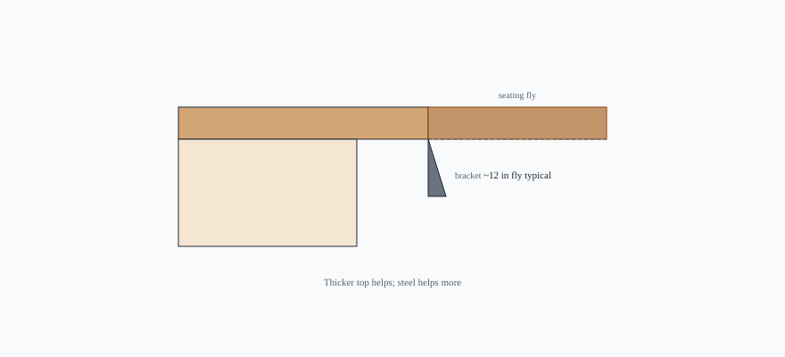

<figure class="bradley-figure bradley-figure--diagram">
  
  <figcaption>
    A modest fly on edge grain can live with brackets; pride is not a substitute for steel under a long breakfast side.
    Bradley butcher-block countertops guide — editorial schematic.
  </figcaption>
</figure>
