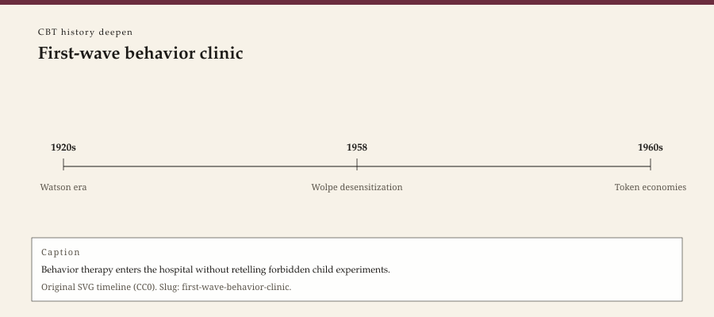

**Educational note.** This is history for a general reader. It is not a diagnosis, not a treatment plan, and not a substitute for care with a licensed clinician.

<!-- figure-id: first-wave-behavior-clinic.lead-timeline -->
<figure class="wow-figure wow-figure--era">
  
  <figcaption>
    <strong>First-wave behavior clinic</strong> — Behavior therapy enters the hospital without retelling forbidden child experiments.
    Original editorial timeline (CC0). No AI-generated faces.
  </figcaption>
</figure>

Joseph Wolpe's *Psychotherapy by Reciprocal Inhibition* (Stanford, 1958) is a clinic in a hardback. A South African psychiatrist, trained in a medical world that still spoke Freudian in the corridors, wrote down a way of treating fear by pairing it with a response that could not, in his physiology, sit beside it. Progressive relaxation. A graded imagination of the feared scene. A theory of inhibition borrowed from the lab.

Hayes, in 2004, would call this sort of work a first wave: stimulus, response, an empirical temper aimed at a visible target. The nickname is hindsight. In 1958 it was just a book that did not ask for an interpretation of a childhood. This page stays with the clinic that book made possible. It will not reprint a hierarchy. It will not teach a relaxation script.

## Before Wolpe, a child named Peter

Mary Cover Jones, in 1924, published "A Laboratory Study of Fear: The Case of Peter." A boy afraid of a rabbit. A method of re-association that later textbooks called a grandmother of desensitization. Jones was a student in the behavioral city Watson had advertised. Watson and Rayner's 1920 Little Albert report — a white rat, a noise, an infant — is the ugly twin: an ethics lesson this pack will not illustrate and will not treat as a method to admire.

The 1920 paper is how a profession learned it could condition a child. The 1924 paper is how a profession learned it might unlearn a fear in a child. Neither paper is a license. Both are dates on the way to a 1958 clinic that treated adults as if the same physiology applied. Between them sit decades of academic behaviorism that did not yet own the consulting room. Skinner's *Science and Human Behavior* (1953) is a system. Wolpe's 1958 book is a practice.

A history that jumps from Little Albert to CBT has skipped the room where someone sat still and imagined a street. Skipping is how "behavior therapy" becomes a rumor about rats. The rumor insulted clinicians who were seeing people. It also hid the real problem: a first wave that could be cold in the service of being clear.

## Johannesburg to Temple

Wolpe worked in South Africa, then in the United States (Temple University is the later American address). Arnold Lazarus, younger, South African too, would push the same household toward cognition and then toward a multimodal inventory of a life. The South African origin matters. A lot of American CBT mythology is Philadelphia and New York. Reciprocal inhibition is a Johannesburg export. The later "waves" metaphor, coined in Reno and sold in workshops, has a first crest that is not Mid-Atlantic.

What Wolpe gave the later house was teachability. A session could be described. A fear could be ordered. A supervisor could ask whether the order was too steep. Those are workforce virtues. They are also how a therapy becomes something an institution can staff without sharing a philosophy. Beck took that virtue and applied it to sentences. Linehan took it and applied it to a team that could stand suicidality. The virtue is older than both.

What Wolpe did not give the later house was a good account of meaning, culture, or a fear that is a correct reading of a neighborhood. Exposure traditions have spent the rest of the century answering that charge — sometimes well, sometimes by ignoring the neighborhood. The Foa essay in this pack is one later chapter. The critiques essay is another.

## How the first wave got named after it was over

Nobody in 1958 called themselves first-wave. They called themselves behavior therapists, or they called themselves physicians who had lost patience with the couch. The "wave" vocabulary arrives with Hayes's 2004 *Behavior Therapy* paper and with a marketing need to explain ACT, DBT, and MBCT as both new and familial. Geology is a metaphor. Metaphors recruit. Hofmann later said the break was overstated. This pack prints both sentences.

On a practice site the use of the metaphor is modest. It keeps a reader from thinking CBT fell from the sky in 1979. It also keeps a reader from thinking "behavior therapy" is only a historical insult. There are still clinics whose honest name is exposure. They are not failed cognitive shops. They are a crest that never fully receded. Behavioral activation, in the 1990s and 2000s, was a reminder inside the depression literature: sometimes the older furniture still held when you carried the cognitive chairs out.

## What this series will not do

No hierarchy. No SUDS. No rabbit. No photograph of a child in a lab. The Jones paper may be cited as a dated object. It may not be illustrated. Watson and Rayner may be cited as ethics history. They may not be a thumbnail.

WOW Therapies does not, here, offer "behavior therapy" as a service brand. The sibling survey pack already has a shorter behaviorism-in-the-clinic essay. This deepen page adds Wolpe's book, Jones's date, and the later nickname that turned a 1958 hardback into "wave one." If you need the cognitive turn, read the 1967 and 1979 essays. If you need the third-wave nickname, read 2004. The first wave is the part of the family that still flinches when someone says the problem is only a thought.

A rural hour that helps a person walk toward a feared doorway is standing in Wolpe's building even if the clipboard says CBT. A rural hour that argues with a sentence and never approaches the doorway is standing in Beck's. Plenty of living hours need both buildings. This page will not draw the floor plan as a homework sheet. It will say: the clinic learned to treat fear as something a body could unlearn before it learned to treat a belief as something a mind could test. The order is historical. It is not a ranking.

## 1958, Stanford, and a physiology that traveled

Stanford University Press put Wolpe's book into American libraries in a year when the analytic institutes still owned prestige. The book did not win prestige overnight. It won a second address: Temple, students, a generation that could describe a session without a dream. Lazarus, already pushing toward cognition, would make the household argument in public. The argument is the first-wave story's second chapter: even inside behavior therapy, someone was already saying the sentence mattered.

This pack will not resolve that chapter with a winner. It will keep 1924, 1958, and 2004 on one shelf so "behavior therapy" is not a slur and not a rat. A rural hour that walks toward a doorway is in the 1958 building. A rural hour that only argues with a sentence is in a later one. Plenty of hours need both. Neither hour needs a hierarchy printed on a history page.

If a graphics agent wants a lead, a 1958 citation as type is enough. A child and a rabbit are not. Jones's paper remains a dated object. It remains unillustrated here.

## Portrait

No Wolpe portrait. Type, or a 1958 title-page citation as graphic. No child-in-lab images.

## Sources

Jones 1924; Watson and Rayner 1920 (ethics history); Wolpe 1958; Skinner 1953; Hayes 2004. Figures: `joseph-wolpe`, `arnold-a-lazarus`.

*WOW Therapies educational series. This pack deepens the CBT lane of the therapy-history calendar; it is complementary to the SLPWOW speech-pathology history pack.*
