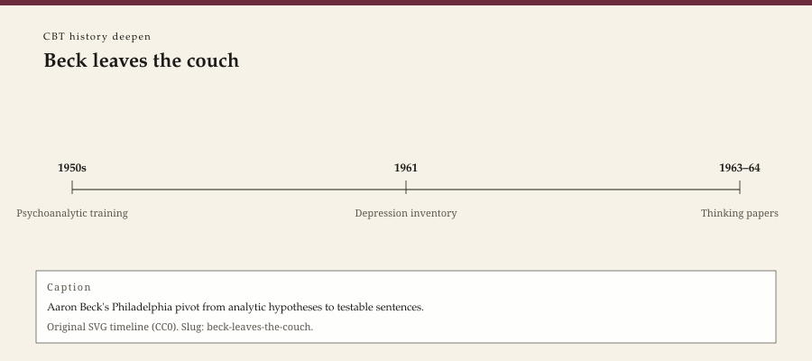

**Educational note.** This is history for a general reader. It is not a diagnosis, not a treatment plan, and not a substitute for care with a licensed clinician.

<!-- figure-id: beck-leaves-the-couch.lead-timeline -->
<figure class="wow-figure wow-figure--era">
  
  <figcaption>
    <strong>Beck leaves the couch</strong> — Aaron Beck's Philadelphia pivot from analytic hypotheses to testable sentences.
    Original editorial timeline (CC0). No AI-generated faces.
  </figcaption>
</figure>

Aaron Temkin Beck expected, as an analyst, to find hostility under depression. He listened, at the University of Pennsylvania and in the Philadelphia institutes that had trained him, and heard something else: a running evaluation. I am a failure. Nothing will work. The world is thin. He began to write the sentences down.

The 1961 paper with Ward, Mendelson, Mock, and Erbaugh — "An Inventory for Measuring Depression," *Archives of General Psychiatry* — is the public instrument. The 1963 and 1964 "Thinking and Depression" papers in the same journal are the theory's first clothes. *Depression: Clinical, Experimental, and Theoretical Aspects* (1967) is the book. The leaving of the couch is not a single afternoon. It is a decade of notes that stopped waiting for insight to lift a score.

The sibling figure essay in this pack follows him to the 1994 institute and the 2021 obituaries. The survey pack's Beck essay is the biography. This page stays in the 1960s room where an analyst became a man who treated a thought as data.

## Philadelphia, not California

Beck was born in Providence in 1921, trained in medicine at Yale, and spent the working decades that matter here at Penn. The path is hospital-shaped. Cognitive therapy's comfort with a score, a tape, and a competence scale comes from that path. So does its later ease with insurers. A California workshop tradition — humanistic, encounter, the weekend that changes your life — is a different American weather. Beck did not come from it. His students sometimes fled into it and back.

The Philadelphia analytic institutes of the 1950s were not a cartoon. They were a serious guild that taught him to listen. He kept the listening after he lost the theory of what he was supposed to hear. That remainder is why good CBT can still sound like a conversation and bad CBT sounds like a form. The leaving was of a hypothesis (hostility under sadness; the dream as the road), not of the idea that another person is in the room.

Judith Beck, in later teaching, would keep insisting on the relationship as the thing that makes a thought testable. That insistence is a daughter of the leaving: if you walk out of an institute, you had better not walk out of the hour.

## What "writing it down" changed

An analytic session produced a narrative the analyst held. A Beck session, once the habit set, produced sentences that could be read back, tested before Thursday, and shown to a student who had missed the hot one. Visibility is a moral choice as much as a scientific one. It invites imitation. The imitation includes the worksheet that never looks up.

The inventory (BDI) escaped the lab and became a waiting-room ritual. A score is not a person. It is a way a clinic talks to itself and to a payer. Beck knew the difference. The later industry of "outcomes" sometimes forgot it. The 1961 paper is innocent of that industry and also its seed. Historical objects do that: they grow rooms their authors did not furnish.

Ellis had already been interrupting musts for a decade when the 1963 paper appeared. Beck did not need Ellis's volume. He needed a psychiatry department that would let him treat thoughts as findings. Penn did. The later Beck Institute (1994) is a training shop built on that permission. The permission is the 1960s event.

## What he did not leave

He did not leave biology. He did not claim that a pill was a fiction. He claimed that a person could still work with what the mind was doing while the biology was being addressed, or while it was not. A. John Rush's later name on the 1979 manual is the pharmacologist's chair pulled up to the same table. STAR*D, in the 2000s, is a descendant of that shared graph, not a conversion story.

He also did not leave the possibility of overreach. Anxiety, personality, later schizophrenia and CT-R — a founder who cannot stop founding will extend the model until colleagues flinch. The depression wall still holds. The extensions are a later essay (`after-beck-2021`). The 1960s leaving is narrower: an analyst who got tired of waiting.

## How a practice site should read the leaving

WOW Therapies does not, here, invite a reader to "challenge a thought." The invitation, if it ever belongs anywhere, belongs in a licensed room. This page names a professional event: a man trained to wait for insight decided that a sentence on Tuesday was already the work.

A rural clinic that uses a thought record is in his building. A rural clinic that uses a thought record *instead of* a relationship is in a parody of his building. The 1957 Rogers paper and the 1960s Beck notes are not a forced choice. A living hour may need both. A slide deck rarely says so.

The leaving also explains a tone. Ellis attacked. Beck tested. American hospitals, for reasons that were only partly scientific, preferred the tester. Managed care later preferred the tester's grandchild. Preference is not destiny, but it is how a workforce gets hired. This deepen pack exists to keep the 1960s notes from collapsing into a brand.

Providence, a Jewish household, a brother who died in the 1918 influenza — biographies mention the early life. It is not a key to the triad. It is a reminder that he came to psychiatry after a century that had already taught him what a death in a family does to a story. The 1960s notes are that story's professional form: write the sentence down, see whether the world agrees, stop waiting for a theory to do the lifting.

## 1961, a journal, an inventory

The BDI paper in *Archives of General Psychiatry* is the first object a later waiting room would recognize. It is also the first object a later critic would recognize as the seed of a ritual. Both recognitions are fair. An inventory that can travel will travel. Travel is how a department talks to itself across wards. Travel is how a score becomes a person-substitute. Beck's 1963 and 1964 papers tried to keep thinking in the picture so the score would not be the only picture. Readers who know only the waiting-room form have not met those papers.

This leaving, then, has three public clothes before 1967: a score, a theory of idiosyncratic content, a theory of therapy. The couch is already in the rearview. The institute is not yet built. The 1960s room is a psychiatrist writing in a journal his colleagues already read. That is why the leaving stuck. It happened in their language.

The Philadelphia institutes did not vanish when he left their hypothesis. Colleagues still taught dreams. He still knew how to listen. The leaving is narrower than a conversion story: one hypothesis about hostility, set down, because the sentences in the room did not match it.

## Portrait

No clean licensed photograph. Type: "Aaron T. Beck, leaving the analytic hypothesis, 1961–1967." Do not scrape Penn.

## Sources

Beck et al. 1961; Beck 1963, 1964, 1967. Figures: `aaron-temkin-beck`, `judith-s-beck`. Sibling survey: `aaron-beck`.

*WOW Therapies educational series. This pack deepens the CBT lane of the therapy-history calendar; it is complementary to the SLPWOW speech-pathology history pack.*
