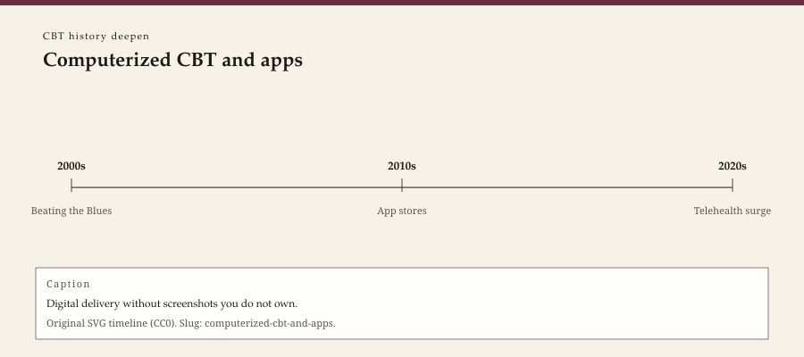

**Educational note.** This is history for a general reader. It is not a diagnosis, not a treatment plan, and not a substitute for care with a licensed clinician.

<!-- figure-id: computerized-cbt-and-apps.lead-timeline -->
<figure class="wow-figure wow-figure--era">
  
  <figcaption>
    <strong>Computerized CBT and apps</strong> — Digital delivery without screenshots you do not own.
    Original editorial timeline (CC0). No AI-generated faces.
  </figcaption>
</figure>

By the late 1990s a British product with a cheerful name — *Beating the Blues* — was already trying to put a grandchild of the Penn manuals on a computer. Judy Proudfoot and colleagues published trials. Other packages followed. IAPT, after 2008, had a place in its stepped furniture for computerized work. By the 2010s the computer had become a phone, the package had become an app, and "mindfulness" had become a word on yogurt.

This page is a history of that thinning. It is not a review of apps. It will not recommend one. It will not walk a module.

## What a computer could copy

A computer can copy a sequence. It can ask for a score. It can display a sentence and wait for a tap. It cannot, by itself, notice that the person in the room (or not in the room) is about to leave and not come back. Linehan's staffing pattern was one answer to risk. An app is another. They are not the same answer.

Early computerized CBT had a research culture: randomized trials, waiting lists, names you could print in a journal. Later apps had a venture culture: downloads, streaks, a pastel palette. Some apps still run trials. Many run advertisements. The historical useful distinction is not "tech bad." It is which object you are looking at — a studied package with a protocol and a paper, or a product that borrowed the prestige of the paper.

Kabat-Zinn's 1979 clinic and 1990 book were already a medical-behavioral program that could be mistaken for a religion. Segal, Williams, and Teasdale's 2002 MBCT book tried to keep a cushion attached to a relapse problem. The app boom detached the cushion again and sold it to commuters. Third-wave therapies rode that boom and were cheapened by it. Hayes's 2004 nickname did not ask for a subscription model. The subscription model asked for the nickname.

## Access, and the skipped relationship

A person who cannot get to a clinic, or cannot be seen for months, may be glad of a login. Gladness is not a reason to lie about what a login is. The 1957 Rogers paper is still on the shelf. The 1979 manual assumed a supervisor. The app assumes a battery.

IAPT's low-intensity step made the British argument concrete: a new workforce plus a computer versus a two-year wait. American markets made a different argument: a direct-to-consumer subscription versus an authorization. Both arguments use the word CBT. Both are translations of 1979 into a cheaper medium. Translation is how access happens. It is also how a thought record becomes a tap that never looks up, because there is no face to look up at.

WOW Therapies will not, on this page, tell a reader to download anything. If the clinic ever uses a specific digital tool, that belongs on a clinical page with privacy, consent, and a human attached. Here the claim is only: between *Beating the Blues* and the pastel phone, a school that had fought to be filmable became copy-pasteable. Film still had a person. Paste does not always.

## Rights, screenshots, and faces

Do not scrape app-store screens. Do not use a Guilford jacket. Do not generate a "kind therapist avatar." Type is enough: a product name, a year, a paper. If a graphics agent wants a diagram, draw the thinning as a timeline of media (tape, computer, phone), not as a smiling user.

A rural reader with a bad signal already knows the limit this essay is working toward. The limit is not moral superiority of the in-person hour. It is honesty about what each medium can hold. Beck wanted visibility. Visibility invited the tape, then the computer, then the tap. He lived long enough to see the first two. The tap is the grandchild's grandchild.

This series refuses to be a how-to. It also refuses to be a scold that only the original room was real. People were helped by packages with names this page will not advertise. People were also sold a vibe. History's job is to keep the trial and the vibe from sharing a halo.

Crisis belongs to emergency services, not to an app's chatbot. A single line is enough: if you are in danger, call local emergency services. This series will not write a safety protocol around a product.

The COVID years (2020–2021) forced even relationship-minded clinics onto screens. That emergency migration is a different object from a consumer app: same cameras, different consent, different duty. Do not collapse them. A deepen pack can say the collapse happened in public talk. It can refuse to repeat the collapse.

## 2000s, a CD-ROM, a waiting list

Early computerized packages lived on clinic machines and in trials with waiting lists. They had the dignity of a paper. They also had the awkwardness of a 1990s interface. Dignity and awkwardness are both historical. The later phone erased the awkwardness and, often, the paper. A pastel tap is easier to sell than a clinic desktop. Easier is the occupational hazard of a school that had already agreed to be filmable.

This page will not name a current app as a recommendation. Names age into advertisements. Product names that already sit in published trials may be mentioned as history (*Beating the Blues* is that kind of name). Living storefronts are not. If a later editor needs a 2020s title, date it and refuse the download instruction. The educational note stays above the footer. The footer stays. A battery is not a clinician.

A clinic desktop in 2002 and a pastel icon in 2016 share a grandfather in 1979 and share almost nothing in their business model. This URL exists to keep those objects from sharing a halo. Haloes sell subscriptions. Years prevent the sale. Use the years.

A 2004 clinic that booked the desktop room the way it booked a consulting room was still treating the package as an hour with walls. Walls matter. The later phone erased the walls and kept the prestige. This URL exists to put the walls back into the story, not into a reader's house.

A 2012 procurement meeting that compared a login to a waiting list was asking a real access question. Access is not a reason to share a halo between a trialled desktop package and a pastel subscription. This URL keeps the halo off. Years on, batteries still are not clinicians.

A 2003 waiting-list arm in a computerized trial is the dignity of a paper. Later taps kept the prestige and dropped the arm. This URL will not restore the tap. It will restore the distinction.

Proudfoot and colleagues' mid-2000s *Beating the Blues* papers — including a 2004 *British Journal of Psychiatry* primary-care report — are the kind of dated product-and-paper cluster this pack will name and will not advertise. A trialled clinic desktop is a historical object. A living storefront is an advertisement. Keep them from sharing a halo.

## Portrait

Type only. No avatars. No screenshots you do not own.

## Sources

Proudfoot et al. as a historical product-and-paper cluster; Clark 2018 for IAPT's furniture; Kabat-Zinn 1990 as the borrowed cushion's public object.

*WOW Therapies educational series. This pack deepens the CBT lane of the therapy-history calendar; it is complementary to the SLPWOW speech-pathology history pack.*
