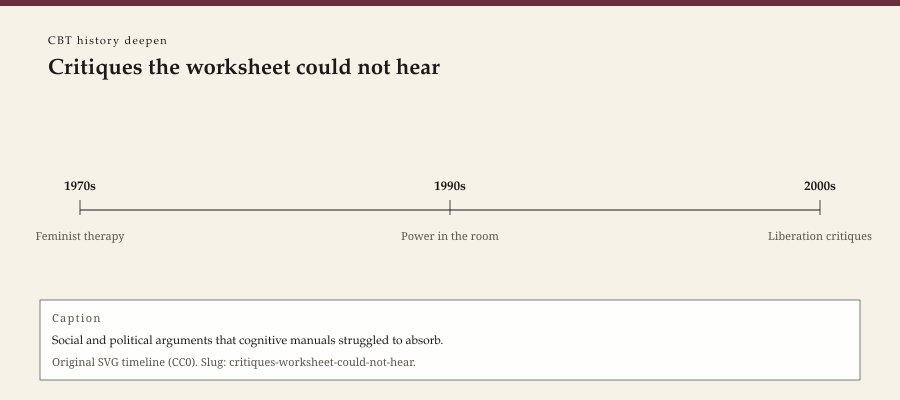

**Educational note.** This is history for a general reader. It is not a diagnosis, not a treatment plan, and not a substitute for care with a licensed clinician.

<!-- figure-id: critiques-worksheet-could-not-hear.lead-timeline -->
<figure class="wow-figure wow-figure--era">
  
  <figcaption>
    <strong>Critiques the worksheet could not hear</strong> — Social and political arguments that cognitive manuals struggled to absorb.
    Original editorial timeline (CC0). No AI-generated faces.
  </figcaption>
</figure>

Cognitive therapy asked a person to treat a belief as a hypothesis. The invitation helped a great many people whose Tuesdays were being eaten by a sentence that could, in fact, be tested. It also arrived, in some rooms, as an instruction to reframe a life that was already a correct reading of a neighborhood, a marriage, a wage, a color line.

This page is a history of that charge. It is not a "diversity" closer stapled to a success story. It is not a claim that thoughts never matter. It is a claim that a worksheet is a poor instrument for a politics.

## Who said it, and when

Feminist therapists said it while the 1979 manual was still new: a woman's "distortion" might be a description of a room that punished her. Multicultural and liberation psychologists said it in a language the Division 12 lists were slow to hear: a trial's English-speaking outpatient is not a universe. Community clinicians said it without a journal: the person who cannot keep a thought record is sometimes the person who cannot keep the lights on.

Philip Cushman's *Constructing the Self, Constructing America* (1995) is one historical book that put psychotherapy itself inside a culture of empty selves and full markets. It is not a CBT monograph. It belongs here because the empirical turn's success was also a cultural success: a self that could be coached, scored, and sold. The sibling survey pack's feminist-relational and multicultural-liberation essays are the wider house. This page keeps the charge inside the cognitive-behavioral family.

Acceptance, in the third wave, did not automatically fix the problem. Taught badly, it can sound like "tolerate your oppression." Linehan's and Hayes's better students treat acceptance as a way to move. The critique still has to be answered. A nickname does not answer it.

## What the university clinic could not see

Exclusion criteria are a methods virtue and a class virtue. Comorbidity, language, distance, a violent home — the 1980s and 1990s trial often left those at the door so the graph would be clean. Rural hours cannot leave them at the door. When "evidence-based" is spoken as if the clean graph were the whole country, the country answers with a flinch.

IAPT's later British critics said a related thing at government scale: complexity falls off a stepped ladder. American managed care said it with a denial letter. The worksheet, in all these weathers, is asked to do work it was not printed for. Beck knew a score was not a person. The industry of outcomes sometimes forgot.

This pack will not invent a composite patient to prove the point. Invented vignettes with identifying color are banned. The record is already public: papers about dropout, about race and measurement, about the limits of analogue samples. Where a specific page is needed and missing, mark `[CITE NEEDED]`. Do not smooth.

## What a practice site does with a critique

It does not answer with a slogan ("we treat the whole person"). It does not answer with a stock photograph of diverse hands. It answers by not pairing these URLs with a diagnosis CTA, by not pretending a history post is a service, and by keeping the critique on the calendar instead of in a footnote.

WOW Therapies is a Southeast Arkansas practice brand. These essays are heritage education, not a claim that the clinic has solved the problem the critiques name. If a later service page speaks to who can get in the door, that page needs its own honesty. This page names an argument the cognitive house has been having since it became a house.

A contemporary clinician who asks "is this thought a distortion or a description?" is standing in the argument. This series will not give them a flowchart. Flowcharts are how critiques become modules. Modules are how modules become apps. The argument is older than the module. Leave it older.

Stoic imports and Adlerian timber get the same test. A philosophy that tells you to adjust your view can be medicine. It can also be a muzzle. Ellis's better days distinguished a violent home from a pebble. His worse days did not. History's job is to keep the worse day on the page so a workshop cannot edit it out.

The sibling survey pack already refused to make "diversity" a last paragraph. This deepen pack refuses to make critique a last paragraph of the CBT success story. The success is real. The charge is real. A small-city site can hold both if it does not sell either.

When a later writer wants a named critic — a specific 1980s feminist paper, a specific measurement-invariance study — they should add the page to `BIBLIOGRAPHY.md` and to the YAML. Until then, the honest mark is better than a fake footnote. This essay is a door, not a literature review. Doors that pretend to be reviews are how AI filler happens. We will not.

## 1979, a sequence, a room it did not describe

The Guilford depression manual assumed a person who could come, sit, and treat a sentence as work. A great many people could. A great many people were in a room the sequence did not describe: a shift job, a partner who reads the homework, a language the trial did not speak, a fear that is a correct map. Feminist journals in the late 1970s and 1980s were already arguing about whose reality got called a distortion. This pack will not fake a citation we have not opened. It will say the argument is as old as the manual's first decade.

Cushman 1995 is one later book that put the whole talking trade inside an American market of selves. Read it as context, not as a CBT takedown. The takedown that matters here is smaller and local: a worksheet asked to do a politics. Worksheets fail at politics. That failure is not a reason to throw out Tuesday's sentence. It is a reason not to call Tuesday's neighborhood a cognition. Rural hours already knew. Journals were slower. Lists were slower still. This URL is for the slowness.

Southeast Arkansas already knows a neighborhood can be a description. This site does not need a coastal journal to authorize that knowledge. It needs not to lie about it when a history post mentions a triad. The triad is a 1967 diagram. The neighborhood is a place. Keep them on different pages of the same honest essay.

A 1981 community meeting that refused to call a wage a cognition was already writing the critique without a journal. Journals were slower. This pack will not fake the meeting's minutes. It will say the refusal is older than the list-world and younger than the neighborhood.

## Portrait

Type only. No "world flags + handshake."

## Sources

Cushman 1995; Beck 1967 as the house being charged; Hayes 2004 as a later weather that did not automatically answer. Sibling survey slugs: `feminist-relational-therapies`, `multicultural-liberation-psychology`.

*WOW Therapies educational series. This pack deepens the CBT lane of the therapy-history calendar; it is complementary to the SLPWOW speech-pathology history pack.*
