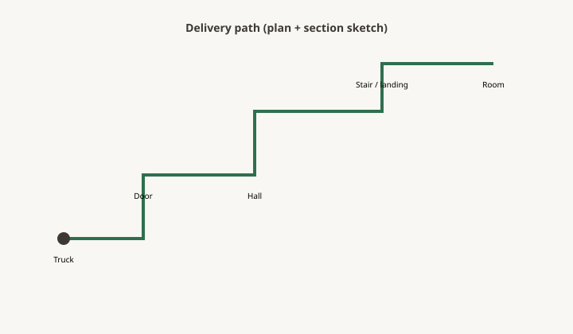

**Disclaimer.** Educational shop talk. Not a quote, not a contract, and not legal advice. Deposit terms, lead times, and cancellation rules live on the acknowledgment you actually sign. A shop in another state may run a different clock.

<figure>
  
  <figcaption>If the piece cannot walk this path, the RFQ is fiction — map door, hall, stair, landing, soffit before you price. Original schematic (CC0).</figcaption>
</figure>

The crate stood on the landing and would not turn. Not almost. Would not. The rail was oak and original and nobody was cutting it on a Thursday. The top was beautiful and downstairs. The room was upstairs. That is a path failure, and it was written on no one's RFQ.

A quote that does not include the path is a quote for a different building. White glove is a service: pads, assembly, a careful crew. It is not a wider stair. Threshold is a service: across the sill, not up the turn. Dock is a service: the truck, not the house. Name the service (piece 34). Measure the path.

## Walk it

From the curb or the dock to the final wall. Tape in hand. Helper if you have one. The largest door width, the tightest hall, every turn, every landing, the soffit at the stair, the light fixture you will hate, the newel.

Write the smallest width and the smallest height. Those two numbers run the job. A 42-inch tabletop in a crate is not 42 inches. The crate is the object that turns (piece 35). If the top ships blanket-wrapped, write that — and write who pays when a blanket is not enough.

## Stairs

Tread width, rail-to-rail, rail-to-wall. Landing length. Headroom at the soffit — people forget the soffit until the crate chips the plaster. A turn stair is two problems: the turn and the landing rectangle.

If the piece must stand on end to make the turn, write the height of the stairwell. A 96-inch top on end is a 96-inch spear. Ceilings at landings are often lower than the hall.

Will the rail come off? Will the shop be allowed to take it off? Who puts it back? That is a carpentry job hiding in a furniture ticket.

## Doors and locks

Remove the door? Many will, some will not (steel frames, fire doors, HOA). Measure the clear opening, not the slab. Hinges steal. Weatherstrip steals. A 32-inch door is not a 32-inch hole.

## Elevators

Door width, door height, car depth, car width, diagonal. Pads required. Hours. Certificate of insurance. Reservation. If the car is smaller than the crate, you are in a stair or a crane conversation. Cranes are not a punch-list item (piece 37). They are a different quote.

## Condos and old courthouses

South Arkansas houses are one problem. A Little Rock high-rise is another. A commercial install at a clinic is a third (piece 46). After-hours, union docks, infection-control, no tobacco on campus — write the rule that will stop the truck.

## Split the piece

Tops off bases. Aprons that knock down. Beds in rails. A split is a joint the customer will see or a hardware set they will maintain. Price the split. Do not surprise them with a seam because you were optimistic about the landing.

If the piece cannot split and cannot turn, the honest RFQ ends in a smaller object or a window removal. Window removal is a contractor. It is not "the furniture guys."

## Who measures the path

Same rule as the room (piece 17). If the shop's driver is the first person to see the stair, the shop is gambling. A pre-delivery path check is cheaper than a refusal at the curb. If the customer refuses the check, they own the curb.

Dealers: your warehouse door is not the customer's stair. Do not write "easy in" because your receiving is easy.

## Photos

The tight turn, the soffit, the elevator plate, the rail (piece 07). A video walk-through is fine if someone also writes the two small numbers. Video without numbers is a tour.

## A path card you can tape to the crate

Curb → stoop (height) → first door (clear width) → hall (width) → stair (rail-to-rail, soffit) → landing rectangle → room door. One number per gate. The smallest two run the crate (piece 35).

If a helper can hold a 42 × 96 cardboard blank through that path, you have a chance. If the blank dies, the table dies or the table splits. Do the blank before you approve REV C (piece 08). Cardboard is cheaper than a split you invent at the curb.

Rural notes: low oak limbs, a cul-de-sac a trailer cannot back, a ditch. Write them. A smaller truck is a line on piece 45, not a surprise fee.

## Condo hours are a freight line

A building that allows moves 9–11 a.m. on Tuesdays is not "white glove sometime." It is a booked window, a COI, and a pad rule. Put it on the RFQ the same day you measure the car diagonal. Missing it is how a finished table sits in a truck for a redelivery fee (piece 45) while the household thinks the shop is late (piece 25).

## The RFQ lines

Smallest width. Smallest height. Stair type. Elevator or not. Split plan. Service level (dock / threshold / room). A sentence: path measured by [name] on [date].

The room can love the table. The landing has veto. Ask the landing first.
