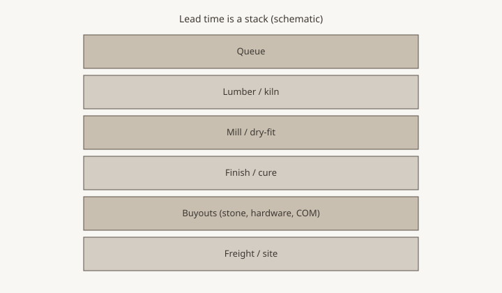

**Disclaimer.** Educational shop talk. Not a quote, not a contract, and not legal advice. Deposit terms, lead times, and cancellation rules live on the acknowledgment you actually sign. A shop in another state may run a different clock.

<figure class="blog-figure">
  
  <figcaption><strong>Figure.</strong> Species and thickness are calendar events. <em>Original schematic (CC0).</em></figcaption>
</figure>

The rack was empty of 8/4 white oak in the grade the drawing wanted. The yard said two weeks, then the kiln, then a rest in the shop. The salesperson had already said "we're good on wood." They were good on a different thickness.

Lumber is a calendar before it is a romance. Species, grade, thickness, width, and whether the shop will glue up a panel or buy a slab — those choices are weeks. An RFQ that treats "oak" as a checkbox will get a date that belongs to a different board.

## What is actually here

Ask: is this species and thickness in the building, on order, or a hope? In the building still needs acclimation if it just came off a truck (piece 36). On order needs a yard promise, which is another shop's whiteboard. A hope needs a sentence on the quote: date subject to lumber.

Wide, thick, clean stock is slower than narrow #1 common. A tabletop that wants 7-inch riftsawn is not a tabletop that will accept 4-inch cathedral. Say the look you need (piece 31) so the yard can be told the truth.

## Kiln and rest

Green wood is not a furniture week. Kiln time is the yard's. Rest time is the shop's — boards sitting stickered until the meter says they belong in this building. `[VERIFY]` house moisture practice; do not invent a percent in this pack. The craft essays next door care about the meter. This pack cares that the rest is a line in the stack (piece 19).

Winter heat and a south Arkansas August are different rest stories. A rush that skips rest is how a top cups in the customer's dining room and becomes a warranty that is really a climate (piece 32, piece 38).

## Slabs vs glue-ups

A slab is a hunt. Hunts are not 12-week stamps. A glue-up is a plan. Plans are why made-to-order is faster than "I saw a live edge on Instagram" (piece 04). If the RFQ wants a slab, say slab and say the width. If the shop must refuse the width (piece 42), better in week one.

## Cores and composite

Plywood and MDF in a case are faster than solid in some shops and slower if the stamp has to be TSCA Title VI / CARB and the yard is out of the right stamp. Write the core. "Solid where it shows" is a sentence that prices. It is also a sentence that must be true.

## Matching existing pieces

A sideboard to match a 10-year-old table is a lumber and a finish problem (piece 31). The old oak has colored. The new oak has not. Lead time may include a sample that sits in the room. That sit is calendar. It is not the shop stalling.

## Dealers

Do not write "in stock" on a special because the factory has *some* oak. Write the thickness. A bedroom suite that mixes 4/4 and 8/4 is two calendars.

If you sell a species the shop does not keep — walnut in a shop that lives in red oak country — say imported-to-the-shop. The county grew a lot of oak. It did not grow your Instagram walnut.

## Homeowners

If you want the cheaper week, ask what is in the rack. If you want a specific look, pay the hunt. Do not ask for both and then call the shop slow.

## Questions that prevent a fake week

Is the thickness in the building. Is the grade in the building. Is it stickered or still sweating from the truck. If it is a slab, is it in the county. If it is walnut in an oak shop, when did the last bundle arrive and what was the waste.

A dealer who writes "oak" on twenty specials is writing twenty different calendars. 4/4 #1 common and 8/4 rift are not cousins in the rack. Split the lines (piece 05) so one late slab does not hold a bedroom suite that could have shipped.

## Waste is calendar too

Rift and quartered looks waste more than cathedral. A shop that quotes a clean-face 42-inch glue-up from a thin bundle will wait on a second truck. Ask about yield if the look is fussy. A household that wants "no knots, no color change, 8-inch riftsawn" has ordered a hunt even if they used the word oak. Hunts are not stamps (piece 19).

## The RFQ lines

Species, cut, thickness, grade, slab vs glue-up, core if any, "must match" yes/no. A question: on hand / to order / unknown.

The saw cannot run on a truck that has not arrived. Put the truck in the stack. Then the stamp, if you still want one, has a board under it.
