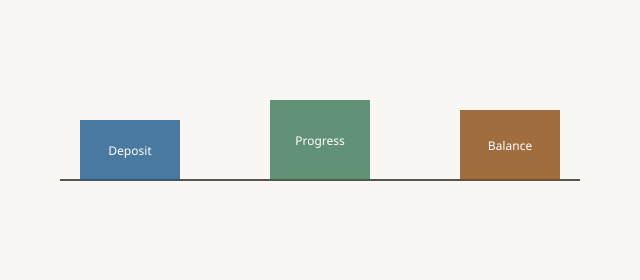

**Disclaimer.** Educational shop talk. Not a quote, not a contract, and not legal advice. Deposit terms, lead times, and cancellation rules live on the acknowledgment you actually sign. A shop in another state may run a different clock.

<figure class="blog-figure">
  
  <figcaption><strong>Figure.</strong> Deposit buys queue position, not the whole price. <em>Original schematic (CC0).</em></figcaption>
</figure>

The check sat in the office drawer under a magnet from a hardware house. Not framed. Not blessed. It was oak money and a name on the whiteboard. That is a deposit. It is not a club membership. It is not a "hold my vibe."

Shops take deposits because custom work spends money before a truck rolls. Lumber is identified to a job (UCC § 2-501). A slot is denied to someone else (piece 19). Hardware is ordered (piece 22). If you walk after that, the shop is holding an object that may not be suitable for sale to others — the specially manufactured goods neighborhood (UCC § 2-201(3)(a), piece 29). A deposit is how both sides admit that neighborhood exists before anyone is angry.

## What it is not

It is not a statute. There is no federal "50% custom furniture deposit" law. `[VERIFY]` any house split before anyone prints a number as policy. A blog that says "industry standard is half" is selling a rumor.

It is not interest-bearing unless you actually escrowed it that way. Do not say it is.

It is not a tip. It is not a way to see if the customer is "serious" as a personality test. Serious is a signed drawing (piece 08) and a cleared payment.

It is not the whole price (piece 27). People who treat the deposit as "we're done paying until delivery" will meet a COD conversation at the curb.

## What it buys

Material the shop would not have pulled. A queue position with a start event (piece 25). The right to a date that has a reasonable basis. The shop's willingness to tell another job "this slot is taken."

It does not buy the right to redesign after freeze (piece 30). It does not buy a rush (piece 23). It does not buy a finish that matches a phone (piece 31).

## Dealers

Your PO may say "net 30 after ship." The mill may say "deposit to start." Those papers will fight (piece 02). Align them before you sell the table. A dealer who starts jobs on reputation alone is a dealer the mill has decided to bankroll. That favor disappears the first time a special dies and the oak is cut.

House accounts and floor samples can have different splits. Write which. Do not use the floor-sample split on a sold residential special.

## Homeowners

You should hate sending money before you have a drawing. Good. Approve the drawing, then send the money (piece 08). A shop that wants a card to "hold the quote" before a number exists is selling a slot for a ghost (piece 03).

Ask: when does the deposit clear, what starts, what happens if I cancel tomorrow, what happens after the cut list. Those questions are the job. Anyone who answers with a shrug is not ready to hold your money.

## If the shop never starts

Then the deposit should come back. Write that. A shop that sits on a check and a silent whiteboard is not "custom." It is a problem. Remote orders may have more to say under 16 CFR Part 435 (piece 25). Every channel still has ordinary honesty.

## The RFQ / ack lines

Deposit required: yes/no. Amount or percent — on the ack, not in this essay. Start event. Refund language pointer (piece 29). Not taken at RFQ.

## What "cleared" means

A check that has not posted is not a start. A card that the household later disputes is a hole in the whiteboard. Write the start event as "deposit cleared," not "deposit received." ACH, card, and a dealer house account are three clocks. A shop that starts the saw on a card authorization it cannot capture is a shop that will eat oak.

If a dealer wants terms, those terms are a credit decision, not a custom-furniture romance. Put them in the vendor packet in week one, not after the cut list (piece 29).

## The whiteboard is the product

A name on the board is a denied slot for someone else. That is what the check bought. If the name is not on the board, ask why. A shop that takes money and does not write the name is a drawer with a magnet and no queue. Walk (piece 43).

The magnet on the drawer is not a shrine. It is a reminder that the oak now has a name. If you do not want your name on a board, do not send the check. If you send the check, let the board be true.
