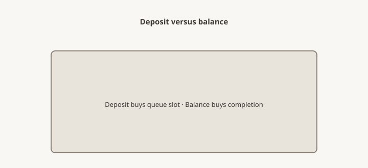

**Disclaimer.** Educational shop talk. Not a quote, not a contract, and not legal advice. Deposit terms, lead times, and cancellation rules live on the acknowledgment you actually sign. A shop in another state may run a different clock.

<figure>
  
  <figcaption>Deposit is not the whole price — progress draws and balance lines belong on the ack in writing. Original schematic (CC0).</figcaption>
</figure>

The driver had the table. The customer had the deposit receipt and a theory that the rest was "on account." The curb is a bad classroom. The ack should have been the teacher.

Custom jobs often move money in two or three steps. Deposit to start (piece 26). Sometimes a progress payment when mill is done or finish starts. Balance before the piece leaves the shop or before it comes off the truck. `[VERIFY]` the house steps. This essay will not invent them. It will say why mixing them makes a scene.

## Why the shop wants the balance before the truck

A custom table identified to you is a bad warehouse item (piece 29). UCC § 2-709 is the neighborhood where a seller may sue for the price of identified goods in some cases. You do not want that neighborhood. The shop does not want it either. A cleared balance is how both of you stay out of it.

COD at the curb is legal in a lot of shops and ugly in all of them. If the ack says "paid in full before ship," believe it. Bring the remaining money in a form the shop named — not a surprise card the terminal will not take, not a check on a bank in another state on a Saturday.

UCC § 2-511 is about tender of payment. This pack is not your treatise. It is a curb warning: agree the form of the last dollar while the piece is still in the spray room.

## Progress payments

Useful on long stacks (piece 19) and on commercial jobs (piece 46). A progress invoice says: lumber is yours, mill is done, we are entering finish. It is not a chance to redesign (piece 30). It is not a second deposit for the same oak.

If you do not use progress payments, say so. Two steps are easier to remember than three. Three are kinder to a shop that will sit on a finished top for a month because the stone is late (piece 22).

## Dealers

Your store may collect 100% from the household and still owe the mill a deposit + balance. Do not spend the household's balance on the store's light bill and then ask the mill to ship on reputation. That story is older than oak.

Flooring the special — borrowing against it — is your finance, not the mill's. If you need a delayed balance, put it in the vendor packet in week one (piece 05), not at the dock.

## Homeowners

Ask for a simple schedule in one paragraph on the quote. Dates will move (piece 25). The *steps* should not surprise you. If a shop adds a progress invoice that was not on the ack, ask why. Sometimes the stack grew. Sometimes someone is patching cash. You are allowed to know which.

## Storage

If you cannot take the piece when it is ready, you are in storage. Storage is money and a climate (piece 36). It is not a free warehouse because you paid a deposit. Write a grace week and a weekly rate, or write that the shop does not store. Curb scenes start here as often as they start at COD.

## A three-step example, not a policy

Deposit at approval to pull oak. Progress when mill is signed off and finish is about to start. Balance five days before the booked truck. If the truck slips, the balance sits until the new window. If the household cannot take the piece, storage starts after a written grace week.

`[VERIFY]` before anyone treats those steps as house law. The point is the *shape*: money meets work, the last dollar meets the truck, storage is named. A single "pay whenever" on a custom top is how a curb becomes a classroom.

## Form of the last dollar

Name it while the piece is in the spray room: card, ACH, cashier's check, dealer house account. A surprise card on a Saturday curb with a terminal that is down is a table on a liftgate and a marriage. UCC tender rules exist; this pack will not recite them. The ack can still say "paid in full before ship" and mean it.

## The ack lines

Steps: 2 or 3. Triggers. Form of payment. Paid-in-full before: ship / delivery. Storage after ready: yes/no, rate.

The table on the liftgate is a heavy argument. Pay the last dollar where the ack said to pay it. Then the curb can be a hello.
