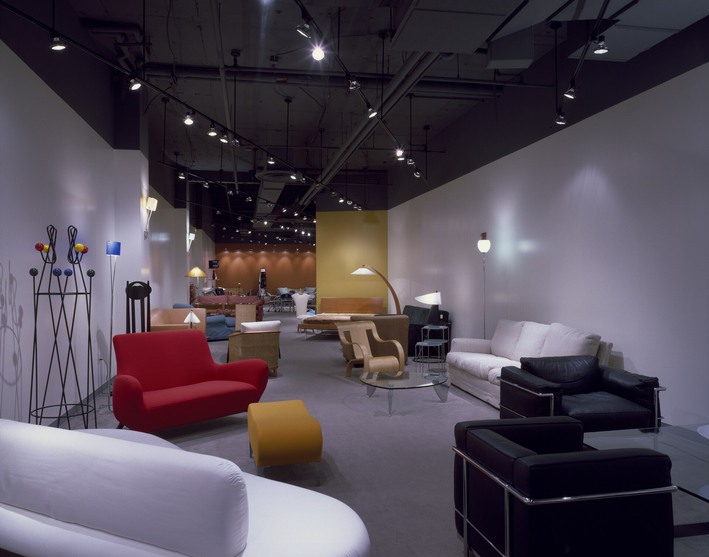

**Disclaimer.** Educational shop talk. Not a quote, not a contract, and not legal advice. Deposit terms, lead times, and cancellation rules live on the acknowledgment you actually sign. A shop in another state may run a different clock.

<figure>
  
  <figcaption>Dealer price and the floor — documentary showroom photo, not an implied current line card. Photo: Library of Congress (public domain). Photo: Carol M. Highsmith | Library of Congress / public domain (<a href="https://commons.wikimedia.org/wiki/File:Furniture_store_interior_LCCN2011634378.tif">source</a>).</figcaption>
</figure>

The PO said "house" and the email said "sold." The mill built a floor-beater edge on a customer's dining table. Nobody was trying to cheat. Two tickets wore one SKU.

Dealers and mills stay friends when the ticket kind is written on page one (piece 05). This piece is the rest of that honesty: price, floor, MAP, and what the mill does not need to know.

## Three tickets

**House** — your warehouse or your own dining room. Maybe a better price. Maybe a faster dock. Still needs a path if it will see a stair later.

**Floor** — a sample that will be sat on, leaned on, tagged, and sold later with miles. Edges and finishes may differ. Crates may be lighter. Do not sell a floor ticket as a first-quality residential special without saying the miles.

**Sold special** — a household is waiting. Path, finish sample, date, deposit. This is the ticket this pack is mostly about.

Mixing them is how a customer inherits a showroom ding you planned to eat.

## What the mill needs

Object, inches, finish, qty, ship-to, requested week, ticket kind. Not your retail. Not your salesperson's commission. Not the household's argument.

The mill needs your retail if they print a hangtag or if a MAP policy says they must see advertised prices. `[VERIFY]` whether any such program exists before you write as if it does. Heritage-page channel history is not a live MAP sheet.

## MAP and advertised numbers

If a line has a minimum advertised price, that is a *policy* between brand and dealer, with legal edges this pack will not walk. What the shop floor cares about: do not ask the mill to build a custom object and also to police your Google Shopping tile. Custom often has no tile. If you make a tile, do not use a *from* price as a bid (piece 01, piece 03).

## Chargebacks and routing

Your backside terms will try to eat a late truck (piece 25) or a scuffed crate (piece 35). Put the routing guide in the RFQ, not in a Friday PDF. A mill that has never seen your PRO rules will miss them. Missing them is not "quality."

UCC § 2-207 is still the paper fight. The ack will strike what it will strike. Read it before you promise the household a chargeback you cannot pass through.

## House accounts vs one-off

A store that RFQs every week can earn a simpler deposit (piece 26) and a faster quote. A one-off designer can still get a good object. They should not expect the house-account clock on the first job. Say so without being precious.

## One SKU, three endings

Same model, three tickets: floor sample with a eased edge and a scuff plan; house stock for the warehouse; sold special with a path and a room stain. If your POS uses one SKU, add a suffix. The mill will build the suffix. A missing suffix is how a customer inherits a showroom radius they did not buy.

## Do not spend the household balance on the lights

If you collected 100% and still owe the mill a balance, that money is not a light bill. Mills remember the store that floated a special and then asked for a dock date. Households remember the store that could not get the truck because the mill had not been paid. Both memories are expensive.

## The RFQ lines

Ticket: house / floor / sold. MAP or tag print: yes/no. Routing guide attached: yes/no. Retail omitted: yes.

The oak does not need your margin. It needs to know whether it will be a dinner or a sample. Write which.
