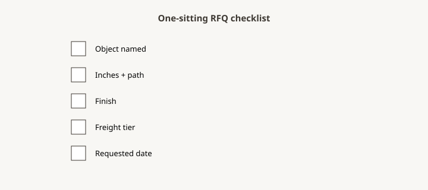

**Disclaimer.** Educational shop talk. Not a quote, not a contract, and not legal advice. Deposit terms, lead times, and cancellation rules live on the acknowledgment you actually sign. A shop in another state may run a different clock.

<figure>
  
  <figcaption>One-sitting RFQ checklist — object, inches, path, finish, freight, date — before anyone cuts. Original schematic (CC0).</figcaption>
</figure>

This is the one-sitting pass. It does not replace the rest of the pack. It is what you run before you hit send or before you take a card. If a box fails, you are not RFQing yet (piece 02). You are wishing.

Print it. Write the job name at the top. Sign it.

## 0. What kind of work

- [ ] Stock / made-to-order / custom named (piece 04).
- [ ] Dealer ticket: house / floor / sold (piece 33) — or household job.
- [ ] Channel: showroom / PO / internet / phone (piece 25).

## 1. The object

- [ ] One sentence problem (piece 06).
- [ ] Species, size, joinery grade or model, leaf story, hardware (piece 02).
- [ ] What the inspiration photo is stealing — and not (piece 07).

## 2. The inches

- [ ] Who holds the tape; date (piece 09, piece 17).
- [ ] Room, out-of-square notes (piece 10).
- [ ] Table pass / case / island aisles if they apply (piece 11, piece 12, piece 13).
- [ ] Live-room list: outlets, returns, radiators, swings (piece 18).
- [ ] Heights: fan, pendant, soffit, ceiling (piece 15).
- [ ] Template required: yes/no (piece 16).

## 3. The path

- [ ] Smallest width and height (piece 14).
- [ ] Stair / elevator / HOA.
- [ ] Split plan.
- [ ] Crate-out or blanket (piece 35).
- [ ] Service: dock / liftgate / threshold / room (piece 34).

## 4. Finish and buyouts

- [ ] Sample in the room, or declined on paper (piece 31).
- [ ] Buyouts listed; who supplies (piece 22, piece 39).
- [ ] Stone / COM sequence if any.

## 5. Time

- [ ] Want-date labeled WANT; holiday pile-up admitted (piece 24).
- [ ] Stack asked: queue, lumber, mill, finish, buyout, freight (piece 19).
- [ ] Rush: not requested, or requested with what can drop (piece 23).
- [ ] No hallway-only date (piece 03, piece 25).

## 6. Money (after the quote — do not send a card with the RFQ)

- [ ] Budget ceiling if household, labeled (piece 06).
- [ ] Deposit after drawing, not before (piece 08, piece 26).
- [ ] Steps: deposit / progress / balance named on the *ack* (piece 27).
- [ ] Tax and freight whose lines (piece 45).

## 7. Paper

- [ ] One page (dealer) or one packet (household) (piece 05, piece 06).
- [ ] Same packet if shopping three shops (piece 40).
- [ ] Routing guide attached if dealer (piece 33).
- [ ] You will sign a REV, not a heart emoji (piece 08).

## 8. Walk / no

- [ ] Shop still allowed to say no (piece 42).
- [ ] You still allowed to walk (piece 43).
- [ ] Cheap integer checked against scope (piece 41).

## How to use this without turning it into a novel

One sitting. Fail closed on measure and path. Send. When the quote returns, run the "after they quote" boxes before you send money. Do not run the money boxes on the same night you first measured — that is how hallway deposits happen (piece 03, piece 26).

Dealers: put this on the back of the one-pager (piece 05). Households: put it on the fridge until the ack exists. Then put the ack on the fridge. The checklist is a gate. The ack is the job.

## Fail closed on 2 and 3

If the inches or the path fail, do not send. The rest of the list can be pretty and you will still have a porch. Get a tape. Walk the landing. Then send. Money boxes wait for the quote and the drawing. Mixing money with the first measure is how hallway deposits happen.

## After they quote

- [ ] Scope initialed as written.
- [ ] Date kind: ship / dock / room.
- [ ] Freeze gate and cancellation schedule exist (piece 29, piece 30).
- [ ] Warranty card is as-specified, not "heirloom" (piece 38).
- [ ] Site climate warning if new build (piece 36).

If section 2 or 3 fails, do not send. Get a tape. The corkboard can wait (piece 01). The landing will not grow while you type.
