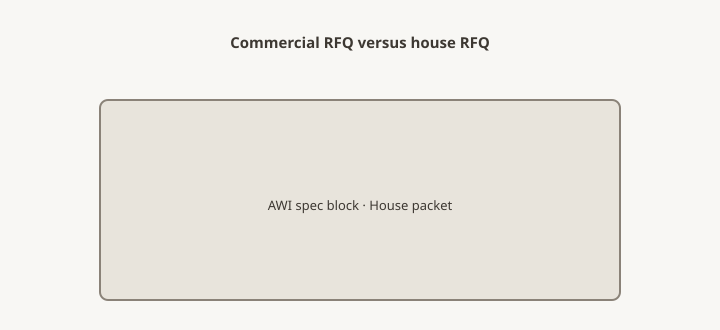

**Disclaimer.** Educational shop talk. Not a quote, not a contract, and not legal advice. Deposit terms, lead times, and cancellation rules live on the acknowledgment you actually sign. A shop in another state may run a different clock.

<figure>
  
  <figcaption>Commercial RFQ carries spec sections; house jobs carry tape and path — same shop, different packet weight. Original schematic (CC0).</figcaption>
</figure>

The typical said 42-inch tables, laminate, a metal finish from last year's standard. The room was a day room with an out-of-square column and a nurse path that was not in the typical. Someone sent a household-style email: "something warm, unique." The facility needed a packet. The packet is this piece.

A shop that also builds household tables can still quote a clinic or a café. It should not quote them with a Pinterest letter (piece 06). Commercial RFQs are typicals plus field, plus a dock, plus a date that is an opening (piece 24). Heritage-page jobs in this lane are history until someone `[VERIFY]`s a live contract. Do not name them here as if the truck is still there.

## Typical vs room

Chains send typicals. Typicals are a start. Each room still needs a measure (piece 09), a path (piece 14), and the live obstacles — oxygen, rails, a wipeable corner, a column (piece 10, piece 18). A typical that overrides a field measure without initials will lose on install day (piece 08).

If the spec cites ANSI/BIFMA, AWI, or a finish schedule, attach the pages. "Looks commercial" is not a spec.

## People who are not a dinner guest

Infection control, after-hours, badging, no tobacco, a union dock, a receiving window that is Tuesday 6–8 a.m. Write the rule that will stop the truck (piece 34). White glove into a live SNF hallway is a different crew than a dining room.

COI, W-9, vendor packet — with the RFQ, not the week of the ribbon (piece 05).

## Calendar

Openings do not move for your spray room. That means the RFQ is early, the freeze is real (piece 30), and a no is allowed (piece 42). Rush fees do not dry a slab (piece 23). Storage is likely (piece 27) because the building will be late (piece 36). Price storage.

A ribbon date is a NEED with a reason. Still label the shop's date as ship / dock / room (piece 25). Facilities hear "the 14th" as residents in the chairs.

## Money

Progress payments are ordinary (piece 27). Deposits still start lumber (piece 26). Cancellation after a run of twenty identical tables is a warehouse of specially manufactured goods (piece 29). Do not use household refund language on a 40-piece PO unless the ack says so.

Purchase orders will battle the ack (UCC § 2-207). Read both. Indemnity and insurance are not blog decorations. Counsel.

## Finish and care

Wipeable, repairable, a film that can take a cleaner. Household oil that loves a farm table may be a fool in a dining hall. Say the cleaner. Sample it (piece 31). Warranty is as-specified to a facility, not "heirloom" (piece 38).

COM on seating has fire and yard rules (piece 39). Do not take a leftover residential fabric into a corridor.

## Dealers and GPO

If a group purchasing organization or a house vendor number exists, put it on page one. If it does not, do not invent a program from an old channel list.

## Do not run a household closer on a facility

No scarcity, no holiday story, no "unique." The facility needs a dock, a typical, a cleaner, and a date that matches an opening. If your salesperson only knows household RFQs, hand the packet to someone who has shipped a receiving window. A warm table in a day room is still a typical plus a column. Keep the warmth in the radius and the film. Keep the packet boring.

## Storage is part of the opening

Buildings are late. HVAC is late. The ribbon is not. Price storage (piece 27) and a climate warning (piece 36) in the first packet. A shop that stores twenty tables in a hall "as a favor" will meet a scratch and a claim. Favors are not freight. Freight is not install. Install is not a typical. Keep the words apart.

## The packet

Cover page: facility, room list, need-date, dock rules. Typical + exceptions. Field sheets. Finish schedule. Vendor docs. Path for the largest piece. Storage plan.

The day room can still be warm. Warm is a finish and a radius. It is not an excuse to skip the typical or the column. Send the packet. Keep the Pinterest for the house job on the other ticket.
