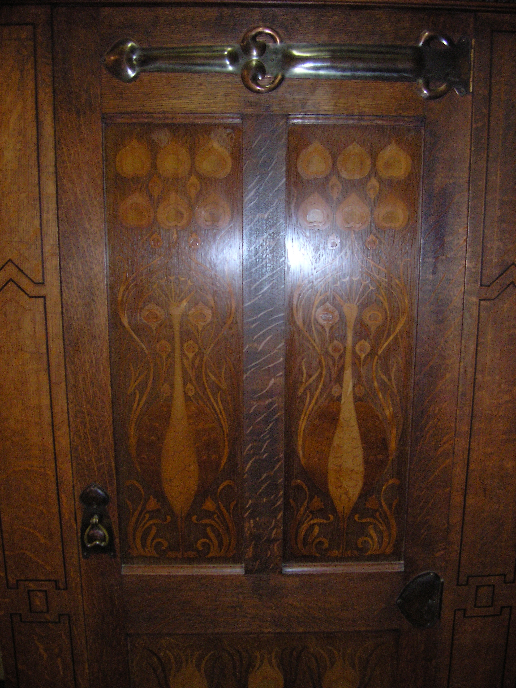

The hallway is the only room in the house that is allowed to be rude.

<!-- figure:commons -->
<figure class="desk-entry-figure">

<figcaption>Figure 1. Victorian hall cupboard with hooks and storage. Auckland War Memorial Museum (via Wikimedia Commons). CC BY 4.0. Full credits: RIGHTS.md.</figcaption>
</figure>

It does not owe you a conversation. It owes you a place to stop being outside. Coats come off. Shoes hesitate. Bags hit a surface. Someone looks in a glass. Then the house begins. If the furniture in that strip of floor cannot do those jobs, it is decoration in a doorway, and decoration in a doorway is how people trip.

Victorian houses understood this better than we do, and they were snobs about it. The front hall was neutral territory. It did not belong to the parlor and it did not belong to the kitchen. A stranger could stand there without being received. That is why the hall stand exists — hooks, a mirror, an umbrella well, sometimes a shelf for a card. The furniture was the etiquette.

We flattened the etiquette and kept the weather. Ranch houses and bungalows ate the hall. Closets ate the hall tree. Then we invented the mudroom and the "drop zone" and pretended we had discovered something. We had rediscovered the rude room. Shoes, wet, backpacks, a place to sit while you fight a lace. The century changed. The job did not.

I walk an entry with a different tape than I walk a study. In a study I care about the forearm and the lamp. In a hall I care about the door swing, the wet, and whether two people can pass without turning sideways like they are in a train. Thirty-six inches of clear walkway is a planning target I like. It is not a law. A 28-inch carton of "entryway set" does not care. You have to care.

Staging, in this folder, means two things and I will not let them blur. First: the draft status. These pages are staged for Keith's cut, not published. Second: the hall itself. You stage an entry the way you stage a landing zone. Traffic first. Pretty second. If the photograph needs a bowl of lemons on a console that blocks the storm door, the photograph is lying.

A hall tree, a bench, a console, a wall rack, a tray for mail — those are tools. BBF collections can sell you the tools. This folder will tell you which century invented them and which rooms they fail in. If that makes a collection page quieter, good. Quiet is how a hall should feel after the door shuts.
