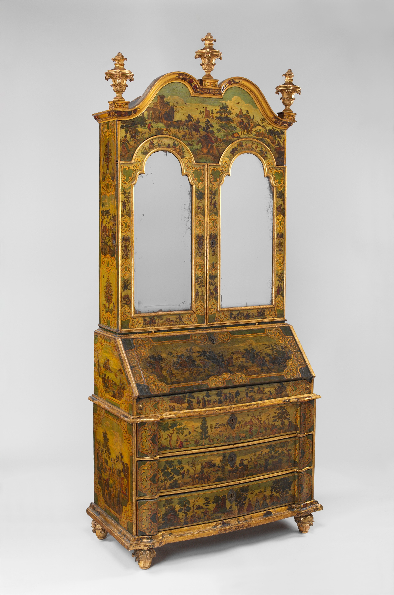

The secretary is a closet that learned to write.

<!-- figure:commons -->
<figure class="desk-entry-figure">

<figcaption>Figure 1. Fall-front secretary desk with closed lid. The Metropolitan Museum of Art, Open Access. CC0 1.0. Full credits: RIGHTS.md.</figcaption>
</figure>

In the eighteenth century, European cabinetmakers hinged a flap on a cabinet, lined the interior with pigeonholes, and called the result a secrétaire à abattant — a fall-front. You drop the flap. It becomes the desk. You lift the flap. The work disappears. That is a moral furniture. It lets a parlor stay a parlor after the letters are done.

American slant-front desks do the same job with less marble and more walnut. The flap is the lock and the work surface. The drawers below are the archive. The bookcase on top, when it exists, is the library that would not fit in another room. A good secretary is three pieces of furniture sharing a footprint. That is why small houses loved them and still should.

I will not romanticize the cubbies. Pigeonholes were for a world of folded paper and sealing wax. A modern laptop does not want a cubby. It wants a flap that is deep enough and a lamp that does not live in a cubby. If you buy a secretary because a film set had one, measure the flap. Many antiques have a writing surface that is a joke by current paper sizes. That is not a defect. It is a century.

The Wooton cabinet secretary of the 1870s is the secretary that became an office building. Doors full of drawers. A flap. A lockup that looks like a church. I will get to Wooton. The point here is lineage. Fall-front is the idea. Everything after is an argument about how much paper a life produces.

When a collection page says "secretary desk" and shows a 30-inch writing table with a hutch, I get tired. A hutch is not a fall-front. A hutch is a shelf with a back. If the work cannot disappear behind a flap or a door, say writing desk. The word secretary should cost something. It should cost a lid.

I have restored fall-fronts where the hinge rail was tired and the leather was a black dust. The piece still made sense. You sit. You drop the flap. The room changes register. You lift the flap. The room returns. No other desk does that as cleanly. If your house has one good wall and too much paper, that is still the form.
