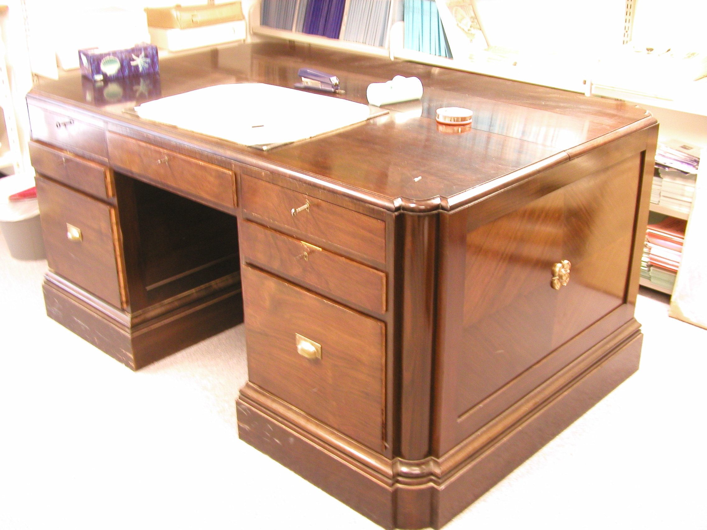

A partner desk is two desks pretending to be one piece of furniture, and that is not an insult.

<!-- figure:commons -->
<figure class="desk-entry-figure">

<figcaption>Figure 1. Partners desk with two working faces sharing one carcass. Auckland War Memorial Museum (via Wikimedia Commons). CC BY 4.0. Full credits: RIGHTS.md.</figcaption>
</figure>

Nineteenth-century banks and counting houses put two clerks, or a partner and a clerk, on opposite sides of one carcass. Drawers both ways. Kneeholes both ways. A top wide enough that ledgers did not collide in the middle. The furniture encoded a social fact: two people were going to sit in each other's air and pretend it was efficiency.

It is not a synonym for "big desk." I have seen catalogs call any pedestal desk with two pedestals a partner desk. That is lazy. A pedestal desk has one working face. A partner desk has two. If you cannot sit opposite someone and both have drawers, you bought a status rectangle.

The form is honest about width and dishonest about conversation. You can share a lamp. You cannot share a phone call. Modern houses put partner desks in studies as a marriage fantasy. Sometimes it works. Sometimes it becomes a hotel check-in. Measure the room. A true partner top wants depth that will eat a small study. If the room is ten feet, you do not have a partner desk. You have a fight.

I like the form when the work is actually shared — a shop office, a two-person practice, a couple who bill hours from the same room and have already learned to hate each other's keyboard. I dislike it as a trophy. Trophy partner desks are how dining rooms lose a table.

If a BBF collection ever uses the word, make the second face real or drop the word. Adjacent history is useless if the name is costume.

Shop note: the middle of a partner top is a dead zone. Nobody writes in the exact center unless they are posing. Put the lamp off-center or put a leather pad where the arms actually land. The Victorian office already knew this. We keep forgetting because the photograph is taken from the end, where the desk looks like a ship.
