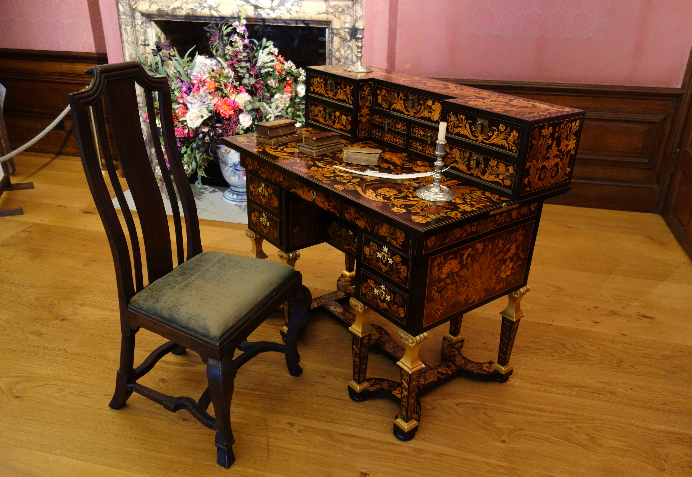

The kneehole is not a style. It is a place for your legs.

<!-- figure:commons -->
<figure class="desk-entry-figure">

<figcaption>Figure 1. Kneehole desk with marquetry. Wikimedia Commons contributor. CC BY-SA 4.0. Full credits: RIGHTS.md.</figcaption>
</figure>

Eighteenth-century cabinetmakers pulled the drawers into two stacks and left a void in the middle so a person could sit close to the work. That void is the kneehole. Pedestals are just the stacks given a heavier name. Pedestal desk, kneehole desk — same family. One working face. Drawers where your hands can reach without standing up.

American and English shops made these in mahogany and walnut until the form became the default office desk of the late nineteenth century. Add a modesty panel and you can put it in an open room. Add a return and you are halfway to an L. None of that changes the first question: can you get your knees under the top without hitting a drawer box that someone thought was storage?

I have opened "kneehole" desks where the hole was a six-inch apology. That is a bureau with a dent. A useful kneehole is wide enough for the chair and deep enough that your feet are not performing. If you sit down and your kneecaps explain the construction, the desk failed.

The pedestal is where shops hide bad drawers. A pretty pull on a box that will not take a file folder is jewelry. If you mean to keep files, say so and build for letter or legal. If you mean to keep pens and a stapler, a shallow box is honest. Mixed pedestals — files on one side, box drawers on the other — are how a one-person office actually lives.

History is useful here because the old desks assumed paper of a certain size and a body in a wooden chair. We have laptops and rolling chairs with thick seats. The kneehole has to grow or the person has to suffer. I will grow the hole. I will not pretend a 1780 silhouette is a compliment if your thighs are in a drawer.

When you look at a collection pedestal desk, ignore the finish first. Sit. If you cannot sit, walk away. The century that invented the kneehole will not be offended.
