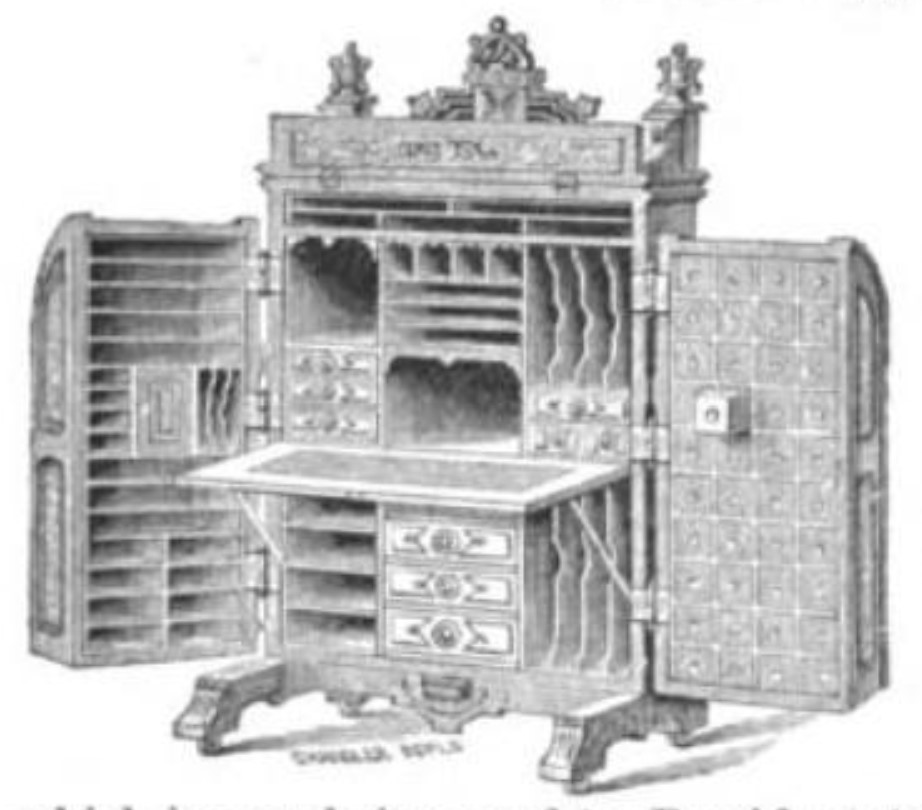

Indiana made a desk that looked like a church organ and behaved like a filing cabinet.

<!-- figure:commons -->
<figure class="desk-entry-figure">

<figcaption>Figure 1. Wooton patent cabinet office secretary. Wikimedia Commons. Public domain. Full credits: RIGHTS.md.</figcaption>
</figure>

William S. Wooton was a Quaker minister and a furniture man. On 6 October 1874 the United States Patent Office issued patent 155,604 for what he called a cabinet office secretary. Indianapolis built them. The 1876 Centennial Exhibition in Philadelphia gave the form a stage. People still call it the King of Desks, which is a Smithsonian phrase with a straight face, and I will allow it because the object is genuinely strange.

It is a fall-front that grew doors. Two tall wings, as deep as the carcass, swing shut and lock. Inside: drawers, pigeonholes, cubbies enough to make a clerk feel organized and a historian feel tired. The writing flap hides only some of the mess. The real lockup is the wings. Closed, it is architecture. Open, it is an office that forgot it needed a room.

The desk arrives at the exact moment American paper explodes — more correspondence, more invoices, not yet a filing cabinet in every closet. Wooton sold convenience to men who wanted their business to look like a piece of furniture when the door opened. Production fades by the 1890s. Fountain pens and typewriters changed the paper. Filing cabinets changed the storage. Wooton himself left the firm and went back to ministry. The desks stayed, heavy as guilt.

I have stood in front of them in museums and in one private hall that should not have held one. They are not a home-office solution. They are a document of a decade that believed a lock and a hundred cubbies could substitute for a secretary — the human kind. If you want one, you want a relic. Say that. Do not say you need pigeonholes for USB cables.

For this folder the Wooton matters because it is Midwestern and because it is the secretary idea taken to a dare. Adjacent collections do not need to copy it. They need to not pretend a hutch with adjustable shelves is the same dare. A few honest drawers and a flap that works will do more for a life than a hundred cubbies you will never label.
