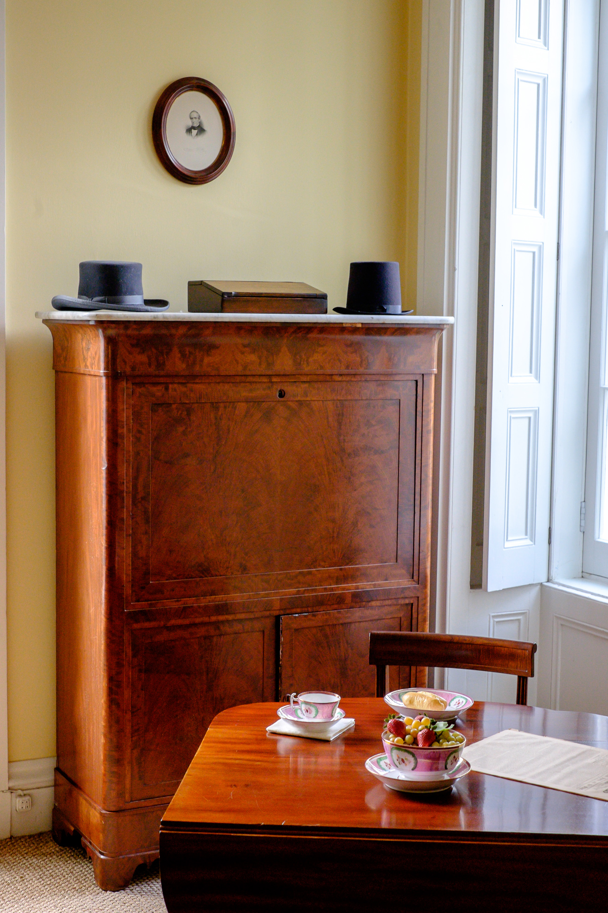

Campaign furniture is what you get when the British Army decides a desk has to survive a ship.

<!-- figure:commons -->
<figure class="desk-entry-figure">

<figcaption>Figure 1. Campaign-style desk with traveling furniture context. Wikimedia Commons. CC BY-SA 4.0. Full credits: RIGHTS.md.</figcaption>
</figure>

Eighteenth- and nineteenth-century officers took a household to war and to colony. The furniture had to knock down, crate, and not shame the owner when it was assembled in a tent or a bungalow. Brass corners. Short, often turned, legs that unscrew. Chests that become sofas. Desks that are boxes until the gallery goes on. The look people now call "campaign" in a catalog is usually the brass and the flush handles. The job was travel.

I respect the job and I am suspicious of the look. A campaign desk that cannot come apart is a coffee-table story. A campaign desk that can come apart and still rack when you write is a good box. The brass is sacrificial. It takes the hit so the corner of the carcass does not. If your house never moves, you do not need the brass. You might still want the flush hardware, because a hall or a tight study will catch a proud pull and tear it off.

The writing surface on period pieces is often smaller than a modern laptop wants. That is a useful humility. Officers wrote letters, not slide decks. If you need a 24-by-48 top, do not buy a 30-inch campaign box and call it authenticity. Buy the size. Steal the hardware language if you like it.

American shops made their own traveling desks — lap desks, writing boxes with a sloped lid, inkwells in a well. Those sat on a table. They are the board-on-trestles idea in a suitcase. I have one in the shop that still smells like old leather and iron gall if you imagine hard enough. It is not a desk by my overnight definition. It is a kit. Kits are allowed. Just do not park a kit in a collection page as a full desk.

BBF-adjacent note: if a collection uses campaign as a finish story — dark wood, brass cap — say finish story. If it uses campaign as a knock-down story, show the screws. History is the difference.
