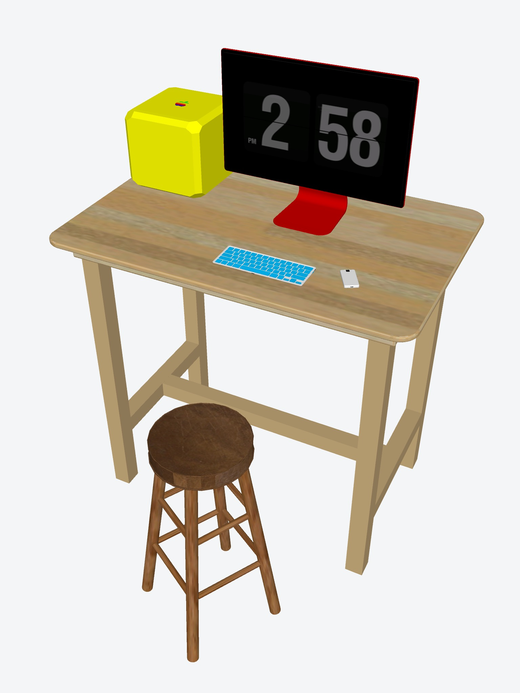

Standing to write is older than sitting to type.

<!-- figure:commons -->
<figure class="desk-entry-figure">

<figcaption>Figure 1. Standing desk with stool. Wikimedia Commons. CC BY-SA 3.0. Full credits: RIGHTS.md.</figcaption>
</figure>

Counting-house desks were high. Clerks stood or perched on stools because ledgers were large and the light was a window. Ministers and lawyers kept a high surface for the work that should not get comfortable. Thomas Jefferson had revolving and standing arrangements. Nineteenth-century writers stood because their backs already knew what eight hours of sitting would do. None of them owned a motorized base.

The sit-to-stand desk of the last twenty years is a mechanism, not a revelation. I like a good mechanism. I dislike the sermon that comes with it. Standing is a posture, not a virtue. If your shoulders creep up to your ears, sit down. If your hips lock, stand up. The furniture should allow both without a lecture.

Height math is rude and useful. A seated writing top near 29–30 inches. A standing writing top often lands near 40–42 inches for an average adult, and that average is a liar. Elbows want a slight bend. Screens want a different height than paper. If you stack a monitor on a standing top designed for paper, you will look like a periscope. Separate the problems.

I have built fixed standing ledges against a wall for people who only stand to pay bills. That is a hall-adjacent desk, and it can be honest: a 12-inch deep shelf, a drawer for the checkbook, a lamp. I have also built full sit-to-stand pedestals that cost more than the chair. Both can be right. The room decides.

Do not put a standing desk in a hall and call it an entry table. People will set keys on it and you will hate them. Do not put a standing desk in a small bedroom and then add a treadmill. The photograph will be funny for a week.

History's gift is permission. You may stand. You may sit. You may own a stool that is not a throne. The century that invented the clerk already ran this experiment. We just added a switch.
