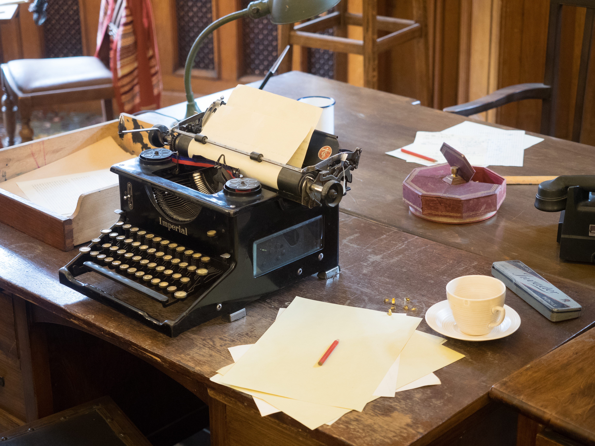

The typewriter did more to a desk than any designer after 1900.

<!-- figure:commons -->
<figure class="desk-entry-figure">

<figcaption>Figure 1. Desk with manual typewriter. Wikimedia Commons. CC BY 2.0. Full credits: RIGHTS.md.</figcaption>
</figure>

A pen wants a slight slope or a flat blotter and a place for the inkwell. A typewriter wants a lower, stiffer surface, room for the carriage to travel, and often a return — a second surface at a right angle — so the paper and the extra machine have a home. Office furniture after the 1890s is a conversation with a machine. Steel cases. Linoleum tops. Drop-front typewriter compartments that look clever until the machine weighs thirty pounds and the hinges sag.

Remington and Underwood did not care about your Queen Anne knee space. They cared about a platen you could hit without lifting your elbows and a carriage that cleared the back edge. Catalog desks from the 1910s and 1920s often show a typing shelf near twenty-six inches — lower than a pen desk — with a stiff skirt or metal frame so the case does not walk when you pound the keys. The return is not decoration. It is where the extra platen length and the paper guide live when the main top is already full.

I care about this because people still buy "writing desks" and then set a keyboard tray under a 30-inch top as if the last century did not happen. A keyboard wants a different height than a fountain pen. If you ignore that, your wrists will write the review.

The secretarial desk of the mid-twentieth century — a pedestal, a typewriter return, a modest top — is an underrated American form. It is not pretty in the antique-mall sense. It is correct. You can still find steel ones that will outlive a laminate box. If you strip the paint and call it industrial, I will not stop you. If you keep it ugly and useful, I will like you more.

Home offices after the war borrowed the return and lost the machine. The L-desk is a typewriter memory. We will get there. The point here is the top. Once the work is a machine, the wood has to stop being precious. You will dent it. You will need a mat. A leather pad is not nostalgia. It is a sacrificial surface. The Victorians already knew that. The typewriter just made the sacrifice louder.

When a collection page shows a delicate writing desk under a desktop computer, the page is a comedy. Either the desk is a laptop perch — say that — or the machine needs a different piece. Adjacent history is the right to laugh and then buy the stiffer top.
