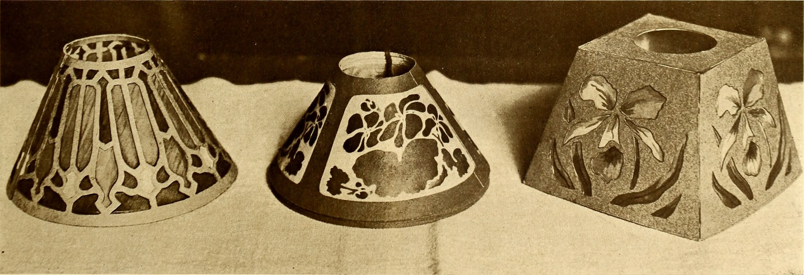

An L-desk is a confession that one rectangle was not enough.

<!-- figure:commons -->
<figure class="desk-entry-figure">

<figcaption>Figure 1. Early twentieth-century L-shaped desk layout. Internet Archive / Wikimedia Commons. Public domain. Full credits: RIGHTS.md.</figcaption>
</figure>

The return is the short wing. It comes from the typewriter and from the clerk who needed a second pile. In a modern room it holds the printer you swore you would not own, the scanner, the second screen, the cat. I have never met an L that stayed as clean as the drawing.

A U-desk is the same confession said twice. Two returns, or a credenza behind, and you have built a cockpit. Cockpits are efficient and lonely. They also eat a room. If you cannot walk around the U, you have built a cubicle in a house that paid for windows.

History is short here because the form is an office export. Mid-century steel, then laminate, then "executive" wood that tried to look like a partner desk and behaved like a workstation. Home versions arrived when the personal computer needed more surface than a secretary flap. The 1990s were a graveyard of oak laminate L's with keyboard trays that stuck.

Design rules I will stand on:

- The inside corner is a dead zone. Do not put a monitor in the exact corner unless you like turning your neck into a hinge.
- The return depth can be shallower than the main top. Eighteen inches will hold a printer. Twenty-four is kinder.
- Aisle behind the chair still matters. If the return pins you to a wall, you will hate the chair casters.
- One pedestal is often enough. Two pedestals plus a return is how drawers become landfills.

BBF collections love the L because it photographs as "serious office" in a spare bedroom. Sometimes that is the right sale. Sometimes the room wants a 60-inch rectangle and a cart. A cart leaves. An L does not. I would rather sell the rectangle and the cart than an L that turns the bed into a hostage.

If you need the L, measure the door to the room. I have seen returns that could not enter without unscrewing a railing. Campaign furniture would have laughed and come apart. Laminate does not laugh.
