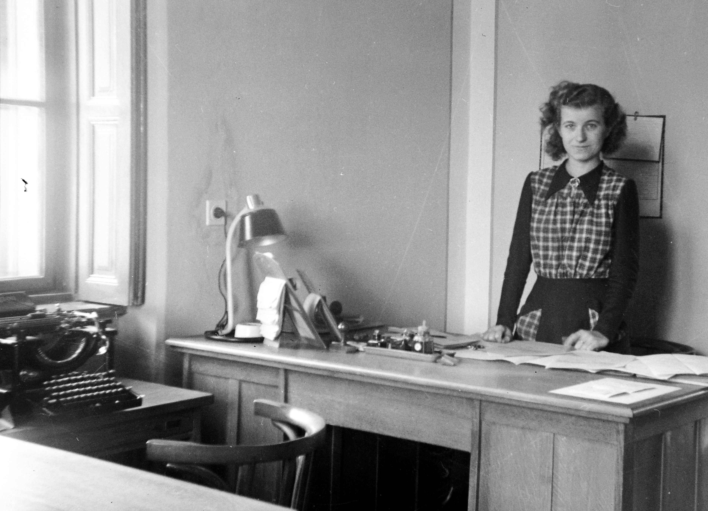

The computer desk of 1994 was a piece of furniture that apologized for a beige box.

<!-- figure:commons -->
<figure class="desk-entry-figure">

<figcaption>Figure 1. Mid-century office desk with typewriter era hardware. Fortepan / Wikimedia Commons. CC BY-SA 3.0. Full credits: RIGHTS.md.</figcaption>
</figure>

It had a cubby for a tower, a sliding tray for a keyboard, a hole for cables that was never in the right place, and a hutch that held speakers the size of lunchboxes. The monitor sat too high or too low. The printer lived on the top shelf so you could hear every page. We called it a computer desk because we were ashamed of the computer. Furniture was supposed to hide the future.

I am not nostalgic. Those desks were particleboard and cam locks and a dream of order. They taught a generation that "desk" meant a workstation silhouette. Then laptops arrived and made the cubby stupid. Then slim monitors made the hutch empty. Then people put the tower on the floor and the desk became a cheap table with a wound in the side.

The scar is still in the culture. Collection pages still show CPU compartments. Houses still have a 48-inch "computer center" in the basement doing nothing. The honest move is to admit the machine got small and the paper did not. You still need a surface, a lamp, a drawer for the ugly cables, and a place for a screen that does not wreck your neck. You do not need a tower tomb.

What I kept from that decade: cable discipline, and the idea that a desk can be allowed to look technical. What I threw out: the tray that rattles, the cubby that collects dust, the hutch that shades the work.

If you are writing adjacent copy for a BBF collection, do not call a 1994 silhouette "classic." Call it a scar unless the piece has actually learned. A clean rectangle with a grommet and a drawer is the apology withdrawn. That is the better history.

I still keep one tower cubby in the shop as a warning. Mice liked it. Dust liked it. The computer outgrew it and the furniture did not notice. When a form stops noticing the work, it is no longer a desk. It is a souvenir of a beige decade. Souvenirs belong on a shelf, not in the middle of a room you pay heat for.
