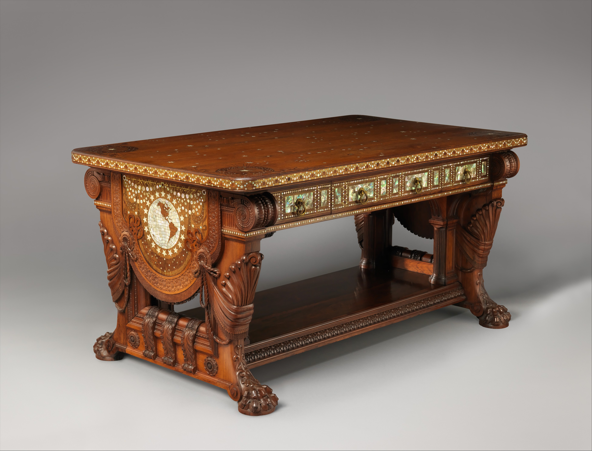

Depth is where people lie to themselves.

<!-- figure:commons -->
<figure class="desk-entry-figure">

<figcaption>Figure 1. Library table depth in a museum view. The Metropolitan Museum of Art, Open Access. CC0 1.0. Full credits: RIGHTS.md.</figcaption>
</figure>

They buy 20 inches because the room is tight, then they add a monitor, a lamp, a notebook, and a drink. The monitor wins. The notebook lives on a chair. The drink lives on a windowsill. Then they say the desk is too small, which is true, and that the room is too small, which may be true, and that they need an L, which is how a tight room becomes a trapped room.

Useful depths, said as shop talk:

- 16–18 inches: a hall-adjacent writing ledge or a laptop perch. Honest if you call it a perch.
- 20–24 inches: a writing desk if the lamp is skinny and the screen is not a television.
- 24–30 inches: a working desk. Keyboard and mouse can live on the top without a tray.
- 30–36 inches: library-table territory. Good for spreading paper. Bad if you cannot reach the back without standing.
- Past 36: you are hosting a meeting or hiding a radiator.

The lie is the monitor. People measure the desk and forget the screen has a base and a tilt. A 24-inch desk with a deep monitor stand is an 18-inch desk. Wall-mount the screen or buy a shallow stand or admit you need more depth. I will not design around a 12-inch monitor foot as if it were weather.

Reach is the other lie. A deep desk feels powerful in a photograph taken from a ladder. In a body it becomes a swimming pool for crumbs. Keep daily tools inside a forearm. Put the archive in a pedestal. If you want to spread maps, get a table. Desks that try to be tables and archives at once become neither.

Corner placement makes the lie worse. A 24-inch desk pushed into a corner gives you a triangle of usable top. The monitor goes on the long leg, the lamp on the short leg, and the keyboard ends up on your thighs. Measure the corner as a work zone, not as a rectangle on the plan. Sometimes the honest move is a shallow wall ledge for the screen and a separate table for paper — two depths instead of one fantasy depth.

Hall crossover: a console at 16 inches is a good hall depth and a bad desk depth. Do not work there unless the work is a two-minute note. Your back will file a complaint with the house.
