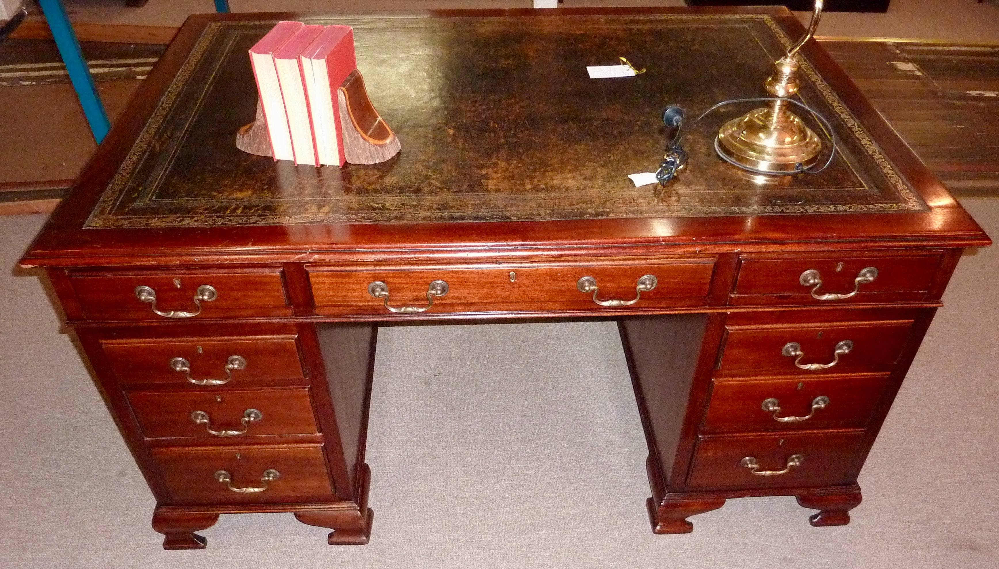

A drawer that will not take a file folder is a jewelry box in the wrong room.

<!-- figure:commons -->
<figure class="desk-entry-figure">

<figcaption>Figure 1. Partner desk drawer bank. Wikimedia Commons. CC BY-SA 3.0. Full credits: RIGHTS.md.</figcaption>
</figure>

I am not against jewelry boxes. I am against lying about storage. Pencil drawers are honest when they are shallow and close to the writing hand. Box drawers are honest when they take the stapler, the stamps, the tape that always vanishes. File drawers are honest when they take letter or legal hanging files without pinching the tabs. If a collection page says "storage desk" and shows three pencil trays, the page should say "small things."

Runners matter more than faces. Undermount slides that do not rack, wood-on-wood that is waxed and still true, even a clean metal slide from a century that did not apologize for metal — I will take any of those over a pretty false front. A false front is a drawer that died in the meeting.

Depth inside the box is the number people skip. A 24-inch desk does not give you a 24-inch drawer. The back, the slides, the thickness of the carcass — you might have 16 inches of useful well. Folders will not sit. Laptops will not hide. Measure the well or I will.

I like one file drawer and two box drawers for a one-person desk. I like a center pencil drawer only if it does not steal knee space. I dislike pedestals stuffed with identical shallow boxes. That is a hotel dresser pretending to help you work.

Locks are a Victorian leftover that still make sense in a shared house. If you lock, lock a well that is worth locking. A lock on a pencil tray is theater.

Full-extension slides changed what “deep” means inside the box. If you can see the back corner without fishing, you will use it. If the drawer stops at three-quarters, the back becomes a graveyard for dead batteries and cables you were afraid to throw away. When you spec a desk, open every drawer with a legal folder and a tape measure. If the folder binds on the slide hardware, that drawer is not a file drawer no matter what the label says.

History: the pigeonhole was a drawer that did not move. It taught us to sort. The hanging file taught us to stop sorting by the size of a cubby. Use both if you want. Do not use neither and then pile paper on the chair. The chair is not a drawer. I have said that in more houses than I can count.
