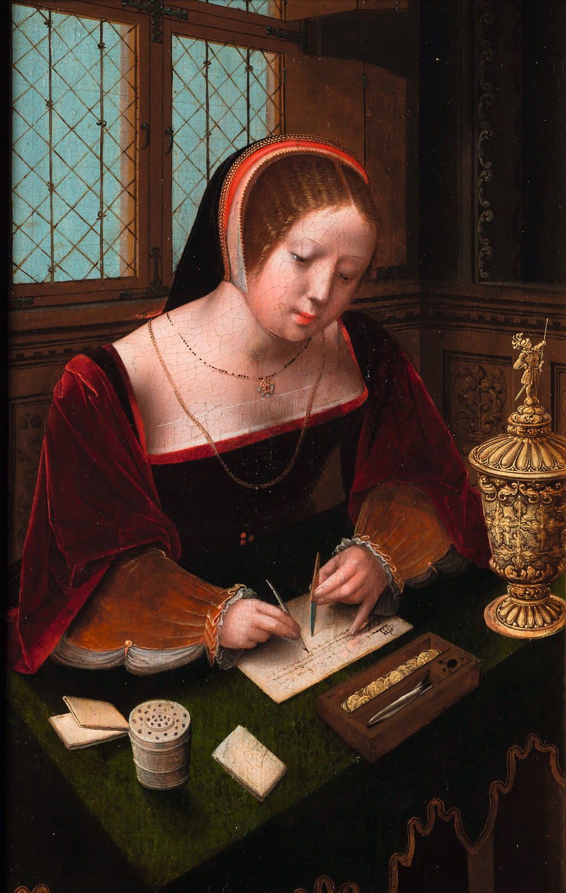

The small writing desk was a room, not a gender.

<!-- figure:commons -->
<figure class="desk-entry-figure">

<figcaption>Figure 1. Small writing desk in a period painting. Wikimedia Commons. Public domain. Full credits: RIGHTS.md.</figcaption>
</figure>

Nineteenth-century catalogs said "ladies' desk" the way they said "ladies' chair": smaller, prettier, often a fall-front or a tambour on a delicate frame, meant for a bedroom or a morning room. The work was real — letters, accounts of a household, the correspondence that ran a family. The name was a cage. The form was a gift to small rooms.

I will use the form and retire the cage. A 36- to 42-inch writing desk with a shallow drawer and a lid is how a guest room earns a second job without becoming an office. It is how a parlor keeps a place for a note without a pedestal fortress. It is how an apartment admits that a laptop needs a home that is not the sink.

Hepplewhite and Sheraton silhouettes — tapered legs, light rails, sometimes a tambour — are the ancestors people still steal. French bureaus plats are the flat cousins: a writing table with drawers in the frieze, no kneehole stacks. Both assume a chair that can slide in and a rug that will forgive.

The danger is fragility as a brand. Thin legs on a 20-inch depth will rack if you lean. Hide a steel angle if you must. Do not make the desk so precious that a backpack on the flap feels like a crime. A writing desk that cannot take a backpack is a display stand.

When a collection says "ladies' writing desk," I hear a 1910 catalog and a 2026 meeting that did not flinch. Say small writing desk. Say secretary, if there is a flap. Say what the lid does. The people who wrote at those desks already did the work. We can stop decorating their gender.

I have built the small desk in cherry for a nurse who writes notes at 5 a.m. and for a retired man who keeps stamps. Same height. Same flap. Same refusal of a pedestal fortress. The room was the constraint. The work was the honor. That is all the form ever needed.
