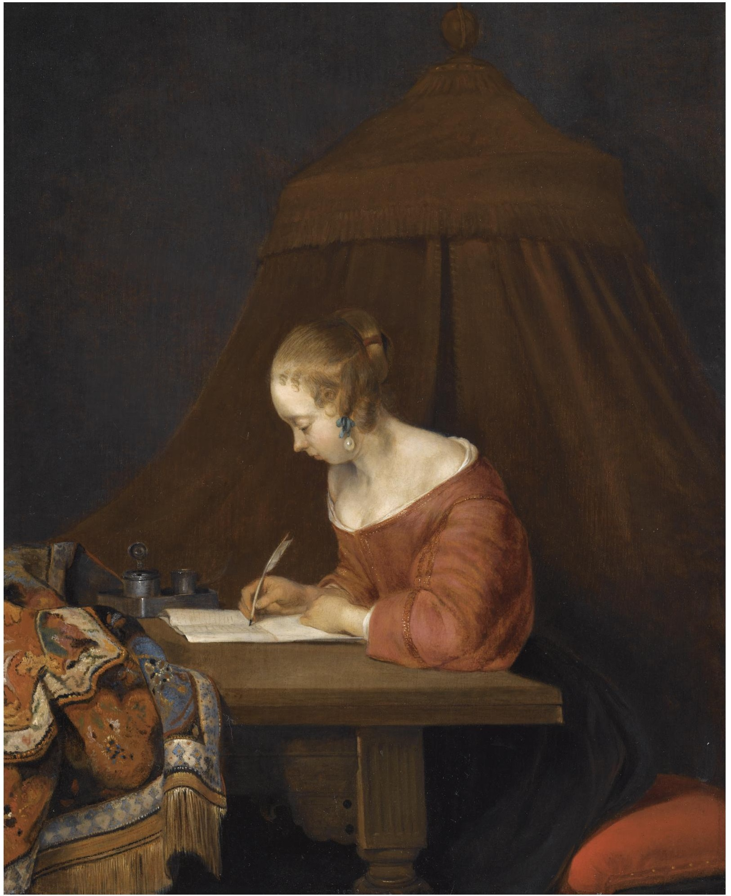

Put the lamp where the hand is not.

<!-- figure:commons -->
<figure class="desk-entry-figure">

<figcaption>Figure 1. Writer at a desk in a Dutch interior. Wikimedia Commons. Public domain. Full credits: RIGHTS.md.</figcaption>
</figure>

Right-handed writers want light from the left so the hand does not throw a shadow across the line. Left-handed writers want the opposite. Screens want a lamp that does not glare in the glass. That is three sentences and they will save more necks than a new chair.

I have watched people buy a beautiful desk lamp and plant it in the middle of the top like a trophy. Then they work around it. The lamp is not the work. Move it. A swing-arm that clamps to the rail is not a compromise. It is how studios stayed sane. A library lamp with a heavy base is fine if the base is off the writing pad.

History: oil lamps and candles made the left-hand rule a fire rule too. You did not want a sleeve in a flame. Electric light made us sloppy. We put cans of LEDs everywhere and called it brightness. Brightness is not direction. A dim lamp in the right place beats a shop-light in the wrong one.

Hutches steal light. Roll-tops steal light. Secretaries can steal light when the flap is up and the cubbies shade the page. If you love those forms, budget a lamp that lives on the flap or on a nearby wall. Do not assume the overhead can do desk work. Overhead is for walking. Desk light is for the centimeter in front of your eyes.

A north window is a kind lamp until November. Then it is a gray smear and you will reach for a can of LEDs and blast the top. I would rather you keep a 2700–3000 K bulb in a shade that cuts the glare and leave the overhead off. Color temperature is not a personality. It is whether the page looks like paper or like a clinic.

Collection pages love a lamp as a prop on the wrong side. When we sit beside those pages, we should say so. Adjacent does not mean silent. If the photograph put the lamp on the writing hand, move it before you live there. The hand was here first.
