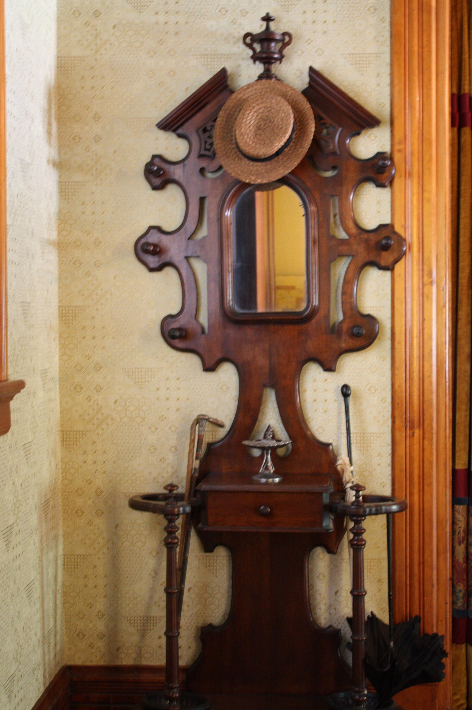

A hall tree is a coat rack that sat down.

<!-- figure:commons -->
<figure class="desk-entry-figure">

<figcaption>Figure 1. Entry hall hat stand with seat. Wikimedia Commons. CC BY-SA 4.0. Full credits: RIGHTS.md.</figcaption>
</figure>

The name wanders. Hatstand, hatrack, coat tree, portmanteau, hall tree. The British like hatstand for the pole with pegs. Americans like hall tree for the combined piece: hooks above, seat below, sometimes a slat back, sometimes a mirror. The Victorian hall stand is the tall cousin without a commitment to sitting. The modern hall tree is usually a bench with a spine.

I use hall tree when there is a seat you can actually use. I use coat rack when there is not. I use hall stand when the object is the nineteenth-century etiquette machine. Those three sentences would clean up half the collection pages I have read.

The sit-down version is the one American houses need, because shoes became the plot. You cannot fight a boot from a standing pole. You need 18 inches of seat, enough depth that you are not perched like a bird, and enough structure that a 200-pound relative does not become a lawsuit. Open cubbies under the seat collect grit and the pair you cannot find. Doors hide the grit and hide the pair. I like doors if you will close them. I like open cubbies if you will not.

Hooks on a hall tree should not be an afterthought of three decorative pegs. Three hooks is a couple. A family needs a row and a second row for the short people. Side hooks are how backpacks live without punching the person on the bench.

The Victorian stand showed coats as status. The hall tree should hide the worst of them or at least face them toward the wall. If the first thing a guest sees is four hoodies, you have a closet problem, not a furniture problem. Furniture cannot cure a missing closet. It can only stage the overflow.

Width is the last argument. A 24-inch tree is a one-person pole with a perch. A 40-inch tree can take a couple and a kid if the hooks are not a decoration. Past 48 inches you are building a wall. Walls need the hall to be a room. Measure first. The coat rack that sat down still has to stand in a plan.
