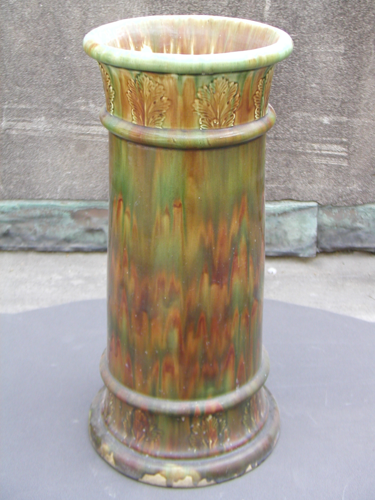

The umbrella drip pan is the most honest hardware in the house.

<!-- figure:commons -->
<figure class="desk-entry-figure">

<figcaption>Figure 1. Victorian umbrella stand with drip tray. Auckland War Memorial Museum (via Wikimedia Commons). CC BY 4.0. Full credits: RIGHTS.md.</figcaption>
</figure>

Victorian hall stands put a well at the bottom, often zinc or another metal that could take water, because the umbrella had come inside and it was not going to apologize. That pan is a sentence about weather. Everything else on the stand is etiquette. The pan is physics.

We still have weather. We have fewer pans. We lean wet umbrellas on oak and then act surprised at the black stain. I would rather see a cheap metal tray that you can empty than a "decorative" ceramic that nobody dares to use. Honest and ugly beats pretty and ruined.

Design the well so you can clean it. A sealed box that traps water is a mushroom farm. A removable insert is the grown-up version of the zinc pan. If a hall tree has no well, give the umbrella a hook above a tray on the floor and admit the piece is for coats, not rain.

Walking sticks lived in the same wells. We have fewer sticks and more backpacks. The well is still the right idea for anything that arrives wet — a dog leash, a kid's rain jacket that will not go back on a hook without dripping. Put a towel on a hook nearby. Furniture cannot absorb a storm. It can localize it.

When I look at BBF-adjacent entry sets, I look for the pan the way I look for the kneehole on a desk. If it is missing, the set is a fair-weather friend. Fair weather is not why halls exist.

If you already own the stand and it has no well, you can still tell the truth. A boot tray on the floor under the umbrellas is the zinc pan in exile. A hook over a bare oak floor is a stain in calendar form. I have sanded those stains. They come out if you catch them. They do not come out if you wait for spring and then blame the wood. The pan was the cheaper repair. It still is.
