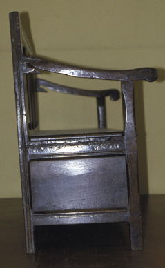

The settle is the hall bench with a longer memory.

<!-- figure:commons -->
<figure class="desk-entry-figure">

<figcaption>Figure 1. Oak settle bench. Auckland War Memorial Museum (via Wikimedia Commons). CC BY 4.0. Full credits: RIGHTS.md.</figcaption>
</figure>

A settle is a bench with a back, sometimes with arms, sometimes with a chest under the seat, that sat near fires and in halls when those were the same kind of room — cold, public, a place to wait. American and British houses used them for centuries before anyone said "entryway bench." The hall stand borrowed a seat now and then. The mudroom stole the chest. The collection page stole the silhouette and lost the thickness.

A bench you cannot sit on while tying a shoe is sculpture. I want about 18 inches of seat height, enough depth that the thigh is on wood, and a front edge that does not cut. A 12-inch deep seat is a perch for a photograph. A 16- to 18-inch seat is a place to work on a boot. If there is a back, it should not shove you off the front. If there is a lid, it should stay open without slamming on a hand.

Storage under the seat is the old chest idea. It is good for hats and scarves if you will empty it. It is bad for shoes you need every morning, because a lid is a chore. I like open cubbies for daily shoes and a chest for the off-season. Two jobs, two boxes, or one box and a lie.

Weight ratings are not romance. If the copy says 250 pounds, believe the need and test the join. A settle in a hall takes the largest person who visits, not the average. History's settles were oak and overbuilt because they had to be. You can build lighter. You cannot build cute and call it a settle.

When I sit on a collection bench, I sit like I have a wet lace in my hand. If I slide off, the piece failed the old test.

Arms are optional and sometimes a problem. An arm that blocks a person from sliding down to the end of the bench wastes a seat. An arm that gives a place to push up from is a kindness to a knee. Pick the kindness that matches the household. Do not pick two small arms because the drawing looked like a sofa. A hall bench is not a sofa. It is a tool you sit on for ninety seconds.
