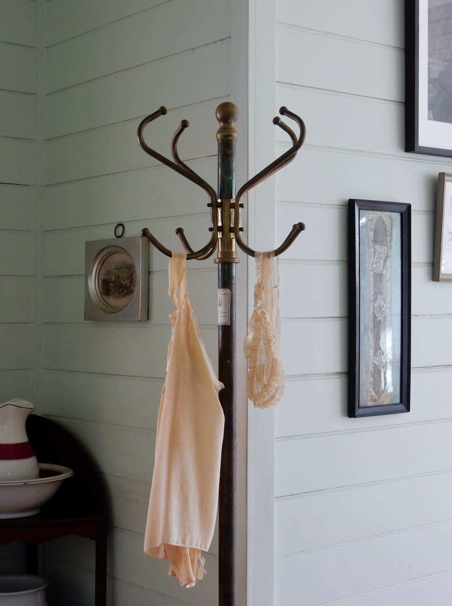

Hook height is a kindness or a slight, depending on who lives there.

<!-- figure:commons -->
<figure class="desk-entry-figure">

<figcaption>Figure 1. Coat stand hook height in a furnished entry. Wikimedia Commons. CC BY 2.0. Full credits: RIGHTS.md.</figcaption>
</figure>

Adult coats want a hook near 60–66 inches so the hem clears the bench and the floor. Children want a row near 36–42 inches so they can hang the coat without a speech. Guests want one hook that is empty and obvious. If every hook is at a "designer's eye line," you have designed for a photograph of empty pegs.

Spacing is the other kindness. Hooks that sit 4 inches apart will fight. I like 6–8 inches for thin coats and more for winter. Backpacks need a hook that can take a swing. A decorative double hook that is really two small horns will throw a backpack on the floor and look innocent.

Wall structure matters. A row of loaded hooks on drywall anchors is a future repair. Find a stud, or a rail that hits studs, or a tree that stands on the floor and does not ask the wall to be a beam. Victorian stands stood because the floor was willing. We keep forgetting the floor is still willing.

I do not like hooks over a mirror's edge. A sleeve will find the glass. I do not like hooks so low that a dripping hem soaks the bench cushion. I do not like a single row in a family of five. That is how chairs become closets.

History's hall stands put hooks where a visitor's coat would look impressive. We can put hooks where a child's coat will actually land. Adjacent collections that offer one height should offer a second rail or admit they are for a couple who do not own hockey bags.

Measure the people with their coats on. That sounds obvious. I have skipped it. I have regretted it. The coat is thicker than the drawing.

A row that steps down — adult, then child, then a low hook for a bag — reads as a family even when the finish is plain. A single high row reads as a shop. Shops are allowed. Families get tired of standing on a stool to hang a raincoat. I would rather the rail look a little uneven than the child look a little defeated.
