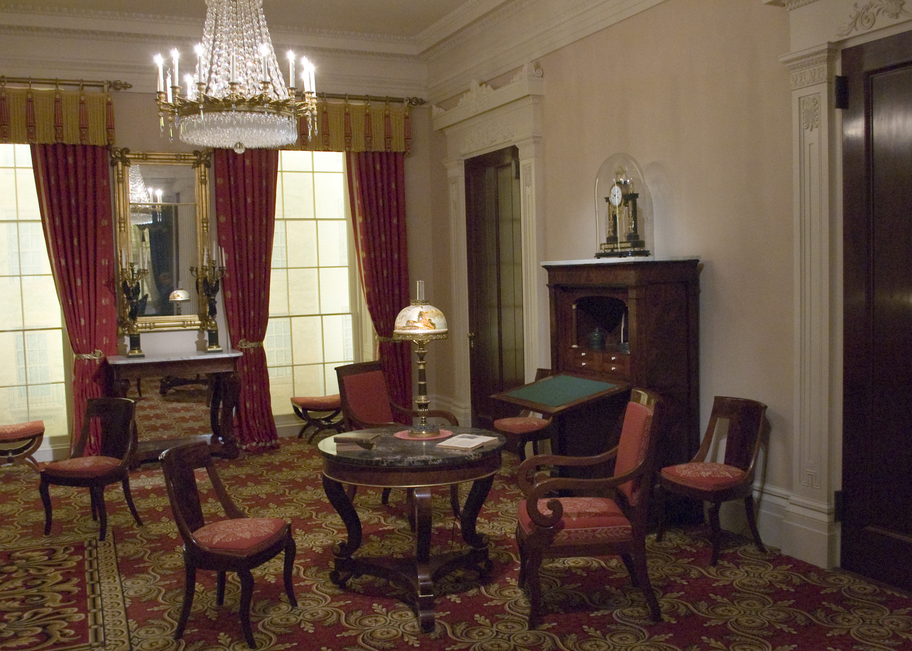

Staging an entry is not decorating. It is traffic control.

<!-- figure:commons -->
<figure class="desk-entry-figure">

<figcaption>Figure 1. Greek Revival parlor staging. The Metropolitan Museum of Art, Open Access. CC0 1.0. Full credits: RIGHTS.md.</figcaption>
</figure>

I use staging here as the shop word: how you set the objects so the next body can move. Not the real-estate word, though real-estate staging stole our language and filled bowls with lemons. Lemons do not take a wet glove. A tray does.

Sequence I walk with a client:

1. Door swing and storm door. Tape the arc.
2. Wet. Where does water stop? Mat, pan, towel hook.
3. Sit. Bench or none. If none, admit the shoe fight will happen on the stairs.
4. Hang. Hooks you can see. Closet if it exists and will be used.
5. Small objects. Tray or drawer. Empty it weekly or do not bother.
6. Light. A switch you can find with an elbow. A mirror that is not a horror.
7. Path. What remains after 1–6. If the path is gone, delete an object.

That is staging. The photograph comes last, if it comes. A styled entry that fails the sequence will be unstyled by Tuesday.

I will allow one object that is only pretty — a picture, a plant that can survive a draft, a clock. One. The hall is a working room. Working rooms can take a little art. They cannot take a boutique.

BBF collections will show the pretty version. These drafts sit beside them so the sequence stays in the room when the photographer leaves. If a collection page used this list, I would trust it more. Adjacent means we keep the list even when the page cannot.

I will also stage the empty hook. One hook with nothing on it is hospitality. A rail stuffed to the last peg is a household at capacity. Guests can read that. So can you, if you are honest on a Sunday. Empty is a measurement. Fill is a measurement. Decorating is what you do after both numbers are kind.

Night staging is a different pass. You should be able to find a hook and the tray in the dark with an elbow. A lamp on a timer or a switch by the latch is worth more than a styled runner. I have tripped on a styled runner. I have never tripped on a switch I could hit with a bag.
