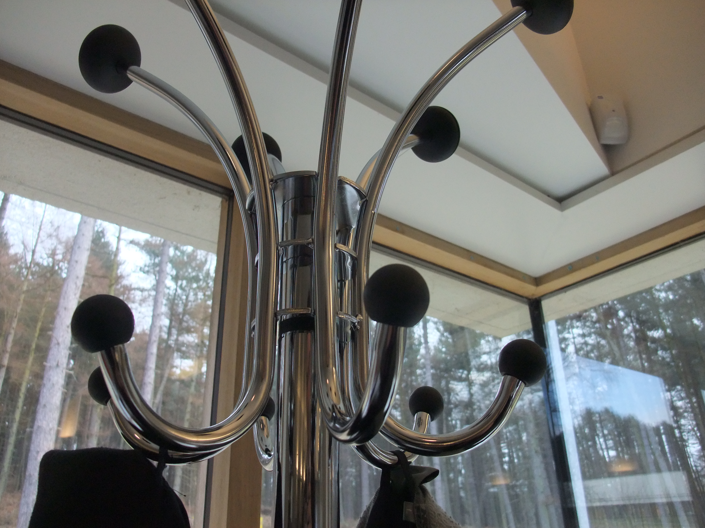

The drop zone is a military phrase that wandered into a mudroom and stayed.

<!-- figure:commons -->
<figure class="desk-entry-figure">

<figcaption>Figure 1. Wall-mounted coat rack drop zone. Wikimedia Commons. CC BY 2.0. Full credits: RIGHTS.md.</figcaption>
</figure>

I do not mind borrowed language if the operation stays. A drop zone is where incoming material lands so the rest of the house does not have to process it in a panic. Keys, mail, devices, the form from school, the leash. One tray. One hook. One charger if you must. Not four surfaces competing.

The failure mode is sprawl. A drop zone that grows into a second living room is a hall that lost. Keep it ugly enough that you will not display it and small enough that you will empty it. A beautiful drop zone becomes a shrine. Shrines accumulate.

I like a wall-mounted rail with a shelf at about 36–40 inches — hand height with a bag — and a tray that can come off for cleaning. I like a hidden power point if the house can take it, because devices will live there whether I approve or not. I do not like a desk in the drop zone. Desks are overnight. Drop zones are ten minutes. If you pay bills there, the bills will smell like wet dog.

Victorian cards were a drop zone with etiquette. We kept the drop and lost the etiquette. Fine. Keep the lip on the tray. Keep the path. Keep the wet on the mat, not in the tray. If the collection calls a whole furniture set a drop zone, ask which object is the zone and which objects are hoping to be invited.

Staging, again: the drop is step five in the entry sequence. It does not get to skip the door swing. I have seen pretty rails installed inside a storm-door arc. The rail lost. The door always wins.

Mail is a special case. A slot in the door used to make the hall the post office. Now the carton sits on the porch and the paper sits in an app. The tray still catches the leftover paper — the one form that is not an app. Empty it. A drop zone that keeps last September is a drawer that learned to live on a shelf. Drawers should be drawers. Trays should be temporary. The military phrase only works if the drop is processed.
