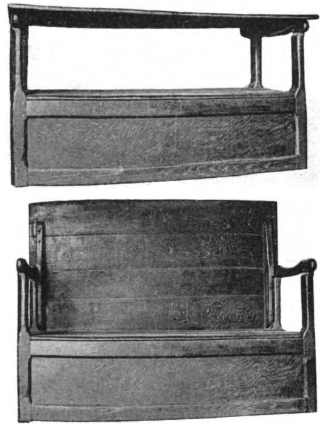

Wood in a hall has a different job than wood in a study.

<!-- figure:commons -->
<figure class="desk-entry-figure">

<figcaption>Figure 1. Seventeenth-century monks bench. Wikimedia Commons. Public domain. Full credits: RIGHTS.md.</figcaption>
</figure>

A study can take a film finish you oil with a cloth and a story. A hall takes grit, water, salt, and the edge of a backpack every afternoon. If you put a dining-room sheen by the door, you will spend the winter touching up black dots that are not stains so much as sanded finish. I want something you can wipe, something that does not show every scar as a moral failure, and something that can be renewed without a truck.

Oil and wax are beautiful and they are a maintenance plan. Conversion varnish and a good waterborne are less beautiful in a catalog and kinder on a Tuesday. Soft woods dent. That can be a charm on a desk and a mess on a bench. Oak, maple, a honest veneer over a stable core — I will take the stable core in a hall if the edge is real wood where the backpack hits.

Desks can be softer. A writing surface wants a little give under a forearm. A leather pad is still the right sacrificial layer. If the same collection uses the same finish on the desk and the hall tree, ask whether the hall tree can take a wet glove. If the answer is a shrug, split the finish. Matching sheen across rooms is how a house starts to look rented. Matching language is enough.

Metal in a hall should not rust into the wood. That is the drip-pan lesson again. Fasteners on the floor of a shoe cubby will rust if the snow lives there. Use what you can replace.

The finishing-chemistry folder in this repo can carry the molecules. This draft carries the weather. Adjacent collections should not ship one sheen for every room and call it a system. A system that ignores weather is a sample door.

I keep a scrap of the hall finish by the back door and I hit it with wet grit on purpose once a year. If I will not do that to the scrap, I will not specify the finish. Shop tests are rude. Halls are ruder. Let the scrap lose first.
