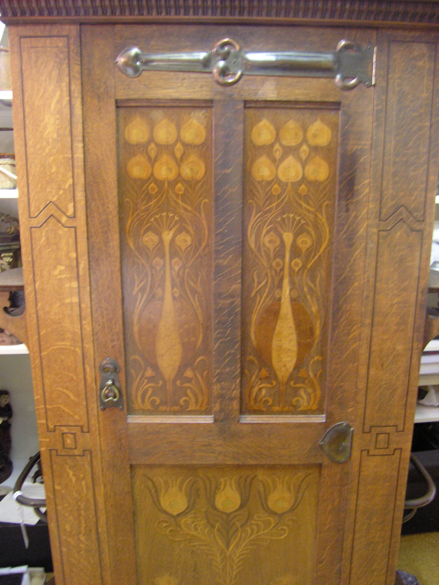

Hardware is the only part of a hall piece that strangers will touch.

<!-- figure:commons -->
<figure class="desk-entry-figure">

<figcaption>Figure 1. Hall cupboard hardware and mirror. Auckland War Memorial Museum (via Wikimedia Commons). CC BY 4.0. Full credits: RIGHTS.md.</figcaption>
</figure>

They will not caress the finish. They will grab a hook, a pull, a knob on a storm-door-adjacent cabinet, the edge of a bench. If the hook is sharp, they will bleed and you will hear about it. If the pull is loose, they will finish the loosening. If the hook is pretty and weak, the coat will teach physics.

I like hooks with a slight upturn and a rounded end. I like pulls you can use with a finger and a grocery bag. I like bench edges that are eased, not knife-sharp, because shins will find them. I dislike square decorative hooks that are really sculpture. Sculpture does not hold a damp wool coat.

Finish on hardware in a hall should survive skin oil and weather. Unlacquered brass will go living and then green if the wet finds it. That can be a look. It can also stain a pale coat. Nickel and a decent powder coat are less poetic and more kind. The Victorian stands used whatever the shop had that would take a drip. We can be choosier and still be honest.

On a desk, hardware is a quieter conversation. You touch it daily. Cheap slides will train you to hate the piece. A good pull on a bad box is still a bad box. Spend on the slide. The pull can be plain.

Collection pages photograph hardware like jewelry. Adjacent writing should photograph a coat on the hook and a hand on the pull. If the hook disappears under a winter coat, it is the right size. If it still looks like jewelry, it may be too small.

I replace hardware before I replace carcasses. A hall tree with new hooks is a new piece to the stranger at the door. That is a cheap resurrection. Use it.

Screws in hooks loosen. That is not a defect. It is a season. A drop of thread locker on a hook that backs out monthly is allowed. A bigger screw into a tired hole is how you split a rail. If the rail is tired, replace the rail. The hook is not the whole story. The wood that holds the hook is the story the stranger never sees and always uses.
