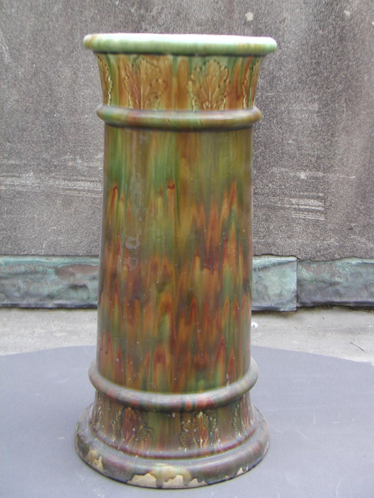

Aftercare in a hall is about water and grit, not lemon oil advertisements.

<!-- figure:commons -->
<figure class="desk-entry-figure">

<figcaption>Figure 1. Umbrella stand after wet weather. Auckland War Memorial Museum (via Wikimedia Commons). CC BY 4.0. Full credits: RIGHTS.md.</figcaption>
</figure>

Wipe the drip pan. Shake the mat. Run a broom under the bench before the grit becomes a sandpaper for the finish. Once a season, take the hooks off if they are designed to come off and clean the wall rail. Look at the feet. If a leveler walked, the bench will rock and a child will notice with their teeth.

A desk's aftercare is quieter. Dust the pigeonholes you swore you would use. Empty the pencil drawer before it becomes a grave. Oil a wood top if the top is oil. Do not oil a film finish and then wonder why it is sticky. The chemistry folder can scold you more precisely. My scold is simpler: the writing pad is sacrificial. Replace it. The top will thank you.

Water is the hall's first solvent. Salt is the second. If you live where roads are treated, assume the cubby floor is a winter experiment. A removable tray in the shoe well is aftercare you design on day one. If the collection did not give you a tray, a cheap baking sheet that fits is not a shame. It is a pan. Victorians used zinc. You can use aluminum.

I do not believe in weekly lemon oil as a personality. I believe in a cloth when something is wet and a serious look twice a year. If a piece needs more than that to survive a family, the piece was wrong for the room.

These forty-four drafts are staged. They will need aftercare too — a cut, a date stamp, a correction when a code or a catalog changes a name. History does not mind being corrected. Brochures do. Stay on the history side. Wipe the pan. Leave the path. Let the desk hold the night. That is the whole job.

One more hall habit: after a storm, open the door and smell. If you smell wet wood, you waited too long. Dry the well. If you smell nothing but cold air, the pan did its work and you can go back to the desk. The desk will wait. That is why we built it to hold the night.
